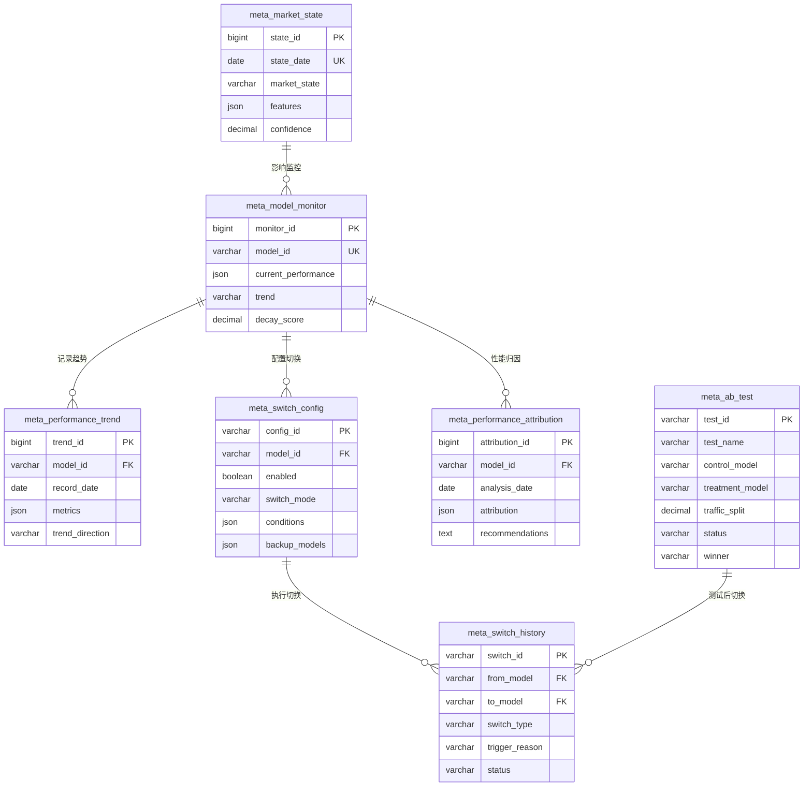

# Meta Controller监控模块 - 数据模型（Production阶段）

> **阶段**: Production阶段
> **模块**: Meta Controller监控
> **状态**: ✅ 文档完成
> **版本**: v1.0
> **最后更新**: 2026-02-14
> **优先级**: P1核心功能
> **核心价值**: 模型性能监控、自动切换、在线自适应
> **基于**: QLib Meta Controller模块

---

## 📊 数据表结构

### 1. 模型性能监控表 (meta_model_monitor)

存储在线模型的实时性能监控数据。

```sql
CREATE TABLE meta_model_monitor (
    -- 主键
    monitor_id BIGINT AUTO_INCREMENT PRIMARY KEY,

    -- 模型信息
    model_id VARCHAR(64) NOT NULL COMMENT '模型ID',

    -- 当前性能
    current_performance JSON NOT NULL COMMENT '当前性能指标',
    baseline_performance JSON COMMENT '基准性能指标',

    -- 趋势分析
    trend ENUM('stable', 'improving', 'declining', 'volatile') COMMENT '性能趋势',
    decay_score DECIMAL(5, 4) COMMENT '衰减评分(0-1)',

    -- 监控状态
    last_check_time TIMESTAMP NOT NULL COMMENT '最后检查时间',
    check_count INT DEFAULT 0 COMMENT '检查次数',

    -- 元数据
    created_at TIMESTAMP NOT NULL DEFAULT CURRENT_TIMESTAMP COMMENT '创建时间',
    updated_at TIMESTAMP NOT NULL DEFAULT CURRENT_TIMESTAMP ON UPDATE CURRENT_TIMESTAMP COMMENT '更新时间',

    -- 索引
    INDEX idx_model_id (model_id),
    INDEX idx_trend (trend),
    INDEX idx_last_check (last_check_time),
    UNIQUE KEY uk_model_id (model_id)
) ENGINE=InnoDB DEFAULT CHARSET=utf8mb4 COMMENT='模型性能监控表';
```

**current_performance字段结构**:
```json
{
  "ic": 0.068,
  "icir": 0.85,
  "rank_ic": 0.072,
  "sharpe": 1.2,
  "returns": 0.15
}
```

---

### 2. 性能趋势表 (meta_performance_trend)

存储模型性能的历史趋势数据。

```sql
CREATE TABLE meta_performance_trend (
    -- 主键
    trend_id BIGINT AUTO_INCREMENT PRIMARY KEY,

    -- 模型和日期
    model_id VARCHAR(64) NOT NULL COMMENT '模型ID',
    record_date DATE NOT NULL COMMENT '记录日期',

    -- 性能指标
    metrics JSON NOT NULL COMMENT '性能指标数据',

    -- 趋势分析
    moving_avg JSON COMMENT '移动平均数据',
    trend_direction ENUM('up', 'down', 'flat') COMMENT '趋势方向',
    change_rate DECIMAL(8, 6) COMMENT '变化率',

    -- 元数据
    created_at TIMESTAMP NOT NULL DEFAULT CURRENT_TIMESTAMP COMMENT '创建时间',

    -- 索引
    INDEX idx_model_date (model_id, record_date),
    INDEX idx_record_date (record_date),
    UNIQUE KEY uk_model_date (model_id, record_date)
) ENGINE=InnoDB DEFAULT CHARSET=utf8mb4 COMMENT='性能趋势表';
```

**metrics字段结构**:
```json
{
  "ic": 0.068,
  "icir": 0.85,
  "rank_ic": 0.072,
  "sharpe": 1.2,
  "returns": 0.15
}
```

---

### 3. 自动切换配置表 (meta_switch_config)

存储自动模型切换策略配置。

```sql
CREATE TABLE meta_switch_config (
    -- 主键
    config_id VARCHAR(64) PRIMARY KEY COMMENT '配置ID',

    -- 模型信息
    model_id VARCHAR(64) NOT NULL COMMENT '监控的模型ID',

    -- 切换策略
    enabled BOOLEAN NOT NULL DEFAULT TRUE COMMENT '是否启用',
    switch_mode ENUM('auto', 'manual', 'semi_auto') NOT NULL DEFAULT 'auto' COMMENT '切换模式',
    approval_required BOOLEAN NOT NULL DEFAULT FALSE COMMENT '是否需要审批',

    -- 触发条件（JSON格式）
    conditions JSON NOT NULL COMMENT '切换条件',

    -- 备选模型
    backup_models JSON COMMENT '备选模型列表',

    -- 配置状态
    status ENUM('active', 'paused', 'disabled') NOT NULL DEFAULT 'active' COMMENT '配置状态',

    -- 元数据
    created_at TIMESTAMP NOT NULL DEFAULT CURRENT_TIMESTAMP COMMENT '创建时间',
    updated_at TIMESTAMP NOT NULL DEFAULT CURRENT_TIMESTAMP ON UPDATE CURRENT_TIMESTAMP COMMENT '更新时间',
    created_by VARCHAR(64) NOT NULL COMMENT '创建用户ID',

    -- 索引
    INDEX idx_model_id (model_id),
    INDEX idx_enabled (enabled),
    INDEX idx_status (status)
) ENGINE=InnoDB DEFAULT CHARSET=utf8mb4 COMMENT='自动切换配置表';
```

**conditions字段结构**:
```json
{
  "ic_threshold": 0.050,
  "decay_threshold": 0.20,
  "consecutive_days": 3,
  "min_samples": 100
}
```

**backup_models字段结构**:
```json
{
  "primary": "model_001_v4",
  "secondary": ["model_001_v3", "model_001_v2"],
  "selection_criteria": "highest_ic"
}
```

---

### 4. 切换历史表 (meta_switch_history)

存储模型切换历史记录。

```sql
CREATE TABLE meta_switch_history (
    -- 主键
    switch_id VARCHAR(64) PRIMARY KEY COMMENT '切换ID',

    -- 模型信息
    from_model VARCHAR(64) NOT NULL COMMENT '原模型ID',
    to_model VARCHAR(64) NOT NULL COMMENT '目标模型ID',

    -- 切换类型
    switch_type ENUM('auto', 'manual', 'ab_test') NOT NULL COMMENT '切换类型',
    trigger_reason VARCHAR(255) NOT NULL COMMENT '触发原因',

    -- 切换前性能
    before_performance JSON COMMENT '切换前性能',
    after_performance JSON COMMENT '切换后性能',

    -- 切换状态
    status ENUM('pending', 'approved', 'executed', 'rejected', 'failed') NOT NULL DEFAULT 'pending' COMMENT '切换状态',

    -- 审批信息
    approval_required BOOLEAN DEFAULT FALSE COMMENT '是否需要审批',
    approved_by VARCHAR(64) COMMENT '审批人',
    approved_at TIMESTAMP NULL COMMENT '审批时间',

    -- 执行信息
    executed_at TIMESTAMP NULL COMMENT '执行时间',
    executed_by VARCHAR(64) COMMENT '执行人',
    notes TEXT COMMENT '备注',

    -- 元数据
    created_at TIMESTAMP NOT NULL DEFAULT CURRENT_TIMESTAMP COMMENT '创建时间',

    -- 索引
    INDEX idx_from_model (from_model),
    INDEX idx_to_model (to_model),
    INDEX idx_switch_type (switch_type),
    INDEX idx_status (status),
    INDEX idx_executed_at (executed_at)
) ENGINE=InnoDB DEFAULT CHARSET=utf8mb4 COMMENT='切换历史表';
```

---

### 5. A/B测试表 (meta_ab_test)

存储模型A/B测试配置和结果。

```sql
CREATE TABLE meta_ab_test (
    -- 主键
    test_id VARCHAR(64) PRIMARY KEY COMMENT '测试ID',

    -- 测试基本信息
    test_name VARCHAR(255) NOT NULL COMMENT '测试名称',
    description TEXT COMMENT '测试描述',

    -- 测试模型
    control_model VARCHAR(64) NOT NULL COMMENT '对照组模型',
    treatment_model VARCHAR(64) NOT NULL COMMENT '实验组模型',

    -- 测试配置
    traffic_split DECIMAL(5, 2) NOT NULL COMMENT '流量分配比例(0-100)',
    start_date DATE NOT NULL COMMENT '开始日期',
    end_date DATE NULL COMMENT '结束日期',

    -- 测试指标（JSON格式）
    success_metrics JSON NOT NULL COMMENT '成功指标定义',
    min_samples INT NOT NULL COMMENT '最小样本数',

    -- 测试状态
    status ENUM('pending', 'running', 'completed', 'stopped') NOT NULL DEFAULT 'pending' COMMENT '测试状态',

    -- 测试结果
    results JSON COMMENT '测试结果',
    winner VARCHAR(64) COMMENT '获胜模型',
    confidence DECIMAL(5, 4) COMMENT '置信度',

    -- 元数据
    created_at TIMESTAMP NOT NULL DEFAULT CURRENT_TIMESTAMP COMMENT '创建时间',
    created_by VARCHAR(64) NOT NULL COMMENT '创建用户ID',

    -- 索引
    INDEX idx_status (status),
    INDEX idx_start_date (start_date),
    INDEX idx_control_model (control_model)
) ENGINE=InnoDB DEFAULT CHARSET=utf8mb4 COMMENT='A/B测试表';
```

**success_metrics字段结构**:
```json
{
  "primary": "ic",
  "secondary": ["sharpe", "returns"],
  "threshold": {
    "ic": 0.05,
    "improvement_rate": 0.1
  }
}
```

---

### 6. 市场状态表 (meta_market_state)

存储识别的市场状态信息。

```sql
CREATE TABLE meta_market_state (
    -- 主键
    state_id BIGINT AUTO_INCREMENT PRIMARY KEY,

    -- 日期和状态
    state_date DATE NOT NULL COMMENT '状态日期',
    market_state ENUM('bull', 'bear', 'sideways', 'volatile') NOT NULL COMMENT '市场状态',

    -- 状态特征（JSON格式）
    features JSON COMMENT '市场特征指标',

    -- 置信度
    confidence DECIMAL(5, 4) COMMENT '状态识别置信度',

    -- 推荐策略
    recommended_models JSON COMMENT '推荐模型列表',
    risk_level ENUM('low', 'medium', 'high') COMMENT '风险等级',

    -- 元数据
    detected_at TIMESTAMP NOT NULL DEFAULT CURRENT_TIMESTAMP COMMENT '检测时间',

    -- 索引
    INDEX idx_state_date (state_date),
    INDEX idx_market_state (market_state),
    UNIQUE KEY uk_state_date (state_date)
) ENGINE=InnoDB DEFAULT CHARSET=utf8mb4 COMMENT='市场状态表';
```

**features字段结构**:
```json
{
  "market_return": 0.02,
  "volatility": 0.15,
  "volume_ratio": 1.2,
  "trend_strength": 0.8
}
```

---

### 7. 性能归因表 (meta_performance_attribution)

存储模型性能归因分析结果。

```sql
CREATE TABLE meta_performance_attribution (
    -- 主键
    attribution_id BIGINT AUTO_INCREMENT PRIMARY KEY,

    -- 模型和日期
    model_id VARCHAR(64) NOT NULL COMMENT '模型ID',
    analysis_date DATE NOT NULL COMMENT '分析日期',

    -- 归因维度（JSON格式）
    attribution JSON NOT NULL COMMENT '归因分析结果',

    -- 关键发现
    key_findings JSON COMMENT '关键发现',
    recommendations TEXT COMMENT '改进建议',

    -- 元数据
    created_at TIMESTAMP NOT NULL DEFAULT CURRENT_TIMESTAMP COMMENT '创建时间',

    -- 索引
    INDEX idx_model_date (model_id, analysis_date),
    INDEX idx_analysis_date (analysis_date),
    UNIQUE KEY uk_model_date (model_id, analysis_date)
) ENGINE=InnoDB DEFAULT CHARSET=utf8mb4 COMMENT='性能归因表';
```

**attribution字段结构**:
```json
{
  "factor": {
    "momentum": 0.3,
    "value": 0.2,
    "quality": 0.15,
    "volatility": 0.1
  },
  "industry": {
    "tech": 0.25,
    "finance": 0.15,
    "healthcare": 0.1
  },
  "market_cap": {
    "large": 0.2,
    "mid": 0.15,
    "small": 0.1
  }
}
```

---

## 🔗 数据关系图



---

## 🔧 索引设计说明

### 主要查询场景

1. **查询模型监控状态**
   - 索引: `idx_model_id`, `idx_trend`
   - WHERE model_id = ? AND trend = 'declining'

2. **查询性能趋势**
   - 索引: `idx_model_date`, `idx_record_date`
   - WHERE model_id = ? AND record_date BETWEEN ? AND ?

3. **查询切换配置**
   - 索引: `idx_model_id`, `idx_enabled`, `idx_status`
   - WHERE model_id = ? AND enabled = TRUE AND status = 'active'

4. **查询切换历史**
   - 索引: `idx_from_model`, `idx_to_model`, `idx_status`, `idx_executed_at`
   - WHERE from_model = ? OR to_model = ? ORDER BY executed_at DESC

5. **查询A/B测试**
   - 索引: `idx_status`, `idx_start_date`, `idx_control_model`
   - WHERE status = 'running' ORDER BY start_date DESC

---

## 📝 数据生命周期管理

### 数据保留策略

| 表名 | 保留策略 | 归档方式 |
|------|---------|---------|
| meta_model_monitor | 保留最新记录 | 每天更新，覆盖旧数据 |
| meta_performance_trend | 保留2年 | 归档到历史表 |
| meta_switch_config | 永久保留 | 不归档 |
| meta_switch_history | 永久保留 | 不归档 |
| meta_ab_test | 永久保留 | 不归档 |
| meta_market_state | 保留5年 | 归档到历史表 |
| meta_performance_attribution | 保留1年 | 归档到历史表 |

---

**最后更新**: 2026-02-14

---

## 🐍 Python数据类定义

### 核心数据类

```python
from dataclasses import dataclass, field
from datetime import datetime
from typing import Dict, List, Optional, Any
from enum import Enum


class MonitoringStatus(Enum):
    """监控状态"""
    ACTIVE = "active"
    PAUSED = "paused"
    STOPPED = "stopped"


class TrendDirection(Enum):
    """趋势方向"""
    STABLE = "stable"
    IMPROVING = "improving"
    DECLINING = "declining"
    VOLATILE = "volatile"


class RiskLevel(Enum):
    """风险等级"""
    LOW = "low"
    MEDIUM = "medium"
    HIGH = "high"
    CRITICAL = "critical"


class AlertSeverity(Enum):
    """告警严重程度"""
    INFO = "info"
    WARNING = "warning"
    CRITICAL = "critical"


class AlertStatus(Enum):
    """告警状态"""
    ACTIVE = "active"
    ACKNOWLEDGED = "acknowledged"
    RESOLVED = "resolved"


class SwitchType(Enum):
    """切换类型"""
    AUTO = "auto"
    MANUAL = "manual"
    AB_TEST = "ab_test"


@dataclass
class ICMetrics:
    """IC指标"""
    current: float = 0.0
    ma7: float = 0.0
    ma14: float = 0.0
    ma30: float = 0.0
    timestamp: datetime = field(default_factory=datetime.now)


@dataclass
class IRMetrics:
    """IR指标"""
    current: float = 0.0
    ma7: float = 0.0
    timestamp: datetime = field(default_factory=datetime.now)


@dataclass
class DegradationSignals:
    """衰减信号"""
    ic_decline_triggered: bool = False
    ic_decline_value: float = 0.0
    distribution_shift_triggered: bool = False
    ks_statistic: float = 0.0
    accuracy_decline_triggered: bool = False
    accuracy_current: float = 0.0
    accuracy_baseline: float = 0.0


@dataclass
class ModelPerformance:
    """模型性能"""
    model_id: str
    ic: ICMetrics
    ir: IRMetrics
    prediction_count_24h: int = 0
    accuracy_5d: float = 0.0
    degradation_pct: float = 0.0
    trend: TrendDirection = TrendDirection.STABLE
    risk_level: RiskLevel = RiskLevel.LOW
    last_updated: datetime = field(default_factory=datetime.now)


@dataclass
class MonitoringAlert:
    """监控告警"""
    alert_id: str
    severity: AlertSeverity
    alert_type: str
    message: str
    model_id: str
    triggered_at: datetime
    status: AlertStatus = AlertStatus.ACTIVE
    acknowledged_by: Optional[str] = None
    acknowledged_at: Optional[datetime] = None
    metadata: Dict[str, Any] = field(default_factory=dict)


@dataclass
class ModelSwitchRecord:
    """模型切换记录"""
    switch_id: str
    from_model: str
    to_model: str
    switch_type: SwitchType
    reason: str
    triggered_at: datetime
    executed_at: Optional[datetime] = None
    switch_time_ms: float = 0.0
    success: bool = False
    metadata: Dict[str, Any] = field(default_factory=dict)


@dataclass
class DegradationCheckResult:
    """衰减检测结果"""
    model_id: str
    degradation_detected: bool
    risk_level: RiskLevel
    signals: DegradationSignals
    recommendation: str
    checked_at: datetime = field(default_factory=datetime.now)
    next_check_at: Optional[datetime] = None


@dataclass
class MonitoringStatus:
    """监控状态"""
    status: str  # active, paused, stopped
    monitoring_since: datetime
    active_model: Optional[ModelPerformance] = None
    standby_models: List[str] = field(default_factory=list)
    current_ic: float = 0.0
    ic_trend: TrendDirection = TrendDirection.STABLE
    degradation_risk: RiskLevel = RiskLevel.LOW
    alerts_count: int = 0
```

---

## 🔗 相关文档

- [API设计](./API设计.md) - API接口设计
- [前端组件](./前端组件.md) - 前端UI组件
- [实施记录](./实施记录.md) - 开发实施记录
- [Production阶段README](../README.md) - 阶段概述
- [QLib官方文档 - Meta Controller](https://qlib.readthedocs.io/en/latest/component/meta.html)
