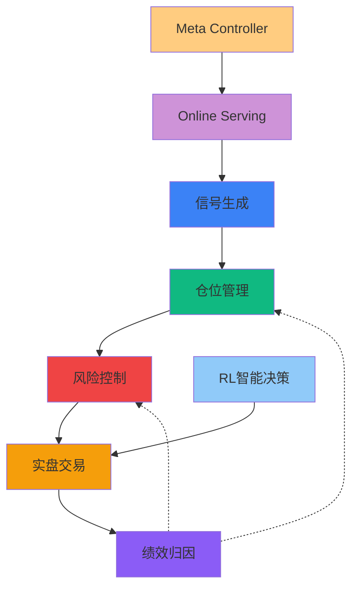

# Production阶段开发指南

> **对应章节**: [第4章 - Production阶段工作流](../../项目设计/MyQuant完整架构与工作流V3/04-Production阶段工作流.html)
> **更新日期**: 2026-02-10

---

## 🎯 阶段目标

**核心任务**: 实盘交易、仓位管理、绩效归因、风险控制

**生产流程**: 信号生成 → 仓位计算 → 风险检查 → 实盘交易 → 绩效分析

---

## 📦 核心模块

### 1. 仓位管理模块 📊

**模块定位**: 动态仓位分配与管理

**核心功能**:
- 策略信号接收
- 仓位计算（4种策略）
  - 等权重配置
  - 风险平价（Risk Parity）
  - 最小方差（Minimum Variance）
  - 最大分散化（Max Diversification）
- 再平衡触发
- 仓位调整执行

**API端点（3个）**:
- `POST /api/v1/production/position/calculate` - 计算目标仓位
- `POST /api/v1/production/position/rebalance` - 执行再平衡
- `GET /api/v1/production/position/allocation` - 查询当前配置

**数据模型**: 见 [仓位管理模块/数据模型.md](./仓位管理模块/数据模型.md)
**API设计**: 见 [仓位管理模块/API设计.md](./仓位管理模块/API设计.md)
**前端组件**: 见 [仓位管理模块/前端组件.md](./仓位管理模块/前端组件.md)
**实施记录**: 见 [实施记录.md](./仓位管理模块/实施记录.md) ⭐

**文档状态**: ✅ **已完成**（API设计+数据模型+前端组件）

---

### 2. 风险控制模块 🛡️

**模块定位**: 实盘风险管理与控制

**核心功能**:
- 实时风险监控
- 仓位限额检查
- 止损执行
- 风险指标计算
- 异常交易拦截

**API端点（3个）**:
- `POST /api/v1/production/risk/daily` - 日度风险归因
- `GET /api/v1/production/risk/trend` - 风险趋势分析
- `POST /api/v1/production/risk/check` - 实时风险检查

**数据模型**: 见 [风险控制模块/数据模型.md](./风险控制模块/数据模型.md)
**API设计**: 见 [风险控制模块/API设计.md](./风险控制模块/API设计.md)
**前端组件**: 见 [风险控制模块/前端组件.md](./风险控制模块/前端组件.md)
**实施记录**: 见 [实施记录.md](./风险控制模块/实施记录.md) ⭐

**文档状态**: ✅ **已完成**（API设计+数据模型+前端组件）

---

### 3. 实盘交易模块 💹

**模块定位**: 真实交易执行

**核心功能**:
- 交易信号执行
- 订单管理
- 持仓跟踪
- 交易记录

**API端点（4个）**:
- `POST /api/v1/production/trade/start` - 启动实盘交易
- `POST /api/v1/production/trade/stop` - 停止实盘交易
- `GET /api/v1/production/trade/status` - 查询交易状态
- `GET /api/v1/production/trade/positions` - 获取当前持仓

**数据模型**: 见 [实盘交易模块/数据模型.md](./实盘交易模块/数据模型.md)
**API设计**: 见 [实盘交易模块/API设计.md](./实盘交易模块/API设计.md)
**前端组件**: 见 [实盘交易模块/前端组件.md](./实盘交易模块/前端组件.md)
**实施记录**: 见 [实施记录.md](./实盘交易模块/实施记录.md) ⭐

**文档状态**: ✅ **已完成**（API设计+数据模型+前端组件）

---

## 🤖 QLib高级模块在Production阶段的应用

> **重要**: QLib三大高级模块是**跨阶段**的核心能力，实盘交易阶段依赖这些模块提供核心功能

### ML信号生成器 ⭐ P0/P1核心

**应用说明**: 将ML预测（0-1评分）转化为可执行的交易信号

**核心功能**:
1. **信号生成**
   - 将ML预测评分转换为交易信号
   - 信号强度分级（WEAK/NORMAL/STRONG）
   - 支持多种信号类型（买入、卖出、持有、观望）

2. **仓位管理**
   - 根据ML预测置信度动态调整仓位
   - 凯利公式变种
   - 风险控制（单股票最大20%）

3. **风险控制**
   - 评估ML预测组合的集中度风险
   - 检测预测分布异常
   - 基于预测置信度调整风险敞口

**文档状态**: 🟡 设计阶段完成（概述+API设计+数据模型+前端组件）

**优先级**: **P0/P1**（实盘交易核心功能）

---

### Online Serving - 在线模型管理 ⭐⭐ P0核心

**应用说明**: 这是QLib **Online Serving**模块在实盘交易中的核心应用，是实盘交易的基础设施

**核心功能**:
1. **实盘模型管理**
   - 模型部署、切换、退役
   - 模型版本管理
   - 性能监控

2. **实时预测服务**
   - 为交易系统提供实时预测
   - 增量更新预测
   - 预测缓存管理

3. **例行更新流程**
   - 每日/每周自动routine
   - 数据更新 → 任务准备 → 模型训练 → 模型切换 → 信号准备

4. **信号准备服务**
   - 为交易系统准备下一个交易周期的信号
   - 支持多种信号组合策略

**API设计**: 见 [API设计.md](./在线模型管理模块/API设计.md)
**实施记录**: 见 [实施记录.md](./在线模型管理模块/实施记录.md) ⭐

**文档状态**: ⚠️ **部分完成**（API设计）

**优先级**: **P0**（实盘交易必需）

---

### Meta Controller - 在线监控 ⭐ P1核心

**应用说明**: 这是QLib **Meta框架**在实盘交易中的应用，确保模型性能和自动切换

**核心功能**:
1. **模型性能监控**
   - 实时监控在线模型性能
   - 性能衰减检测
   - 异常告警

2. **自动模型切换**
   - 基于性能自动切换模型
   - 灰度发布（A/B测试）
   - 手动切换支持

3. **在线自适应**
   - 市场状态识别（牛市/熊市/震荡市）
   - 根据市场状态动态调整策略
   - 自动选择最优模型

4. **性能归因分析**
   - 分析模型表现优劣原因
   - 因子/行业/市值维度归因

**API设计**: 见 [API设计.md](./Meta%20Controller监控模块/API设计.md)
**实施记录**: 见 [实施记录.md](./Meta%20Controller监控模块/实施记录.md) ⭐

**文档状态**: ⚠️ **部分完成**（API设计）

**优先级**: **P1**（实盘交易重要功能）

---

### Reinforcement Learning - 智能决策 P2/P3

**应用说明**: 这是QLib **RL模块**在实盘交易中的应用，用于高级场景

**核心功能**:
1. **RL智能订单执行**（P3）
   - TWAP/VWAP订单拆分
   - 降低市场冲击
   - 减少滑点成本

2. **RL风险决策**（P2）
   - 动态止损
   - 智能仓位调整
   - 风险自适应

3. **RL仓位管理**（P2）
   - 动态仓位优化
   - 市场状态自适应

**详细文档**: 见[实盘交易模块/API设计.md](./实盘交易模块/API设计.md)中的RL智能订单执行章节

**优先级**: P2/P3（视资金规模和交易频率）

**适用场景**:
- 大额资金交易（RL订单执行）
- 高频交易（RL智能决策）
- 动态风险管理（RL风险决策）

---

### Nested Decision Execution - 嵌套决策执行 ⭐ P2/P3

**应用说明**: 这是QLib **Nested Decision Execution**模块在实盘交易中的核心应用，用于高频交易场景

**核心功能**:
1. **实时嵌套决策执行**
   - 多级别策略实时嵌套执行
   - 日频选股 + 日内择时 + 订单拆分
   - 考虑策略交互影响

2. **动态子策略调整**
   - 根据市场情况动态调整参数
   - 临时/永久调整
   - 预期影响评估

3. **执行监控**
   - 各级别子策略状态监控
   - 实时订单执行监控
   - 性能指标实时跟踪

4. **策略切换**（P3高级功能）
   - 渐进式/立即切换
   - A/B测试
   - 性能对比

**Trading Agent架构**:
- Information Extractor（信息提取器）
- Forecast Model（预测模型）
- Decision Generator（决策生成器）

**API端点（10个）**:
- `POST /api/v1/production/nested/execution/start` - 启动嵌套执行
- `DELETE /api/v1/production/nested/execution/stop/{execution_id}` - 停止嵌套执行
- `GET /api/v1/production/nested/execution/status/{execution_id}` - 获取执行状态
- `GET /api/v1/production/nested/monitor/status` - 获取各级子策略状态
- `POST /api/v1/production/nested/substrategy/adjust` - 动态调整子策略
- `POST /api/v1/production/nested/substrategy/switch` - 切换子策略
- `GET /api/v1/production/nested/performance/metrics` - 获取性能指标
- `GET /api/v1/production/nested/orders/pending` - 获取待执行订单
- `POST /api/v1/production/nested/orders/execute` - 手动触发订单执行
- `GET /api/v1/production/nested/logs/stream` - 获取实时日志流

**数据模型**: 见 [数据模型.md](./嵌套决策执行模块/数据模型.md)
**API设计**: 见 [API设计.md](./嵌套决策执行模块/API设计.md)
**前端组件**: 见 [前端组件.md](./嵌套决策执行模块/前端组件.md)
**实施记录**: 见 [实施记录.md](./嵌套决策执行模块/实施记录.md) ⭐

**文档状态**: ✅ **已完成**（深度理解+API设计+数据模型+前端组件）

**优先级**: P2/P3（高频交易场景）

**适用场景**:
- 高频交易（分钟级决策）
- 日内交易（需要盘中择时）
- 大额订单拆分（需要多层决策）
- 多策略组合（需要动态配置）

---

## 🔗 模块依赖关系

---

## 📈 开发优先级

### P0 - 核心功能
- ⏳ 仓位管理模块
- ⏳ 风险控制模块
- ⏳ 实盘交易模块

### P1 - 扩展功能
- ⏳ 绩效归因自动化
- ⏳ 实时风险预警

---

## 📚 相关文档

### 主文档
- [第4章 - Production阶段工作流](../../项目设计/MyQuant完整架构与工作流V3/04-Production阶段工作流.html)
- [第7章 - 完整API参考](../../项目设计/MyQuant完整架构与工作流V3/07-完整API参考.html)

### 风险管理
- [第6章 - 风险管理模块](../../项目设计/MyQuant完整架构与工作流V3/06-风险管理模块.html)
- 风险管理三层体系
- RL智能订单执行（P3优先级）

### 投资分析
- [第3章 - 投资分析系统](../../项目设计/MyQuant完整架构与工作流V3/03-Validation阶段工作流.html#投资分析系统)
- Brinson归因
- 风险归因

### QLib参考资料
- [QLib参考资料 - Portfolio Management](../../QLib参考资料/)
- [QLib参考资料 - Strategy](../../QLib参考资料/)

---

## ⚠️ 重要注意事项

### 生产环境要求
- ✅ 系统稳定性（99.9%可用性）
- ✅ 数据一致性保证
- ✅ 故障恢复机制
- ✅ 实时监控告警
- ✅ 完整的日志记录

### 交易安全
- ✅ 交易限额控制
- ✅ 多级风险检查
- ✅ 异常交易拦截
- ✅ 紧急停止机制

---

**维护说明**: 本指南基于V3文档生成，与主文档保持同步
**最后更新**: 2026-02-10
