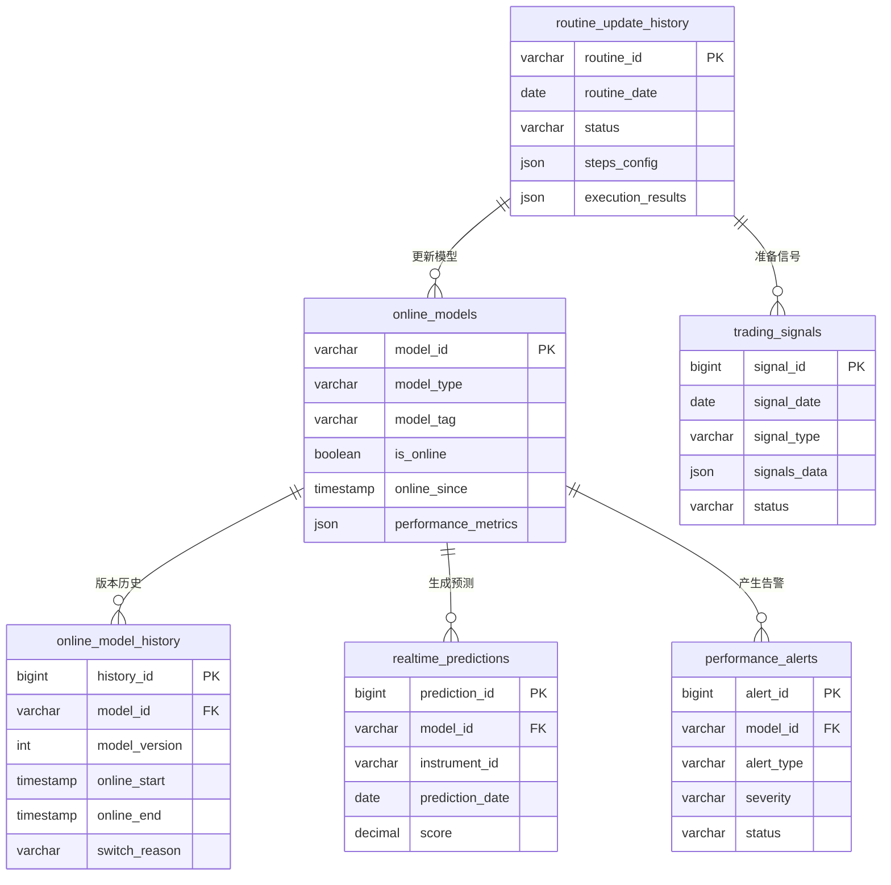

# 在线模型管理模块 - 数据模型（Production阶段）

> **阶段**: Production阶段
> **模块**: 在线模型管理
> **状态**: ✅ 文档完成
> **版本**: v1.0
> **最后更新**: 2026-02-11
> **优先级**: P0核心功能
> **核心价值**: 实盘模型管理、实时预测、自动更新
> **基于**: QLib Online Serving模块

---

## 📊 数据表结构

### 1. 在线模型表 (online_models)

存储当前在线模型的基本信息和状态。

```sql
CREATE TABLE online_models (
    -- 主键
    model_id VARCHAR(64) PRIMARY KEY COMMENT '模型ID，格式: model_XXX_vN',

    -- 模型基本信息
    model_type ENUM('lgb', 'xgboost', 'mlp', 'gmm', 'linear') NOT NULL COMMENT '模型类型',
    model_tag VARCHAR(32) NOT NULL DEFAULT 'online' COMMENT '模型标签: online/standby/retired',
    model_version INT NOT NULL COMMENT '模型版本号',

    -- 模型配置（JSON格式）
    model_config JSON COMMENT '模型配置参数',
    training_config JSON COMMENT '训练配置',

    -- 在线状态
    is_online BOOLEAN NOT NULL DEFAULT FALSE COMMENT '是否在线',
    online_since TIMESTAMP NULL COMMENT '上线时间',
    offline_since TIMESTAMP NULL COMMENT '下线时间',

    -- 性能指标
    performance_metrics JSON COMMENT '性能指标: ic, icir, rank_ic等',
    decay_trend ENUM('stable', 'decay', 'improving') COMMENT '性能趋势',

    -- 预测统计
    last_prediction_time TIMESTAMP NULL COMMENT '最后预测时间',
    total_predictions BIGINT DEFAULT 0 COMMENT '总预测次数',
    avg_prediction_time DECIMAL(6, 3) COMMENT '平均预测耗时(秒)',

    -- 元数据
    created_at TIMESTAMP NOT NULL DEFAULT CURRENT_TIMESTAMP COMMENT '创建时间',
    updated_at TIMESTAMP NOT NULL DEFAULT CURRENT_TIMESTAMP ON UPDATE CURRENT_TIMESTAMP COMMENT '更新时间',
    created_by VARCHAR(64) NOT NULL COMMENT '创建用户ID',

    -- 索引
    INDEX idx_model_tag (model_tag),
    INDEX idx_is_online (is_online),
    INDEX idx_online_since (online_since),
    INDEX idx_model_type (model_type)
) ENGINE=InnoDB DEFAULT CHARSET=utf8mb4 COMMENT='在线模型表';
```

**model_config字段结构**:
```json
{
  "loss": "mse",
  "col_sample": 0.8,
  "learning_rate": 0.01,
  "num_leaves": 31,
  "feature_cols": ["RSI", "MACD", "KDJ", ...],
  "early_stop_rounds": 100
}
```

**performance_metrics字段结构**:
```json
{
  "ic": 0.068,
  "icir": 0.85,
  "rank_ic": 0.072,
  "rank_icir": 0.82
}
```

---

### 2. 在线模型历史表 (online_model_history)

存储在线模型的版本历史和切换记录。

```sql
CREATE TABLE online_model_history (
    -- 主键
    history_id BIGINT AUTO_INCREMENT PRIMARY KEY,

    -- 模型信息
    model_id VARCHAR(64) NOT NULL COMMENT '模型ID',
    model_version INT NOT NULL COMMENT '模型版本号',

    -- 在线时间段
    online_start TIMESTAMP NOT NULL COMMENT '上线时间',
    online_end TIMESTAMP NULL COMMENT '下线时间',
    days_online INT COMMENT '在线天数',

    -- 性能记录
    performance_metrics JSON COMMENT '在线期间性能指标',
    prediction_stats JSON COMMENT '预测统计',

    -- 切换信息
    switched_from VARCHAR(64) COMMENT '从哪个模型切换而来',
    switched_to VARCHAR(64) COMMENT '切换到哪个模型',
    switch_reason ENUM('routine', 'decay', 'manual', 'ab_test') COMMENT '切换原因',
    switch_notes TEXT COMMENT '切换备注',

    -- 元数据
    created_at TIMESTAMP NOT NULL DEFAULT CURRENT_TIMESTAMP COMMENT '记录创建时间',

    -- 索引
    INDEX idx_model_id (model_id),
    INDEX idx_online_start (online_start),
    INDEX idx_switch_reason (switch_reason),
    UNIQUE KEY uk_model_version (model_id, model_version)
) ENGINE=InnoDB DEFAULT CHARSET=utf8mb4 COMMENT='在线模型历史表';
```

---

### 3. 实时预测表 (realtime_predictions)

存储在线模型的实时预测结果。

```sql
CREATE TABLE realtime_predictions (
    -- 主键
    prediction_id BIGINT AUTO_INCREMENT PRIMARY KEY,

    -- 预测信息
    model_id VARCHAR(64) NOT NULL COMMENT '预测使用的模型ID',
    instrument_id VARCHAR(16) NOT NULL COMMENT '股票代码',
    prediction_date DATE NOT NULL COMMENT '预测日期',
    prediction_time DATETIME NOT NULL COMMENT '预测时间',

    -- 预测结果
    score DECIMAL(10, 6) NOT NULL COMMENT '预测得分',

    -- 元数据
    created_at TIMESTAMP NOT NULL DEFAULT CURRENT_TIMESTAMP COMMENT '创建时间',

    -- 索引
    INDEX idx_model_date (model_id, prediction_date),
    INDEX idx_instrument_date (instrument_id, prediction_date),
    INDEX idx_prediction_time (prediction_time),
    UNIQUE KEY uk_model_instrument_date (model_id, instrument_id, prediction_date)
) ENGINE=InnoDB DEFAULT CHARSET=utf8mb4 COMMENT='实时预测表';
```

---

### 4. 例行更新历史表 (routine_update_history)

存储例行更新流程的执行历史。

```sql
CREATE TABLE routine_update_history (
    -- 主键
    routine_id VARCHAR(64) PRIMARY KEY COMMENT '例行更新ID，格式: routine_YYYYMMDD_XXX',

    -- 更新基本信息
    routine_date DATE NOT NULL COMMENT '更新日期',
    status ENUM('pending', 'running', 'completed', 'failed', 'partial') NOT NULL DEFAULT 'pending' COMMENT '更新状态',

    -- 更新配置（JSON格式）
    routine_config JSON COMMENT '例行更新配置',
    steps_config JSON COMMENT '步骤配置',

    -- 执行结果
    steps_completed JSON COMMENT '已完成的步骤列表',
    execution_results JSON COMMENT '执行结果详情',

    -- 性能信息
    started_at TIMESTAMP NULL COMMENT '开始时间',
    completed_at TIMESTAMP NULL COMMENT '完成时间',
    duration_seconds INT COMMENT '执行时长(秒)',

    -- 结果统计
    models_updated INT COMMENT '更新的模型数量',
    signals_prepared INT COMMENT '准备的信号数量',
    error_message TEXT COMMENT '错误信息',

    -- 元数据
    created_at TIMESTAMP NOT NULL DEFAULT CURRENT_TIMESTAMP COMMENT '创建时间',
    created_by VARCHAR(64) NOT NULL COMMENT '创建用户ID',

    -- 索引
    INDEX idx_routine_date (routine_date),
    INDEX idx_status (status),
    INDEX idx_started_at (started_at)
) ENGINE=InnoDB DEFAULT CHARSET=utf8mb4 COMMENT='例行更新历史表';
```

**routine_config字段结构**:
```json
{
  "cur_time": "2024-02-10",
  "task_kwargs": {
    "segments": ["2021-02-11", "2024-02-10"]
  },
  "model_kwargs": {
    "loss": "mse"
  },
  "signal_kwargs": {
    "prepare_func": "AverageEnsemble"
  }
}
```

**steps_config字段结构**:
```json
{
  "update_prediction": true,
  "prepare_tasks": true,
  "train_models": true,
  "prepare_online_models": true,
  "prepare_signals": true
}
```

---

### 5. 交易信号表 (trading_signals)

存储准备好的交易信号。

```sql
CREATE TABLE trading_signals (
    -- 主键
    signal_id BIGINT AUTO_INCREMENT PRIMARY KEY,

    -- 信号基本信息
    signal_date DATE NOT NULL COMMENT '信号日期',
    signal_type ENUM('topk', 'drop', 'weighted', 'ensemble') NOT NULL COMMENT '信号类型',
    prepare_func VARCHAR(64) NOT NULL COMMENT '准备函数',

    -- 信号配置（JSON格式）
    signal_config JSON COMMENT '信号配置: topk, n_drop等',

    -- 信号数据（JSON格式）
    signals_data JSON NOT NULL COMMENT '信号数据，包含股票列表和得分',

    -- 统计信息
    total_count INT COMMENT '总股票数',
    topk_count INT COMMENT 'Topk股票数',
    drop_count INT COMMENT 'Drop股票数',

    -- 状态信息
    status ENUM('pending', 'ready', 'used', 'expired') NOT NULL DEFAULT 'ready' COMMENT '信号状态',
    used_at TIMESTAMP NULL COMMENT '使用时间',

    -- 元数据
    prepared_at TIMESTAMP NOT NULL DEFAULT CURRENT_TIMESTAMP COMMENT '准备时间',
    prepared_by VARCHAR(64) COMMENT '准备者',

    -- 索引
    INDEX idx_signal_date (signal_date),
    INDEX idx_status (status),
    INDEX idx_prepared_at (prepared_at),
    UNIQUE KEY uk_signal_date_type (signal_date, signal_type)
) ENGINE=InnoDB DEFAULT CHARSET=utf8mb4 COMMENT='交易信号表';
```

**signals_data字段结构**:
```json
{
  "topk": [
    {"instrument": "000001.SZ", "score": 0.025},
    {"instrument": "600000.SH", "score": 0.038}
  ],
  "drop": [
    {"instrument": "000002.SZ", "score": -0.012}
  ],
  "predictions": {
    "000001.SZ": 0.025,
    "000002.SZ": -0.012,
    "600000.SH": 0.038
  }
}
```

---

### 6. 性能告警表 (performance_alerts)

存储模型性能衰减告警。

```sql
CREATE TABLE performance_alerts (
    -- 主键
    alert_id BIGINT AUTO_INCREMENT PRIMARY KEY,

    -- 告警基本信息
    model_id VARCHAR(64) NOT NULL COMMENT '模型ID',
    alert_type ENUM('decay', 'error', 'timeout', 'abnormal') NOT NULL COMMENT '告警类型',
    severity ENUM('info', 'warning', 'critical') NOT NULL COMMENT '严重程度',

    -- 告警详情
    alert_message TEXT NOT NULL COMMENT '告警消息',
    current_value DECIMAL(10, 6) COMMENT '当前值',
    threshold_value DECIMAL(10, 6) COMMENT '阈值',

    -- 告警处理
    status ENUM('open', 'acknowledged', 'resolved', 'ignored') NOT NULL DEFAULT 'open' COMMENT '告警状态',
    recommendation TEXT COMMENT '处理建议',
    action_taken TEXT COMMENT '采取的措施',

    -- 时间信息
    triggered_at TIMESTAMP NOT NULL DEFAULT CURRENT_TIMESTAMP COMMENT '触发时间',
    acknowledged_at TIMESTAMP NULL COMMENT '确认时间',
    resolved_at TIMESTAMP NULL COMMENT '解决时间',

    -- 元数据
    acknowledged_by VARCHAR(64) COMMENT '确认人',
    resolved_by VARCHAR(64) COMMENT '解决人',

    -- 索引
    INDEX idx_model_id (model_id),
    INDEX idx_alert_type (alert_type),
    INDEX idx_severity (severity),
    INDEX idx_status (status),
    INDEX idx_triggered_at (triggered_at)
) ENGINE=InnoDB DEFAULT CHARSET=utf8mb4 COMMENT='性能告警表';
```

---

## 🔗 数据关系图



---

## 📈 数据流设计

### 1. 例行更新流程数据流

```
[触发例行更新]
    ↓
[routine_update_history] (创建记录，状态: pending)
    ↓
[执行步骤]
    ├─ update_prediction → 更新 realtime_predictions
    ├─ prepare_tasks → 准备训练任务
    ├─ train_models → 训练新模型 → 插入 online_models
    ├─ prepare_online_models → 准备在线模型
    └─ prepare_signals → 插入 trading_signals
    ↓
[routine_update_history] (更新状态: completed，记录结果)
```

### 2. 模型切换数据流

```
[检测性能衰减]
    ↓
[performance_alerts] (创建告警)
    ↓
[online_model_history] (记录旧模型下线)
    ↓
[online_models] (更新: is_online=FALSE)
    ↓
[online_models] (新模型: is_online=TRUE)
    ↓
[online_model_history] (记录新模型上线)
```

### 3. 实时预测数据流

```
[交易系统请求预测]
    ↓
[online_models] (查询当前在线模型)
    ↓
[realtime_predictions] (查询/计算预测)
    ↓
[返回预测结果]
    ↓
[trading_signals] (准备交易信号)
```

---

## 🔧 索引设计说明

### 主要查询场景

1. **查询当前在线模型**
   - 索引: `idx_is_online`
   - WHERE is_online = TRUE

2. **查询模型历史**
   - 索引: `idx_model_id`, `idx_online_start`
   - WHERE model_id = ? ORDER BY online_start DESC

3. **查询实时预测**
   - 索引: `idx_model_date`, `idx_instrument_date`
   - WHERE model_id = ? AND prediction_date = ?

4. **查询例行更新历史**
   - 索引: `idx_routine_date`, `idx_status`
   - WHERE routine_date BETWEEN ? AND ?

5. **查询交易信号**
   - 索引: `idx_signal_date`, `idx_status`
   - WHERE signal_date = ? AND status = 'ready'

6. **查询性能告警**
   - 索引: `idx_model_id`, `idx_severity`, `idx_status`
   - WHERE model_id = ? AND status = 'open'

---

## 📝 数据生命周期管理

### 数据保留策略

| 表名 | 保留策略 | 归档方式 |
|------|---------|---------|
| online_models | 永久保留 | 不归档 |
| online_model_history | 永久保留 | 不归档 |
| realtime_predictions | 保留1年 | 归档到历史表 |
| routine_update_history | 保留2年 | 归档到历史表 |
| trading_signals | 保留1年 | 归档到历史表 |
| performance_alerts | 保留6个月 | 归档到历史表 |

### 清理策略

```sql
-- 每月清理过期预测数据
DELETE FROM realtime_predictions
WHERE prediction_date < DATE_SUB(CURRENT_DATE, INTERVAL 1 YEAR);

-- 每季度清理过期信号
DELETE FROM trading_signals
WHERE signal_date < DATE_SUB(CURRENT_DATE, INTERVAL 1 YEAR);

-- 每半年清理过期告警
DELETE FROM performance_alerts
WHERE triggered_at < TIMESTAMP_SUB(NOW(), INTERVAL 6 MONTH)
AND status IN ('resolved', 'ignored');
```

---

## 🔗 相关文档

- [API设计](./API设计.md) - API接口设计
- [前端组件](./前端组件.md) - 前端UI组件
- [实施记录](./实施记录.md) - 开发实施记录
- [Production阶段README](../README.md) - 阶段概述
- [QLib官方文档 - Online Serving](https://qlib.readthedocs.io/en/latest/component/online.html)

---

**最后更新**: 2026-02-11
