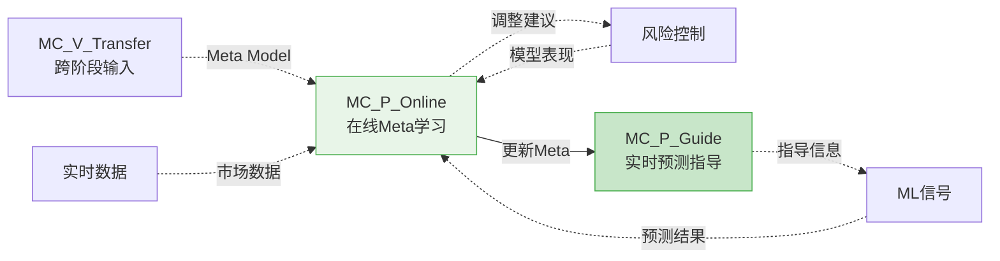
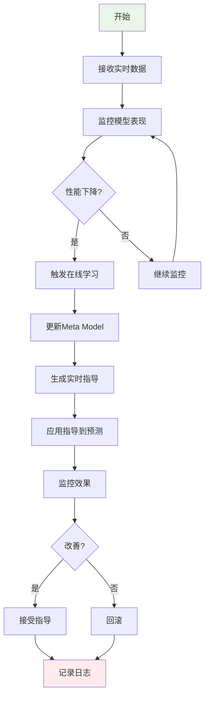

# Meta Controller - Production阶段节点

> **模块名称**: Meta Controller
> **阶段**: Production
> **节点类型**: 增强节点（可选）
> **优先级**: P1
> **最后更新**: 2026-02-23

---

## 🎯 节点概述

### 节点定义
```yaml
节点ID: MC_P_Online
节点名称: 在线Meta学习
所属模块: Meta Controller（元学习框架）
所属阶段: Production阶段
节点类型: 增强节点（可选）
优先级: P1
```

### 功能描述
在Production阶段持续更新Meta Model以适应市场变化，使用学到的模式实时指导预测模型，实现自适应调整。这是Meta Controller在实盘环境中的核心应用。

### 在工作流中的位置
在Production阶段工作流中：
- **连接风险控制模块**：从风险控制获取模型表现数据
- **连接ML信号模块**：为实时预测提供Meta指导
- **连接实盘交易模块**：根据市场状态动态调整

---

## 🔗 节点连接关系

### 输入连接

| 源节点 | 连接类型 | 传递内容 | 触发条件 |
|--------|----------|----------|----------|
| MC_V_Transfer（跨阶段） | 虚线 | 验证过的Meta Model | Validation阶段完成 |
| 风险控制 | 虚线 | 模型表现数据 | 定期检查 |
| 实时数据 | 虚线 | 市场数据 | 实时更新 |
| ML信号 | 虚线 | 预测结果 | 实时预测 |

### 输出连接

| 目标节点 | 连接类型 | 传递内容 | 触发条件 |
|---------|----------|----------|----------|
| MC_P_Guide | 实线 | 更新后的Meta Model | 定期更新 |
| ML信号 | 虚线 | 实时预测指导 | 需要指导 |
| 风险控制 | 虚线 | 自适应调整建议 | 检测到性能下降 |

### Mermaid连接图



---

## 📥 输入输出规范

### 输入数据格式

```python
# 实时模型表现输入
realtime_performance = {
    "model_id": "forecast_model_001",
    "timestamp": "2026-02-23T10:00:00",
    "recent_performance": {
        "last_hour_ic": [0.01, 0.02, -0.01, ...],
        "last_hour_sharpe": 1.2,
        "last_hour_drawdown": 0.05,
        "cumulative_return": 0.08
    },
    "market_state": {
        "regime": "volatile",
        "volatility": 0.25,
        "trend": "downward"
    }
}

# 实时市场数据输入
realtime_market = {
    "timestamp": "2026-02-23T10:00:00",
    "market_index": 3000,
    "market_change": -0.015,
    "volatility_index": 25,
    "sector_performance": {...}
}

# ML预测结果输入
ml_prediction = {
    "model_id": "forecast_model_001",
    "prediction_time": "2026-02-23T10:00:00",
    "predictions": {
        "stock_001": 0.05,
        "stock_002": -0.03,
        # ...
    },
    "confidence": 0.75
}
```

### 输出数据格式

```python
# 实时预测指导输出
online_guidance = {
    "guidance_id": "online_guidance_001",
    "timestamp": "2026-02-23T10:00:00",
    "target_model": "forecast_model_001",

    # 实时指导信息
    "realtime_guidance": {
        # 指导类型1: 模型切换建议
        "model_switch": {
            "recommended": "switch",
            "target_model": "forecast_model_002",
            "confidence": 0.88,
            "urgency": "high",
            "reason": "当前模型性能下降，建议切换"
        },

        # 指导类型2: 预测调整
        "prediction_adjustment": {
            "adjustment_factor": 0.9,
            "confidence": 0.75,
            "reason": "市场波动性增加，降低预测权重"
        },

        # 指导类型3: 风险控制建议
        "risk_control": {
            "position_size": 0.8,
            "stop_loss": 0.02,
            "confidence": 0.82,
            "reason": "根据市场状态调整仓位"
        }
    },

    # 元学习状态
    "meta_learning_status": {
        "last_update": "2026-02-23T09:00:00",
        "accuracy": 0.75,
        "adaptive_score": 0.80,
        "market_regime": "volatile"
    }
}
```

---

## ⚙️ 核心功能

### 功能列表

1. **在线Meta学习**: 持续更新Meta Model以适应市场变化
2. **实时预测指导**: 使用Meta Model指导实时预测
3. **自适应调整**: 根据学到的模式自动调整
4. **性能监控**: 监控Meta Model和预测模型的联合性能
5. **模型切换**: 根据Meta指导自动选择最佳模型

### 处理流程



### 关键算法/逻辑

```python
# 在线Meta学习核心逻辑
def online_meta_learning(current_meta_model, realtime_data):
    """
    在线Meta学习函数
    """
    # 1. 提取实时特征
    realtime_features = extract_realtime_features(realtime_data)

    # 2. 检测性能下降
    performance_drop = detect_performance_drop(realtime_data)
    if performance_drop > threshold:
        # 3. 增量更新Meta Model
        updated_model = incremental_meta_learning(
            current_meta_model,
            realtime_features
        )
        return updated_model
    else:
        return current_meta_model

# 实时预测指导核心逻辑
def realtime_guidance_generation(meta_model, prediction_data):
    """
    实时预测指导生成函数
    """
    # 1. 分析当前市场状态
    market_state = analyze_market_state(prediction_data)

    # 2. Meta Model推理
    guidance = meta_model.inference(market_state)

    # 3. 生成实时指导
    realtime_guidance = {
        "model_switch": should_switch_model(guidance, prediction_data),
        "prediction_adjustment": calculate_adjustment(guidance),
        "risk_control": generate_risk_control(guidance, prediction_data)
    }

    return realtime_guidance

# 自适应调整核心逻辑
def adaptive_adjustment(guidance, current_position):
    """
    自适应调整逻辑
    """
    adjustments = []

    # 根据指导信息调整
    if guidance["model_switch"]["recommended"] == "switch":
        adjustments.append({
            "type": "model_switch",
            "from": current_model,
            "to": guidance["model_switch"]["target_model"],
            "priority": "high"
        })

    if guidance["prediction_adjustment"]["adjustment_factor"] != 1.0:
        adjustments.append({
            "type": "prediction_scaling",
            "factor": guidance["prediction_adjustment"]["adjustment_factor"],
            "priority": "medium"
        })

    if guidance["risk_control"]["position_size"] != 1.0:
        adjustments.append({
            "type": "position_sizing",
            "size": guidance["risk_control"]["position_size"],
            "priority": "high"
        })

    return adjustments

# 性能监控核心逻辑
def performance_monitoring(meta_model, forecast_models):
    """
    性能监控函数
    """
    performance_metrics = {}

    for model in forecast_models:
        # 计算当前性能
        current_perf = calculate_model_performance(model)

        # 获取Meta指导后的预期性能
        expected_perf = meta_model.predict_performance(model)

        # 对比性能
        performance_metrics[model.id] = {
            "current": current_perf,
            "expected": expected_perf,
            "improvement": expected_perf - current_perf,
            "confidence": meta_model.get_confidence(model)
        }

        # 检测是否需要切换模型
        if should_switch_model(performance_metrics[model.id]):
            trigger_model_switch(model.id)

    return performance_metrics
```

---

## 🔧 技术实现

### 技术栈
- **语言**: Python
- **框架**: QLib Meta Controller, FastAPI
- **库**: qlib, numpy, pandas, asyncio（异步处理）

### API接口

#### 接口1: 实时Meta学习更新

```yaml
路径: /api/v1/production/meta/online-update
方法: POST
描述: 触发在线Meta学习，更新Meta Model
```

**请求参数**:
```json
{
    "meta_model_id": "meta_model_001",
    "update_data": {
        "recent_performance": {...},
        "market_state": {...}
    }
}
```

**响应格式**:
```json
{
    "code": 200,
    "message": "Meta Model更新成功",
    "data": {
        "model_version": "v1.1",
        "update_time": "2026-02-23T10:00:00",
        "performance_improvement": 0.05
    }
}
```

#### 接口2: 实时预测指导

```yaml
路径: /api/v1/production/meta/realtime-guidance
方法: POST
描述: 获取实时预测指导信息
```

**请求参数**:
```json
{
    "model_id": "forecast_model_001",
    "prediction_data": {...},
    "market_data": {...}
}
```

**响应格式**:
```json
{
    "code": 200,
    "message": "指导生成成功",
    "data": {
        "guidance_id": "online_guidance_001",
        "realtime_guidance": {...},
        "confidence": 0.85
    }
}
```

#### 接口3: 性能监控查询

```yaml
路径: /api/v1/production/meta/performance
方法: GET
描述: 查询Meta Model和预测模型的联合性能
```

### 数据存储

**存储路径**: `backend/data/meta_controller/online_learning/`

**存储格式**:
- Meta Model快照: pickle (.pkl)
- 学习历史: SQLite
- 实时指导日志: JSON Lines

**数据模型**:
```python
@dataclass
class OnlineMetaLearning:
    """在线Meta学习数据模型"""
    meta_model_id: str
    version: str
    last_update: datetime
    learning_samples: int
    performance_metrics: dict
    adaptation_history: List[dict]

@dataclass
class RealtimeGuidance:
    """实时指导数据模型"""
    guidance_id: str
    model_id: str
    guidance_type: str
    guidance_data: dict
    confidence: float
    applied: bool
    effectiveness: Optional[float] = None
```

---

## 📊 性能指标

### 关键指标

| 指标名称 | 目标值 | 当前值 | 备注 |
|---------|--------|--------|------|
| 在线学习延迟 | < 1s | - | 更新Meta Model |
| 实时指导延迟 | < 50ms | - | 生成指导信息 |
| 模型切换准确率 | > 75% | - | 切换建议的正确率 |
| 性能改善幅度 | > 5% | - | 应用指导后的提升 |

### 资源消耗

| 资源类型 | 预估消耗 | 峰值消耗 |
|---------|----------|----------|
| CPU | 2-4 cores | 8 cores |
| 内存 | 500MB | 2GB |
| 存储 | 100MB/day | 500MB/day |

---

## 🧪 测试验证

### 测试场景

1. **场景1: 在线学习更新**
   - 输入: 模拟实时数据流
   - 预期输出: Meta Model更新完成
   - 验证方法: 检查版本号和性能指标

2. **场景2: 实时指导生成**
   - 输入: 预测数据和市场数据
   - 预期输出: 实时指导信息
   - 验证方法: 检查指导类型和置信度

3. **场景3: 模型切换决策**
   - 输入: 模拟性能下降场景
   - 预期输出: 模型切换建议
   - 验证方法: 验证切换建议的合理性

### 测试用例

```python
def test_online_meta_learning():
    # Arrange
    meta_model = load_meta_model("meta_model_001")
    update_data = {
        "recent_performance": {
            "last_hour_ic": [0.01, 0.02, -0.01],
            "last_hour_sharpe": 1.2
        },
        "market_state": {"regime": "volatile"}
    }

    # Act
    updated_model = online_meta_learning(meta_model, update_data)

    # Assert
    assert updated_model.version > meta_model.version
    assert updated_model.performance_improvement > 0

def test_realtime_guidance():
    # Arrange
    prediction_data = {"predictions": {...}}
    market_data = {"market_state": "volatile"}

    # Act
    guidance = realtime_guidance_generation(
        meta_model,
        prediction_data,
        market_data
    )

    # Assert
    assert guidance["guidance_id"] is not None
    assert guidance["confidence"] > 0.5
    assert "realtime_guidance" in guidance
```

---

## 📝 开发状态

### 当前进度
- [x] 节点定义完成
- [ ] 接口设计完成
- [ ] 核心逻辑实现
- [ ] 单元测试完成
- [ ] 集成测试完成
- [ ] 文档更新完成

### 待办事项
- [ ] 实现在线Meta学习API
- [ ] 实现实时指导生成逻辑
- [ ] 实现性能监控功能
- [ ] 编写单元测试
- [ ] 性能测试和优化
- [ ] 实现回滚机制

### 已知问题
- 无

---

## 📚 相关文档

- [Meta Controller概述](./概述.md)
- [Meta Controller - Research阶段节点](./Research阶段节点.md)
- [Meta Controller - Validation阶段节点](./Validation阶段节点.md)
- [QLib官方文档 - Online Serving](https://qlib.readthedocs.io/en/latest/component/online.html)

---

## 🔄 版本历史

| 版本 | 日期 | 作者 | 变更说明 |
|------|------|------|----------|
| 1.0.0 | 2026-02-23 | Claude | 初始版本 |

---

**创建时间**: 2026-02-23
**最后更新**: 2026-02-23
**状态**: 规划中
**优先级**: P1（重要，实盘环境的Meta学习）
