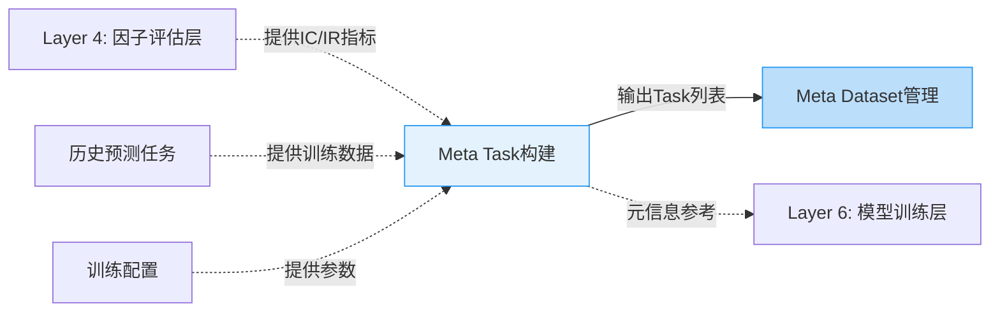
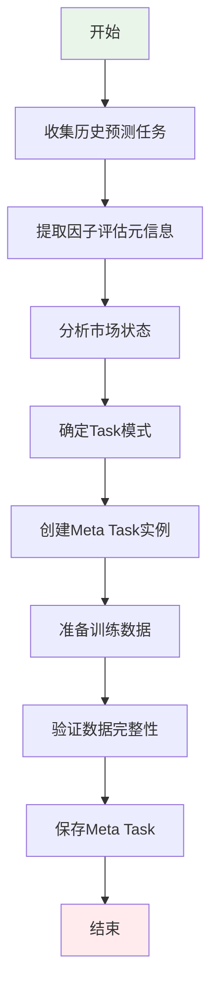

# Meta Controller - Research阶段节点

> **模块名称**: Meta Controller
> **阶段**: Research
> **节点类型**: 增强节点（可选）
> **优先级**: P2
> **最后更新**: 2026-02-23

---

## 🎯 节点概述

### 节点定义
```yaml
节点ID: MC_R_MetaTask
节点名称: Meta Task构建
所属模块: Meta Controller（元学习框架）
所属阶段: Research阶段
节点类型: 增强节点（可选）
优先级: P2
```

### 功能描述
创建元学习任务实例，封装训练数据和元信息，为Meta Model训练提供数据基础。这是元学习框架的起点，将历史预测任务经验打包成可学习的格式。

### 在工作流中的位置
在Research阶段七层架构中：
- **连接Layer 4（因子评估层）**：从因子评估结果获取元信息（IC、IR指标等）
- **连接Layer 6（模型训练层）**：为Meta Model训练提供历史任务数据
- **连接Layer 8（初步验证层）**：验证Meta Model指导效果

---

## 🔗 节点连接关系

### 输入连接

| 源节点 | 连接类型 | 传递内容 | 触发条件 |
|--------|----------|----------|----------|
| Layer 4: 因子评估层 | 虚线 | 因子评估结果（IC、IR） | 因子评估完成 |
| 历史预测任务数据 | 虚线 | 历史训练数据和结果 | 有历史任务记录 |
| 模型训练配置 | 虚线 | 训练参数和配置 | 配置完成 |

### 输出连接

| 目标节点 | 连接类型 | 传递内容 | 触发条件 |
|---------|----------|----------|----------|
| MC_R_MetaDataset | 实线 | Meta Task实例列表 | Meta Task创建完成 |
| Layer 6: 模型训练层 | 虚线 | 元信息参考 | 需要时查询 |

### Mermaid连接图



---

## 📥 输入输出规范

### 输入数据格式

```python
# 因子评估结果输入
factor_evaluation_input = {
    "factors": ["factor1", "factor2", ...],
    "ic_values": [0.03, 0.05, ...],
    "ir_values": [0.5, 0.8, ...],
    "evaluation_time": "2026-02-23"
}

# 历史任务输入
history_task_input = {
    "task_id": "task_20260101",
    "train_start": "2020-01-01",
    "train_end": "2023-12-31",
    "model_type": "LightGBM",
    "features": ["feature1", "feature2"],
    "performance": {
        "ic": 0.05,
        "ir": 0.8,
        "sharpe": 2.5
    }
}
```

### 输出数据格式

```python
# Meta Task输出
meta_task_output = {
    "task_id": "meta_task_001",
    "mode": "full",  # full/test/transfer
    "base_task": {
        "dataset": "csi300",
        "segments": {"train": ("2020", "2022"), "test": ("2023", "2023")}
    },
    "meta_info": {
        "ic_history": [0.03, 0.05, ...],
        "ir_history": [0.5, 0.8, ...],
        "market_state": "bull",  # bull/bear/volatile
        "volatility": 0.15
    },
    "prepared_data": {
        "X_train": "numpy array",
        "y_train": "numpy array",
        "X_test": "numpy array",
        "y_test": "numpy array"
    }
}
```

---

## ⚙️ 核心功能

### 功能列表

1. **Meta Task创建**: 根据历史预测任务创建Meta Task实例
2. **元信息提取**: 从因子评估结果中提取元信息（IC、IR、市场状态等）
3. **数据准备**: 使用`prepare_task_data()`准备Meta Model输入数据
4. **模式管理**: 支持full/test/transfer三种模式
5. **任务封装**: 将任务数据、元信息、配置封装成统一格式

### 处理流程



### 关键算法/逻辑

```python
# Meta Task创建核心逻辑
def create_meta_task(base_task, meta_info, mode="full"):
    """
    创建Meta Task实例

    Args:
        base_task: 基础预测任务配置
        meta_info: 元信息（IC、IR、市场状态等）
        mode: 任务模式（full/test/transfer）

    Returns:
        Meta Task实例
    """
    task = MetaTask(
        task=base_task,
        meta_info=meta_info,
        mode=mode
    )

    # 根据模式处理数据
    if mode == "full":
        # 训练模式：需要完整的训练和测试数据
        task.prepare_task_data()
    elif mode == "test":
        # 测试模式：只需要测试数据
        task.prepare_task_data()
    elif mode == "transfer":
        # 迁移模式：只需要元信息
        task.prepare_meta_info_only()

    return task

# 元信息提取逻辑
def extract_meta_info(factor_evaluation, market_data):
    """
    从因子评估和市场数据中提取元信息
    """
    meta_info = {
        # IC统计信息
        "ic_mean": np.mean(factor_evaluation["ic_values"]),
        "ic_std": np.std(factor_evaluation["ic_values"]),
        "ic_max": np.max(factor_evaluation["ic_values"]),
        "ic_min": np.min(factor_evaluation["ic_values"]),

        # IR统计信息
        "ir_mean": np.mean(factor_evaluation["ir_values"]),
        "ir_std": np.std(factor_evaluation["ir_values"]),

        # 市场状态
        "market_state": classify_market_state(market_data),
        "volatility": calculate_volatility(market_data),
        "trend": calculate_trend(market_data),

        # 时间信息
        "evaluation_time": factor_evaluation["evaluation_time"],
        "time_span": calculate_time_span(factor_evaluation)
    }

    return meta_info
```

---

## 🔧 技术实现

### 技术栈
- **语言**: Python
- **框架**: QLib Meta Controller
- **库**: qlib, numpy, pandas

### API接口

#### 接口1: 创建Meta Task

```yaml
路径: /api/v1/research/meta/task/create
方法: POST
描述: 创建Meta Task实例
```

**请求参数**:
```json
{
    "base_task": {
        "dataset": "csi300",
        "segments": {
            "train": ["2020-01-01", "2022-12-31"],
            "test": ["2023-01-01", "2023-12-31"]
        }
    },
    "meta_info": {
        "ic_mean": 0.05,
        "ir_mean": 0.8,
        "market_state": "bull"
    },
    "mode": "full"
}
```

**响应格式**:
```json
{
    "code": 200,
    "message": "Meta Task创建成功",
    "data": {
        "task_id": "meta_task_001",
        "meta_info": {...},
        "prepared_data": {...}
    }
}
```

#### 接口2: 批量创建Meta Tasks

```yaml
路径: /api/v1/research/meta/task/batch
方法: POST
描述: 批量创建多个Meta Task实例
```

**请求参数**:
```json
{
    "tasks": [
        {
            "base_task": {...},
            "meta_info": {...},
            "mode": "full"
        },
        ...
    ]
}
```

#### 接口3: 查询Meta Task

```yaml
路径: /api/v1/research/meta/task/{task_id}
方法: GET
描述: 查询Meta Task详情
```

### 数据存储

**存储路径**: `backend/data/meta_controller/meta_tasks/`

**存储格式**: pickle (.pkl)

**数据模型**:
```python
@dataclass
class MetaTask:
    """Meta Task数据模型"""
    task_id: str
    base_task: dict
    meta_info: dict
    mode: str  # full/test/transfer
    created_at: datetime
    prepared_data: Optional[dict] = None

    def prepare_task_data(self) -> dict:
        """准备Meta Model输入数据"""
        # 实现数据准备逻辑
        pass

    def get_meta_input(self) -> object:
        """返回处理后的元信息"""
        # 实现元信息获取逻辑
        pass
```

---

## 📊 性能指标

### 关键指标

| 指标名称 | 目标值 | 当前值 | 备注 |
|---------|--------|--------|------|
| Task创建速度 | > 100 tasks/s | - | 批量创建场景 |
| 元信息提取延迟 | < 50ms | - | 单个任务 |
| 数据准备时间 | < 1s | - | 单个任务 |
| 存储空间 | < 10MB/task | - | 包含数据 |

### 资源消耗

| 资源类型 | 预估消耗 | 峰值消耗 |
|---------|----------|----------|
| CPU | 1-2 cores | 4 cores |
| 内存 | 500MB | 2GB |
| 存储 | 10MB/task | 50MB/task |

---

## 🧪 测试验证

### 测试场景

1. **场景1: 创建单个Meta Task**
   - 输入: 标准base_task和meta_info
   - 预期输出: 成功创建Meta Task实例
   - 验证方法: 检查task_id和prepared_data

2. **场景2: 批量创建Meta Tasks**
   - 输入: 100个任务的列表
   - 预期输出: 100个Meta Task实例
   - 验证方法: 检查数量和完整性

3. **场景3: 不同模式的数据准备**
   - 输入: full/test/transfer三种模式
   - 预期输出: 不同模式的正确数据格式
   - 验证方法: 检查prepared_data结构

### 测试用例

```python
def test_create_meta_task():
    # Arrange
    base_task = {
        "dataset": "csi300",
        "segments": {"train": ("2020", "2022")}
    }
    meta_info = {"ic_mean": 0.05}

    # Act
    task = create_meta_task(base_task, meta_info, mode="full")

    # Assert
    assert task.task_id is not None
    assert task.mode == "full"
    assert task.meta_info == meta_info
    assert task.prepared_data is not None

def test_batch_create_meta_tasks():
    # Arrange
    tasks = [
        {"base_task": {...}, "meta_info": {...}}
        for _ in range(100)
    ]

    # Act
    results = batch_create_meta_tasks(tasks)

    # Assert
    assert len(results) == 100
    assert all(r["code"] == 200 for r in results)
```

---

## 📝 开发状态

### 当前进度
- [x] 节点定义完成
- [ ] 接口设计完成
- [ ] 核心逻辑实现
- [ ] 单元测试完成
- [ ] 集成测试完成
- [ ] 文档更新完成

### 待办事项
- [ ] 实现Meta Task创建API
- [ ] 实现元信息提取逻辑
- [ ] 实现数据准备功能
- [ ] 编写单元测试
- [ ] 性能测试和优化

### 已知问题
- 无

---

## 📚 相关文档

- [Meta Controller概述](./概述.md)
- [Meta Controller - Validation阶段节点](./Validation阶段节点.md)
- [Meta Controller - Production阶段节点](./Production阶段节点.md)
- [QLib官方文档 - Meta Task](https://qlib.readthedocs.io/en/latest/component/meta.html#meta-task)

---

## 🔄 版本历史

| 版本 | 日期 | 作者 | 变更说明 |
|------|------|------|----------|
| 1.0.0 | 2026-02-23 | Claude | 初始版本 |

---

**创建时间**: 2026-02-23
**最后更新**: 2026-02-23
**状态**: 规划中
**优先级**: P2（可选，适应市场动态变化）
