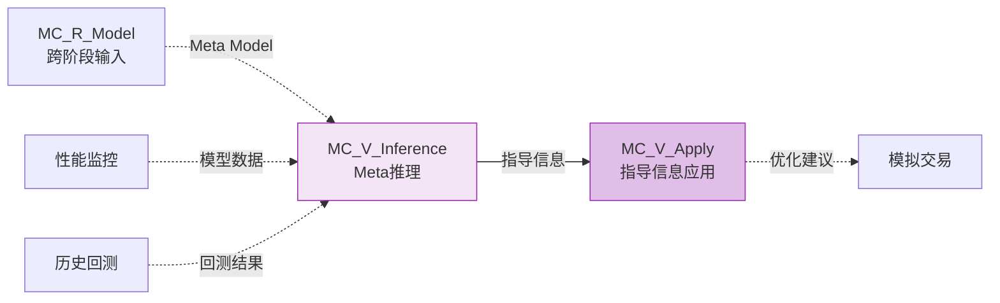
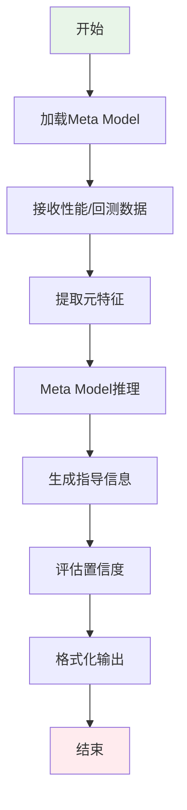

# Meta Controller - Validation阶段节点

> **模块名称**: Meta Controller
> **阶段**: Validation
> **节点类型**: 增强节点（可选）
> **优先级**: P2
> **最后更新**: 2026-02-23

---

## 🎯 节点概述

### 节点定义
```yaml
节点ID: MC_V_Inference
节点名称: Meta Model推理
所属模块: Meta Controller（元学习框架）
所属阶段: Validation阶段
节点类型: 增强节点（可选）
优先级: P2
```

### 功能描述
使用在Research阶段训练好的Meta Model对Validation阶段的预测模型进行推理，生成指导信息。这是验证Meta Controller元学习效果的关键环节。

### 在工作流中的位置
在Validation阶段工作流中：
- **连接性能监控模块**：从性能监控获取模型表现数据
- **连接模拟交易模块**：为模拟盘提供Meta指导信息
- **连接历史回测模块**：为回测提供优化建议

---

## 🔗 节点连接关系

### 输入连接

| 源节点 | 连接类型 | 传递内容 | 触发条件 |
|--------|----------|----------|----------|
| MC_R_Model（跨阶段） | 虚线 | 训练好的Meta Model | Research阶段完成 |
| 性能监控 | 虚线 | 模型表现数据 | 需要优化指导 |
| 历史回测 | 虚线 | 回测结果 | 回测完成 |

### 输出连接

| 目标节点 | 连接类型 | 传递内容 | 触发条件 |
|---------|----------|----------|----------|
| MC_V_Apply | 实线 | Meta指导信息 | 推理完成 |
| 模拟交易 | 虚线 | 优化建议 | 需要指导 |

### Mermaid连接图



---

## 📥 输入输出规范

### 输入数据格式

```python
# Meta Model输入（来自Research阶段）
meta_model_input = {
    "model_id": "meta_model_001",
    "model_type": "DDG-DA",  # 或其他Meta Model类型
    "training_tasks": [...],  # 训练任务历史
    "model_state": {...}     # 模型状态和参数
}

# 性能监控数据输入
performance_input = {
    "model_id": "forecast_model_001",
    "ic_values": [0.02, 0.03, 0.01, ...],
    "sharpe_ratio": 1.8,
    "max_drawdown": 0.15,
    "win_rate": 0.55
}

# 回测结果输入
backtest_input = {
    "backtest_id": "bt_001",
    "return": 0.12,
    "volatility": 0.18,
    "sharpe": 1.5,
    "trades": 150
}
```

### 输出数据格式

```python
# Meta指导信息输出
guidance_output = {
    "guidance_id": "guidance_001",
    "timestamp": "2026-02-23T10:00:00",
    "target_model": "forecast_model_001",

    # 指导类型1: 模型选择建议
    "model_guidance": {
        "action": "switch_model",
        "suggested_model": "LightGBM",
        "confidence": 0.85,
        "reason": "当前市场状态适合LightGBM"
    },

    # 指导类型2: 训练参数建议
    "training_guidance": {
        "action": "adjust_params",
        "suggested_params": {
            "learning_rate": 0.01,
            "num_rounds": 500
        },
        "confidence": 0.75
    },

    # 指导类型3: 数据选择建议
    "data_guidance": {
        "action": "adjust_data_range",
        "suggested_range": ["2023-01-01", "2023-12-31"],
        "confidence": 0.90
    },

    # 元学习解释
    "explanation": {
        "market_regime": "volatile",
        "historical_patterns": [...],
        "meta_features": {...}
    }
}
```

---

## ⚙️ 核心功能

### 功能列表

1. **Meta Model推理**: 使用训练好的Meta Model进行推理
2. **指导信息生成**: 根据推理结果生成具体的指导建议
3. **置信度评估**: 评估指导信息的置信度
4. **多模型支持**: 支持多种Meta Model类型（DDG-DA等）
5. **批量推理**: 支持对多个模型进行批量推理

### 处理流程



### 关键算法/逻辑

```python
# Meta Model推理核心逻辑
def meta_inference(meta_model, input_data):
    """
    Meta Model推理函数

    Args:
        meta_model: 训练好的Meta Model
        input_data: 输入数据（性能监控或回测结果）

    Returns:
        指导信息
    """
    # 1. 提取元特征
    meta_features = extract_meta_features(input_data)

    # 2. Meta Model推理
    guidance = meta_model.inference(meta_features)

    # 3. 生成具体建议
    recommendations = generate_recommendations(
        guidance,
        input_data,
        meta_model
    )

    # 4. 评估置信度
    confidence = calculate_confidence(
        guidance,
        meta_features,
        historical_performance
    )

    return {
        "guidance_id": generate_guidance_id(),
        "recommendations": recommendations,
        "confidence": confidence,
        "explanation": explain_guidance(guidance, meta_features)
    }

# 元特征提取逻辑
def extract_meta_features(input_data):
    """
    从输入数据中提取元特征
    """
    features = {
        # 性能特征
        "performance": {
            "ic_mean": np.mean(input_data.get("ic_values", [])),
            "sharpe_ratio": input_data.get("sharpe_ratio", 0),
            "max_drawdown": input_data.get("max_drawdown", 0),
            "win_rate": input_data.get("win_rate", 0.5)
        },

        # 市场状态特征
        "market_state": classify_market_state(input_data),

        # 时间特征
        "temporal": {
            "month": datetime.now().month,
            "day_of_week": datetime.now().weekday(),
            "quarter": (datetime.now().month - 1) // 3 + 1
        },

        # 波动性特征
        "volatility": calculate_volatility_features(input_data)
    }

    return features

# 指导信息生成逻辑
def generate_recommendations(guidance, input_data, meta_model):
    """
    根据Meta Model推理结果生成具体建议
    """
    recommendations = []

    # 解析guidance类型
    guidance_type = guidance["type"]

    if guidance_type == "model_selection":
        # 模型选择建议
        recommendations.append({
            "action": "switch_model",
            "suggested_model": guidance["model"],
            "reason": guidance["explanation"]
        })

    elif guidance_type == "parameter_tuning":
        # 参数调整建议
        recommendations.append({
            "action": "adjust_params",
            "params": guidance["params"],
            "reason": guidance["explanation"]
        })

    elif guidance_type == "data_adjustment":
        # 数据调整建议
        recommendations.append({
            "action": "adjust_data",
            "data_range": guidance["range"],
            "reason": guidance["explanation"]
        })

    return recommendations
```

---

## 🔧 技术实现

### 技术栈
- **语言**: Python
- **框架**: QLib Meta Controller
- **库**: qlib, numpy, pandas, scikit-learn

### API接口

#### 接口1: Meta Model推理

```yaml
路径: /api/v1/validation/meta/inference
方法: POST
描述: 使用Meta Model进行推理，生成指导信息
```

**请求参数**:
```json
{
    "meta_model_id": "meta_model_001",
    "target_model_id": "forecast_model_001",
    "input_data": {
        "performance": {...},
        "backtest": {...}
    }
}
```

**响应格式**:
```json
{
    "code": 200,
    "message": "推理成功",
    "data": {
        "guidance_id": "guidance_001",
        "recommendations": [...],
        "confidence": 0.85,
        "explanation": {...}
    }
}
```

#### 接口2: 批量推理

```yaml
路径: /api/v1/validation/meta/batch-inference
方法: POST
描述: 对多个模型进行批量Meta推理
```

#### 接口3: 查询推理历史

```yaml
路径: /api/v1/validation/meta/inference/history
方法: GET
描述: 查询Meta推理历史记录
```

### 数据存储

**存储路径**: `backend/data/meta_controller/inference_results/`

**存储格式**: pickle (.pkl)

**数据模型**:
```python
@dataclass
class MetaInferenceResult:
    """Meta推理结果数据模型"""
    guidance_id: str
    meta_model_id: str
    target_model_id: str
    inference_time: datetime
    guidance_type: str
    recommendations: dict
    confidence: float
    explanation: dict
    applied: bool = False  # 是否应用了指导
    effectiveness: Optional[float] = None  # 应用后的效果
```

---

## 📊 性能指标

### 关键指标

| 指标名称 | 目标值 | 当前值 | 备注 |
|---------|--------|--------|------|
| 推理延迟 | < 100ms | - | 单次推理 |
| 批量推理吞吐 | > 100 models/s | - | 批量场景 |
| 指导准确率 | > 70% | - | 指导有效性 |
| 置信度校准 | Brier Score < 0.25 | - | 概率校准 |

### 资源消耗

| 资源类型 | 预估消耗 | 峰值消耗 |
|---------|----------|----------|
| CPU | 1-2 cores | 4 cores |
| 内存 | 200MB | 1GB |
| 存储 | 5MB/result | 20MB/result |

---

## 🧪 测试验证

### 测试场景

1. **场景1: 单模型推理**
   - 输入: 单个模型性能数据
   - 预期输出: 指导信息+置信度
   - 验证方法: 检查输出格式和置信度合理性

2. **场景2: 批量推理**
   - 输入: 10个模型的批量请求
   - 预期输出: 10个指导信息
   - 验证方法: 检查数量和一致性

3. **场景3: 指导效果验证**
   - 输入: 应用指导前后的模型数据
   - 预期输出: 性能改善指标
   - 验证方法: 对比前后性能

### 测试用例

```python
def test_meta_inference():
    # Arrange
    meta_model = load_meta_model("meta_model_001")
    input_data = {
        "performance": {
            "ic_values": [0.02, 0.03, 0.01],
            "sharpe_ratio": 1.8
        }
    }

    # Act
    result = meta_inference(meta_model, input_data)

    # Assert
    assert result["guidance_id"] is not None
    assert result["confidence"] > 0.5
    assert len(result["recommendations"]) > 0
```

---

## 📝 开发状态

### 当前进度
- [x] 节点定义完成
- [ ] 接口设计完成
- [ ] 核心逻辑实现
- [ ] 单元测试完成
- [ ] 集成测试完成
- [ ] 文档更新完成

### 待办事项
- [ ] 实现Meta Model推理API
- [ ] 实现指导信息生成逻辑
- [ ] 实现置信度评估
- [ ] 编写单元测试
- [ ] 性能测试和优化

### 已知问题
- 无

---

## 📚 相关文档

- [Meta Controller概述](./概述.md)
- [Meta Controller - Research阶段节点](./Research阶段节点.md)
- [Meta Controller - Production阶段节点](./Production阶段节点.md)
- [QLib官方文档 - Meta Model](https://qlib.readthedocs.io/en/latest/component/meta.html#meta-model)

---

## 🔄 版本历史

| 版本 | 日期 | 作者 | 变更说明 |
|------|------|------|----------|
| 1.0.0 | 2026-02-23 | Claude | 初始版本 |

---

**创建时间**: 2026-02-23
**最后更新**: 2026-02-23
**状态**: 规划中
**优先级**: P2（可选，验证Meta学习效果）
