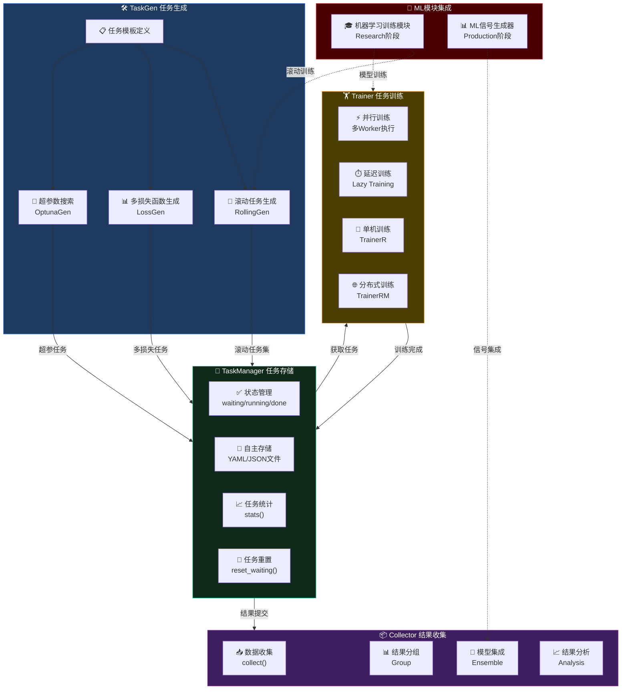

# Task任务管理模块概述

> **模块类型**: 跨阶段核心任务管理引擎
> **QLib组件**: Task Management
> **最后更新**: 2026-02-13

---

## 🎯 模块定位

### 核心价值
**自动生成、存储、训练和收集ML任务，支持滚动训练和多模型对比**

```
┌─────────────────────────────────────────────────────────────────┐
│                    QLib Task Management                              │
├─────────────────────────────────────────────────────────────────┤
│  • 任务生成 (TaskGen): 滚动任务、多损失函数任务                  │
│  • 任务存储 (TaskManager): 自主存储(YAML/JSON)、生命周期管理   │
│  • 任务训练 (Trainer): 并行训练、延迟训练                       │
│  • 任务收集 (Collector): 结果汇总、分组、集成                   │
└─────────────────────────────────────────────────────────────────┘
```

### Workflow vs Task Management

| 组件 | 职责 |
|------|------|
| **Workflow** | 单次执行整个流水线（qrun） |
| **Task Management** | 批量管理多个任务（滚动训练、多模型对比） |

---

## 📊 完整任务流程

### Mermaid流程图 - 三阶段任务管理



### 流程说明

| 阶段 | 组件 | 功能 |
|------|------|------|
| **TaskGen** | 任务生成 | 基于模板生成滚动任务、多损失函数任务、超参搜索任务 |
| **TaskManager** | 任务存储 | 自主存储(YAML/JSON)、状态管理、生命周期管理 |
| **Trainer** | 任务训练 | 并行训练、延迟训练、分布式训练 |
| **Collector** | 结果收集 | 数据收集、结果分组、模型集成 |

### ASCII流程图

```
┌─────────────────────────────────────────────────────────────────┐
│                      完整任务流程                                    │
├─────────────────────────────────────────────────────────────────┤
│                                                                 │
│   ┌──────────┐    ┌──────────┐    ┌──────────┐               │
│   │  Task    │───▶│  Task    │───▶│  Task    │               │
│   │ Generating│    │ Storing  │    │ Training │               │
│   └──────────┘    └──────────┘    └──────────┘               │
│        │                 │                 │                     │
│        ▼                 ▼                 ▼                     │
│   滚动任务集           自主存储         分布式训练                │
│   多损失函数           (YAML/JSON)      并行执行                  │
│                                                                 │
│                        ┌──────────┐                             │
│                        │  Task    │                             │
│                        │ Collecting│                             │
│                        └──────────┘                             │
│                             │                                   │
│                             ▼                                   │
│                        结果汇总                                  │
│                        分组/集成                                 │
│                                                                 │
└─────────────────────────────────────────────────────────────────┘
```

---

## 🏗️ 核心组件

### 1. TaskGen - 任务生成

**功能**: 基于模板生成不同配置的任务

**基类**:
```python
class TaskGen:
    """任务生成器基类"""

    def generate(task: dict) -> List[dict]:
        """
        基于任务模板生成不同任务

        Args:
            task: 任务模板

        Returns:
            生成的任务列表
        """
```

**示例1: 滚动任务生成**
```python
# 输入: 特定任务模板 + 滚动步长
# 输出: 不同时间段的滚动任务集

RollingGen(
    task_template=task,
    roll_step=[("2015-01-01", "2016-01-01"),
               ("2016-01-01", "2017-01-01")]
)
```

**示例2: 多损失函数任务**
```python
# 输入: 特定任务模板 + 损失函数列表
# 输出: 不同损失函数的任务集

LossGen(
    task_template=task,
    losses=["mse", "mae", "binary_crossentropy"]
)
```

---

### 2. TaskManager - 任务存储

**功能**: SQLite自主存储任务和生命周期管理（不依赖MongoDB）

#### 2.1 存储结构设计

```
./task_storage/
├── rolling_exp.db              # SQLite数据库文件
├── multi_model_exp.db         # 另一个任务池
└── index.json                 # 任务池索引
```

#### 2.2 任务数据结构

#### 2.2 SQLite表结构设计

**tasks表**:
```sql
CREATE TABLE tasks (
    id TEXT PRIMARY KEY,
    status TEXT DEFAULT 'waiting',
    config TEXT,           -- JSON格式的任务配置
    created_at TEXT,
    started_at TEXT,
    completed_at TEXT
)
```

**results表**:
```sql
CREATE TABLE results (
    task_id TEXT PRIMARY KEY,
    result TEXT,           -- JSON格式的训练结果
    completed_at TEXT,
    FOREIGN KEY (task_id) REFERENCES tasks(id)
)
```

**metadata表**:
```sql
CREATE TABLE metadata (
    key TEXT PRIMARY KEY,
    value TEXT
)
```

**示例数据**:
```json
// tasks表示例
{
    "id": "task_001",
    "status": "running",
    "config": {
        "model": {"class": "LGBModel", "kwargs": {"loss": "mse"}},
        "dataset": {"handler": "Alpha158"}
    },
    "created_at": "2026-02-13T10:30:00Z",
    "started_at": "2026-02-13T10:31:00Z",
    "completed_at": null
}

// results表示例
{
    "task_id": "task_001",
    "result": {
        "ic": 0.032,
        "rank_ic": 0.041,
        "model_path": "./models/task_001/model.pkl"
    },
    "completed_at": "2026-02-13T10:35:00Z"
}
```

#### 2.3 任务状态常量

```python
# 任务状态定义
STATUS_WAITING = "waiting"      # 等待训练
STATUS_RUNNING = "running"      # 训练中
STATUS_PART_DONE = "part_done"  # 部分完成
STATUS_DONE = "done"            # 全部完成
STATUS_FAILED = "failed"        # 训练失败
```

#### 2.4 完整实现代码

```python
"""
TaskManager - SQLite自主存储任务管理器

替代QLib官方的MongoDB实现，使用SQLite数据库存储
优点：高性能、并发支持、无单文件大小限制
"""

import json
import sqlite3
import threading
import uuid
from pathlib import Path
from datetime import datetime
from typing import Dict, List, Optional, Any
from threading import Lock


class TaskManager:
    """
    基于SQLite的自主存储任务管理器

    存储位置: ./task_storage/{pool_name}.db
    - tasks表: 任务定义和状态
    - results表: 任务结果
    - metadata表: 任务池元信息
    """

    def __init__(self, storage_path: str = "./task_storage", pool: str = "default"):
        """
        初始化任务管理器

        Args:
            storage_path: 存储根目录
            pool: 任务池名称
        """
        self.storage_path = Path(storage_path)
        self.storage_path.mkdir(parents=True, exist_ok=True)
        self.pool_name = pool
        self.db_path = self.storage_path / f"{pool}.db"

        # 线程安全的连接
        self._local = threading.local()
        self._lock = Lock()

        # 初始化数据库
        self._init_db()

    def _get_conn(self) -> sqlite3.Connection:
        """获取线程本地数据库连接"""
        if not hasattr(self._local, 'conn') or self._local.conn is None:
            self._local.conn = sqlite3.connect(str(self.db_path), check_same_thread=False)
            self._local.conn.row_factory = sqlite3.Row
        return self._local.conn

    def _init_db(self):
        """初始化数据库表"""
        conn = self._get_conn()
        cursor = conn.cursor()

        # 任务表
        cursor.execute('''
            CREATE TABLE IF NOT EXISTS tasks (
                id TEXT PRIMARY KEY,
                status TEXT DEFAULT 'waiting',
                config TEXT,           -- JSON格式的任务配置
                created_at TEXT,
                started_at TEXT,
                completed_at TEXT
            )
        ''')

        # 结果表
        cursor.execute('''
            CREATE TABLE IF NOT EXISTS results (
                task_id TEXT PRIMARY KEY,
                result TEXT,           -- JSON格式的结果
                completed_at TEXT,
                FOREIGN KEY (task_id) REFERENCES tasks(id)
            )
        ''')

        # 元信息表
        cursor.execute('''
            CREATE TABLE IF NOT EXISTS metadata (
                key TEXT PRIMARY KEY,
                value TEXT
            )
        ''')

        # 初始化元信息
        cursor.execute('INSERT OR IGNORE INTO metadata (key, value) VALUES (?, ?)',
                       ('pool_name', self.pool_name))
        cursor.execute('INSERT OR IGNORE INTO metadata (key, value) VALUES (?, ?)',
                       ('total_tasks', '0'))
        cursor.execute('INSERT OR IGNORE INTO metadata (key, value) VALUES (?, ?)',
                       ('completed_tasks', '0'))

        conn.commit()

    # ==================== 核心API ====================

    def create_task(self, task_config: Dict) -> str:
        """
        创建单个任务

        Args:
            task_config: 任务配置字典

        Returns:
            任务ID
        """
        with self._lock:
            conn = self._get_conn()
            cursor = conn.cursor()

            # 生成唯一任务ID
            task_id = str(uuid.uuid4())[:8]
            now = datetime.utcnow().isoformat() + "Z"

            # 插入任务记录
            cursor.execute('''
                INSERT INTO tasks (id, status, config, created_at)
                VALUES (?, ?, ?, ?)
            ''', (task_id, 'waiting', json.dumps(task_config, ensure_ascii=False), now))

            # 更新元信息
            cursor.execute('UPDATE metadata SET value = value + 1 WHERE key = ?', ('total_tasks',))

            conn.commit()
            return task_id

    def create_tasks(self, task_configs: List[Dict]) -> List[str]:
        """
        批量创建任务

        Args:
            task_configs: 任务配置列表

        Returns:
            任务ID列表
        """
        return [self.create_task(config) for config in task_configs]

    def fetch_task(self, status: str = "waiting") -> Optional[Dict]:
        """
        获取指定状态的单个任务（原子操作）

        Args:
            status: 任务状态

        Returns:
            任务记录，如果未找到返回None
        """
        with self._lock:
            conn = self._get_conn()
            cursor = conn.cursor()

            now = datetime.utcnow().isoformat() + "Z"

            # 原子更新：找到并锁定任务
            cursor.execute('''
                UPDATE tasks
                SET status = ?, started_at = ?
                WHERE id = (
                    SELECT id FROM tasks
                    WHERE status = ?
                    LIMIT 1
                )
            ''', ('running', now, status))

            conn.commit()

            # 获取被更新的任务
            cursor.execute('''
                SELECT id, config FROM tasks
                WHERE status = ? AND started_at = ?
                LIMIT 1
            ''', ('running', now))

            row = cursor.fetchone()
            if row:
                return {
                    "id": row[0],
                    "config": json.loads(row[1]),
                    "status": "running",
                    "started_at": now
                }
            return None

    def fetch_tasks(self, status: str = "waiting", limit: int = 10) -> List[Dict]:
        """
        批量获取任务

        Args:
            status: 任务状态
            limit: 最大获取数量

        Returns:
            任务列表
        """
        with self._lock:
            conn = self._get_conn()
            cursor = conn.cursor()

            now = datetime.utcnow().isoformat() + "Z"

            # 原子批量更新
            cursor.execute('''
                UPDATE tasks
                SET status = ?, started_at = ?
                WHERE id IN (
                    SELECT id FROM tasks
                    WHERE status = ?
                    LIMIT ?
                )
            ''', ('running', now, status, limit))

            conn.commit()

            # 获取被更新的任务
            cursor.execute('''
                SELECT id, config FROM tasks
                WHERE status = ? AND started_at = ?
                LIMIT ?
            ''', ('running', now, limit))

            return [
                {"id": row[0], "config": json.loads(row[1]), "status": "running", "started_at": now}
                for row in cursor.fetchall()
            ]

    def commit_task_res(self, task_id: str, result: Dict) -> bool:
        """
        提交任务结果

        Args:
            task_id: 任务ID
            result: 结果字典

        Returns:
            是否成功
        """
        with self._lock:
            conn = self._get_conn()
            cursor = conn.cursor()

            now = datetime.utcnow().isoformat() + "Z"

            # 更新任务状态
            cursor.execute('''
                UPDATE tasks
                SET status = 'done', completed_at = ?
                WHERE id = ? AND status = 'running'
            ''', (now, task_id))

            if cursor.rowcount == 0:
                return False

            # 插入结果
            cursor.execute('''
                INSERT OR REPLACE INTO results (task_id, result, completed_at)
                VALUES (?, ?, ?)
            ''', (task_id, json.dumps(result, ensure_ascii=False), now))

            # 更新元信息
            cursor.execute('UPDATE metadata SET value = value + 1 WHERE key = ?', ('completed_tasks',))

            conn.commit()
            return True

    def get_task(self, task_id: str) -> Optional[Dict]:
        """
        获取指定任务

        Args:
            task_id: 任务ID

        Returns:
            任务记录
        """
        conn = self._get_conn()
        cursor = conn.cursor()

        cursor.execute('SELECT * FROM tasks WHERE id = ?', (task_id,))
        row = cursor.fetchone()

        if row:
            return {
                "id": row['id'],
                "status": row['status'],
                "config": json.loads(row['config']),
                "created_at": row['created_at'],
                "started_at": row['started_at'],
                "completed_at": row['completed_at']
            }
        return None

    def get_task_result(self, task_id: str) -> Optional[Dict]:
        """
        获取任务结果

        Args:
            task_id: 任务ID

        Returns:
            结果字典
        """
        conn = self._get_conn()
        cursor = conn.cursor()

        cursor.execute('SELECT result FROM results WHERE task_id = ?', (task_id,))
        row = cursor.fetchone()

        if row:
            return json.loads(row[0])
        return None

    def task_stat(self) -> Dict:
        """
        获取任务统计

        Returns:
            统计字典
        """
        conn = self._get_conn()
        cursor = conn.cursor()

        # 统计各状态数量
        cursor.execute('''
            SELECT status, COUNT(*) as cnt
            FROM tasks
            GROUP BY status
        ''')

        stats = {"total": 0, "waiting": 0, "running": 0, "done": 0, "failed": 0}
        for row in cursor.fetchall():
            stats[row['status']] = row['cnt']
            stats["total"] += row['cnt']

        return stats

    def reset_waiting(self) -> int:
        """重置所有running状态的任务为waiting"""
        with self._lock:
            conn = self._get_conn()
            cursor = conn.cursor()

            now = datetime.utcnow().isoformat() + "Z"

            cursor.execute('''
                UPDATE tasks
                SET status = 'waiting', started_at = NULL
                WHERE status = 'running'
            ''')

            reset_count = cursor.rowcount
            conn.commit()

            return reset_count

    def delete_task(self, task_id: str) -> bool:
        """
        删除任务

        Args:
            task_id: 任务ID

        Returns:
            是否成功
        """
        with self._lock:
            conn = self._get_conn()
            cursor = conn.cursor()

            # 获取任务状态（用于更新元信息）
            cursor.execute('SELECT status FROM tasks WHERE id = ?', (task_id,))
            row = cursor.fetchone()

            if not row:
                return False

            # 删除任务和结果
            cursor.execute('DELETE FROM results WHERE task_id = ?', (task_id,))
            cursor.execute('DELETE FROM tasks WHERE id = ?', (task_id,))

            # 更新元信息
            if row['status'] == 'done':
                cursor.execute('UPDATE metadata SET value = value - 1 WHERE key = ?', ('completed_tasks',))
            cursor.execute('UPDATE metadata SET value = value - 1 WHERE key = ?', ('total_tasks',))

            conn.commit()
            return True

    def clear_pool(self):
        """清空任务池"""
        with self._lock:
            conn = self._get_conn()
            cursor = conn.cursor()

            cursor.execute('DELETE FROM results')
            cursor.execute('DELETE FROM tasks')

            # 重置元信息
            cursor.execute('UPDATE metadata SET value = ? WHERE key = ?', ('0', 'total_tasks'))
            cursor.execute('UPDATE metadata SET value = ? WHERE key = ?', ('0', 'completed_tasks'))

            conn.commit()

    def list_pools(self) -> List[str]:
        """
        列出所有任务池

        Returns:
            任务池名称列表
        """
        if not self.storage_path.exists():
            return []

        pools = []
        for item in self.storage_path.iterdir():
            if item.suffix == '.db' and item.is_file():
                pools.append(item.stem)

        return pools


# ==================== 使用示例 ====================

def example_usage():
    """使用示例"""
    import threading

    # 1. 创建任务管理器
    tm = TaskManager(storage_path="./task_storage", pool="rolling_exp")

    # 2. 定义任务配置
    task_configs = [
        {
            "model": {"class": "LGBModel", "kwargs": {"loss": "mse"}},
            "dataset": {
                "handler": "Alpha158",
                "segments": {
                    "train": ["2008-01-01", "2014-12-31"],
                    "valid": ["2015-01-01", "2016-12-31"]
                }
            }
        },
        {
            "model": {"class": "XGBModel", "kwargs": {"loss": "rmse"}},
            "dataset": {
                "handler": "Alpha158",
                "segments": {
                    "train": ["2008-01-01", "2014-12-31"],
                    "valid": ["2015-01-01", "2016-12-31"]
                }
            }
        }
    ]

    # 3. 创建任务
    task_ids = tm.create_tasks(task_configs)
    print(f"Created tasks: {task_ids}")

    # 4. 获取任务统计
    stats = tm.task_stat()
    print(f"Stats: {stats}")

    # 5. 获取任务执行
    task = tm.fetch_task()
    if task:
        print(f"Executing task: {task['id']}")

        # 模拟训练结果
        result = {
            "ic": 0.032,
            "rank_ic": 0.041,
            "model_path": f"./models/{task['id']}/model.pkl"
        }

        # 提交结果
        tm.commit_task_res(task['id'], result)

    # 6. 查看最终统计
    final_stats = tm.task_stat()
    print(f"Final stats: {final_stats}")
```

---

### 3. Trainer - 任务训练

**功能**: 执行任务训练，支持并行和延迟训练

```python
class Trainer:
    """基础训练器"""

    def train(self, tasks: list) -> list:
        """训练任务列表"""

    def end_train(self, models: list) -> list:
        """训练收尾"""

    def is_delay(self) -> bool:
        """是否延迟完成"""

    def has_worker(self) -> bool:
        """是否有并行worker"""

class TrainerR:
    """简单训练器"""
    # 直接训练任务列表

class TrainerRM:
    """基于TaskManager的管理训练器"""
    # 自动管理任务生命周期
```

**任务执行**:
```python
from qlib.workflow.task.manage import run_task

run_task(
    task_func=task_trainer,      # 任务执行函数
    task_pool="my_tasks",        # 任务池名称
    query={},                     # 查询条件
    force_release=False,           # 是否强制释放资源
    before_status='waiting',      # 执行前状态
    after_status='done'          # 执行后状态
)
```

**任务状态流转**:
```
STATUS_WAITING → STATUS_DONE      # 未开始 → 完成
STATUS_WAITING → STATUS_PART_DONE # 未开始 → 部分完成
STATUS_PART_DONE → STATUS_PART_DONE  # 部分完成 → 部分完成（使用已有结果）
STATUS_PART_DONE → STATUS_DONE    # 部分完成 → 完成
```

---

### 4. Collector/Group/Ensemble - 任务收集

**Collector - 结果收集**:
```python
class Collector:
    def collect(self, data: dict):
        """收集数据"""

    def process_collect(self, data: dict):
        """处理收集的数据"""
```

**Group - 结果分组**:
```python
class Group:
    def group(self, data: dict) -> dict:
        """分组"""

    def reduce(self, data: dict) -> dict:
        """合并"""
```

**分组示例**:
```
{(A, B, C1): obj1, (A, B, C2): obj2}
  ──group──▶ {(A, B): {C1: obj1, C2: obj2}}
  ──reduce──▶ {(A, B): merged_obj}
```

**Ensemble - 结果集成**:
```python
class AverageEnsemble:
    """平均集成 - 同一时间段不同模型"""

class RollingEnsemble:
    """滚动集成 - 不同时间段模型"""
```

---

## 📋 配置示例

### 完整配置流程

```python
from qlib.workflow.task.gen import RollingGen
from qlib.workflow.task.manage import TaskManager, run_task

# 1. 配置自主存储
task_storage = {
    "storage_path": "./task_storage/",
    "task_file": "rolling_tasks.json"
}

# 2. 定义任务模板
task_template = {
    "model": {
        "class": "LGBModel",
        "module_path": "qlib.contrib.model.gbdt",
        "kwargs": {"loss": "mse"}
    },
    "dataset": {
        "class": "DatasetH",
        "kwargs": {
            "handler": {
                "class": "Alpha158"
            },
            "segments": {
                "train": ["2008-01-01", "2014-12-31"],
                "valid": ["2015-01-01", "2016-12-31"]
            }
        }
    }
}

# 3. 生成滚动任务
rolling_tasks = RollingGen(
    task_template=task_template,
    roll_step=["2015-01-01", "2016-01-01", "2017-01-01"]
).generate(task_template)

# 4. 存储任务
manager = TaskManager(task_pool="rolling_exp")
task_ids = manager.create_task(rolling_tasks, dry_run=False)

# 5. 执行训练
run_task(
    task_func=qlib.model.trainer.task_train,
    task_pool="rolling_exp"
)

# 6. 收集结果
from qlib.workflow.task.collect import Collector, AverageEnsemble

collector = Collector(
    process_list=[AverageEnsemble()]
)
results = collector.collect(milogs)
```

---

## 🔗 依赖关系

### 依赖哪些外部系统
- **QLib Workflow** - 任务执行底层
- **Scikit-learn** - 模型训练
- **Optuna** - 超参数优化（可选）

### 被哪些模块依赖
- **Workflow管理模块** - 任务执行
- **历史回测模块** - 滚动回测
- **在线服务模块** - 实时任务调度

---

## 📈 开发状态

### 当前进度
**第一轮: 文档设计** (30%完成)

### 已完成功能
- ✅ 模块架构设计
- ✅ TaskGen任务生成
- ✅ TaskManager任务存储
- ✅ Trainer任务训练
- ✅ Collector结果收集

### 待开发功能
- ⏸️ TaskManager服务实现
- ⏸️ Collector收集器实现
- ⏸️ 前端任务监控界面
- ⏸️ 任务调度API

### 真实完成度
**15%** 🟡 - 文档完成30%，实现待开始

---

## 🏗️ 技术架构

### 后端服务
```
backend/
├── services/
│   └── task/
│       ├── generator.py      # 任务生成器
│       ├── manager.py         # 任务管理器
│       ├── trainer.py         # 任务训练器
│       └── collector.py       # 结果收集器
├── api/v1/
│   └── task/
│       ├── router.py         # API路由
│       ├── tasks.py          # 任务CRUD
│       ├── stats.py          # 任务统计
│       └── collection.py     # 结果收集
└── config/
    └── templates/          # 任务模板
        ├── rolling_template.yaml
        └── multi_loss_template.yaml
```

### API端点

| 端点 | 方法 | 功能 |
|------|------|------|
| `/api/v1/task/pools` | GET | 获取任务池列表 |
| `/api/v1/task/pools` | POST | 创建任务池 |
| `/api/v1/task/pools/{name}/tasks` | POST | 生成任务 |
| `/api/v1/task/pools/{name}/start` | POST | 启动任务执行 |
| `/api/v1/task/pools/{name}/stats` | GET | 获取任务统计 |
| `/api/v1/task/pools/{name}/results` | GET | 获取收集结果 |

---

## 📚 相关文档

- [QLib Task官方文档](https://qlib.readthedocs.io/en/latest/component/workflow.html#task-management)
- [QLib Workflow文档](./Workflow管理模块/概述.md)
- [QLib Trainer文档](https://qlib.readthedocs.io/en/latest/component/trainer.html)
- [QLib Collector文档](https://qlib.readthedocs.io/en/latest/component/collector.html)
- [Research阶段](../Research阶段/README.md)
- [Validation阶段](../Validation阶段/README.md)
- [Production阶段](../Production阶段/README.md)

---

**创建时间**: 2026-02-13
**状态**: 🟡 文档设计阶段
