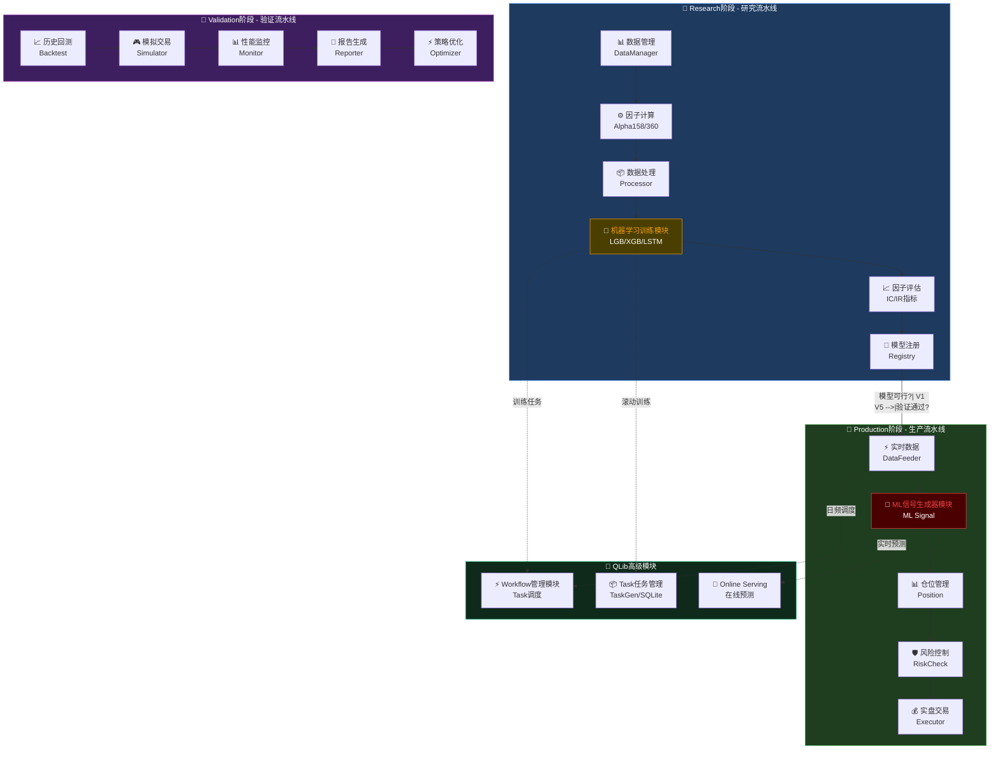

# Workflow管理模块概述

> **模块类型**: 跨阶段核心调度引擎
> **QLib组件**: Workflow / TaskFlow
> **最后更新**: 2026-02-13

---

## 🎯 模块定位

### 核心价值
**QLib Workflow是跨三阶段的核心调度引擎，通过DAG任务流自动管理ML流水线**

```
┌─────────────────────────────────────────────────────────────────┐
│                    QLib Workflow Manager                           │
├─────────────────────────────────────────────────────────────────┤
│  • 任务调度：按时间/事件触发ML pipeline                         │
│  • 依赖管理：数据 → 因子 → 训练 → 预测 → 信号 → 交易          │
│  • 状态追踪：记录每个步骤的状态和日志                           │
│  • 失败重试：自动重试失败的任务                                 │
│  • 资源管理：CPU/GPU资源分配                                    │
│  • 实验管理：Recorder追踪训练/推理/评估全过程                   │
└─────────────────────────────────────────────────────────────────┘
```

### 与其他模块的区别

| 组件 | 职责 |
|------|------|
| **Workflow** | 任务调度和流程编排（何时做什么） |
| **Online Serving** | 实时预测服务（提供什么服务） |
| **Recorder** | 实验记录（记录什么结果） |

---

## 📊 三阶段Workflow应用

### 1. Research阶段 - 研究流水线

```
数据加载 → 因子计算 → 数据处理 → 模型训练 → 模型评估 → 注册模型
   ↓           ↓           ↓           ↓           ↓           ↓
DataLoader  Processor   Slicer     Trainer     Evaluator   Registry
```

### 2. Validation阶段 - 验证流水线

```
历史回测 → 模拟交易 → 性能监控 → 报告生成 → 策略优化
    ↓           ↓           ↓           ↓           ↓
 Backtest   Simulator   Monitor     Reporter    Optimizer
```

### 3. Production阶段 - 生产流水线

```
实时数据 → 在线预测 → 信号生成 → 风险检查 → 订单执行
    ↓           ↓           ↓           ↓           ↓
  Feeder     Predictor   Generator   RiskCheck   Executor
```

---

### 🎨 三阶段完整Workflow流程图 (v10.0.0)



**流程说明**:
- **Research**: 数据管理 → 因子计算 → 数据处理 → **机器学习训练模块** → 因子评估 → 模型注册
- **Validation**: 历史回测 → 模拟交易 → 性能监控 → 报告生成 → 策略优化
- **Production**: 实时数据 → **ML信号生成器模块** → 仓位管理 → 风险控制 → 实盘交易

---

---

## 🏗️ 核心组件

### 1. Task - 任务定义

```yaml
task:
  model:           # 模型配置
    class: LGBModel
    module_path: qlib.contrib.model.gbdt
    kwargs:
      loss: mse
      learning_rate: 0.0421

  dataset:         # 数据集配置
    class: DatasetH
    module_path: qlib.data.dataset
    handler:
      class: Alpha158
    segments:
      train: [2008-01-01, 2014-12-31]
      valid: [2015-01-01, 2016-12-31]
      test: [2017-01-01, 2020-08-01]

  record:          # 记录配置
    - class: SignalRecord
      module_path: qlib.workflow.record_temp
    - class: PortAnaRecord
```

### 2. Recorder - 实验管理

QLib为每次执行提供完整的实验追踪：

```
Recorder
├── 训练信息
│   ├── 模型参数
│   ├── 训练日志
│   └── 模型文件
├── 推理结果
│   ├── 预测信号
│   ├── 预测概率
│   └── 推理时间
└── 评估指标
    ├── IC (Information Coefficient)
    ├── RankIC
    ├── 回测收益
    └── 风险指标
```

### 3. qrun - 启动命令

```bash
# 标准执行
qrun configuration.yaml

# 调试模式
python -m pdb qlib/cli/run.py examples/benchmarks/LightGBM/workflow_config.yaml
```

---

## 📋 配置详解

### 完整配置示例

```yaml
qlib_init:
  provider_uri: "~/.qlib/qlib_data/cn_data"
  region: cn

market: &market csi300
benchmark: &benchmark SH000300

data_handler_config: &data_handler_config
  start_time: 2008-01-01
  end_time: 2020-08-01
  fit_start_time: 2008-01-01
  fit_end_time: 2014-12-31
  instruments: *market

port_analysis_config: &port_analysis_config
  strategy:
    class: TopkDropoutStrategy
    module_path: qlib.contrib.strategy.strategy
    kwargs:
      topk: 50
      n_drop: 5
      signal: <PRED>
  backtest:
    start_time: 2017-01-01
    end_time: 2020-08-01
    account: 100000000
    benchmark: *benchmark
    exchange_kwargs:
      limit_threshold: 0.095
      deal_price: close
      open_cost: 0.0005
      close_cost: 0.0015
      min_cost: 5

task:
  model:
    class: LGBModel
    module_path: qlib.contrib.model.gbdt
    kwargs:
      loss: mse
      colsample_bytree: 0.8879
      learning_rate: 0.0421
      subsample: 0.8789
      lambda_l1: 205.6999
      lambda_l2: 580.9768
      max_depth: 8
      num_leaves: 210
      num_threads: 20

  dataset:
    class: DatasetH
    module_path: qlib.data.dataset
    kwargs:
      handler:
        class: Alpha158
        module_path: qlib.contrib.data.handler
        kwargs: *data_handler_config
      segments:
        train: [2008-01-01, 2014-12-31]
        valid: [2015-01-01, 2016-12-31]
        test: [2017-01-01, 2020-08-01]

  record:
    - class: SignalRecord
      module_path: qlib.workflow.record_temp
      kwargs: {}
    - class: PortAnaRecord
      module_path: qlib.workflow.record_temp
      kwargs:
        config: *port_analysis_config
```

### 配置字段说明

| 字段 | 类型 | 说明 |
|------|------|------|
| `qlib_init.provider_uri` | str | Qlib数据存储路径 |
| `qlib_init.region` | str | 区域 (cn/us) |
| `market` | str | 市场代码 |
| `benchmark` | str | 基准指数 |
| `data_handler_config` | dict | 数据处理器配置 |

---

## 📝 详细配置说明

### 1. Model Section - 模型配置

**功能描述**: 定义训练和推理使用的模型参数

```yaml
task:
  model:
    class: LGBModel
    module_path: qlib.contrib.model.gbdt
    kwargs:
      loss: mse
      colsample_bytree: 0.8879
      learning_rate: 0.0421
      subsample: 0.8789
      lambda_l1: 205.6999
      lambda_l2: 580.9768
      max_depth: 8
      num_leaves: 210
      num_threads: 20
```

**字段说明**:

| 字段 | 类型 | 说明 |
|------|------|------|
| `class` | str | 模型类名（如 LGBModel, XGBModel） |
| `module_path` | str | 模型在QLib中的模块路径 |
| `kwargs.*` | - | 模型超参数，参考具体模型实现 |

**初始化方法**:
```python
from qlib.contrib.model.gbdt import LGBModel
model = LGBModel(kwargs)
```

---

### 2. Dataset Section - 数据集配置

**功能描述**: 定义数据集和数据处理器的参数

**DataHandler配置**:
```yaml
data_handler_config: &data_handler_config
  start_time: 2008-01-01      # 数据开始时间
  end_time: 2020-08-01        # 数据结束时间
  fit_start_time: 2008-01-01  # 训练集开始时间
  fit_end_time: 2014-12-31    # 训练集结束时间
  instruments: *market        # 股票池
```

**字段说明**:

| 字段 | 类型 | 说明 |
|------|------|------|
| `start_time` | str | 整体数据开始日期 |
| `end_time` | str | 整体数据结束日期 |
| `fit_start_time` | str | 训练数据开始日期 |
| `fit_end_time` | str | 训练数据结束日期 |
| `instruments` | str | 股票池代码（如 csi300） |

**Dataset配置**:
```yaml
task:
  dataset:
    class: DatasetH
    module_path: qlib.data.dataset
    kwargs:
      handler:
        class: Alpha158
        module_path: qlib.contrib.data.handler
        kwargs: *data_handler_config
      segments:
        train: [2008-01-01, 2014-12-31]
        valid: [2015-01-01, 2016-12-31]
        test: [2017-01-01, 2020-08-01]
```

**segments说明**:

| 阶段 | 时间范围 | 用途 |
|------|---------|------|
| `train` | 2008-01-01 ~ 2014-12-31 | 模型训练 |
| `valid` | 2015-01-01 ~ 2016-12-31 | 模型验证/调参 |
| `test` | 2017-01-01 ~ 2020-08-31 | 最终测试 |

---

### 3. Record Section - 记录器配置

**功能描述**: 追踪训练过程和结果（IC、回测等）

**回测与策略配置**:
```yaml
port_analysis_config: &port_analysis_config
  strategy:
    class: TopkDropoutStrategy
    module_path: qlib.contrib.strategy.strategy
    kwargs:
      topk: 50            # 选取前50只股票
      n_drop: 5           # 每周淘汰5只
      signal: <PRED>      # 使用预测信号
  backtest:
    start_time: 2017-01-01
    end_time: 2020-08-01
    account: 100000000    # 初始资金
    benchmark: *benchmark
    exchange_kwargs:
      limit_threshold: 0.095
      deal_price: close
      open_cost: 0.0005
      close_cost: 0.0015
      min_cost: 5
```

**策略参数说明**:

| 参数 | 说明 |
|------|------|
| `topk` | 选取信号最强的topk只股票 |
| `n_drop` | 每周从topk中淘汰的股票数 |
| `signal` | 使用的信号（`<PRED>` 表示模型预测） |

**回测参数说明**:

| 参数 | 说明 |
|------|------|
| `account` | 初始资金 |
| `deal_price` | 成交价格 |
| `open_cost` | 买入费率 |
| `close_cost` | 卖出费率 |
| `min_cost` | 最低佣金 |

**Record配置**:
```yaml
task:
  record:
    - class: SignalRecord
      module_path: qlib.workflow.record_temp
      kwargs: {}
    - class: PortAnaRecord
      module_path: qlib.workflow.record_temp
      kwargs:
        config: *port_analysis_config
```

**Record类型说明**:

| Record类型 | 功能 |
|-----------|------|
| `SignalRecord` | 记录模型预测信号和IC指标 |
| `PortAnaRecord` | 记录回测分析和组合收益 |

---

---

## 🔗 依赖关系

### 依赖哪些模块

#### Research阶段
- **数据管理模块** - 提供原始数据
- **因子计算模块** - 提供特征数据
- **机器学习训练模块** - 提供训练好的模型

#### Validation阶段
- **历史回测模块** - 执行回测
- **模拟实盘模块** - 执行模拟交易
- **在线服务模块** - 在线预测服务

#### Production阶段
- **ML信号生成器模块** - 生成交易信号
- **仓位管理模块** - 仓位计算
- **风险控制模块** - 风险检查

### 被哪些模块依赖
- **无** - Workflow是顶层调度器，调度其他模块

---

## 📈 开发状态

### 当前进度
**第一轮: 文档设计** (50%完成)

### 已完成功能
- ✅ 模块架构设计
- ✅ 三阶段任务流定义
- ✅ 配置格式设计

### 待开发功能
- ⏸️ Workflow调度服务实现
- ⏸️ Recorder实验管理实现
- ⏸️ 前端任务监控界面
- ⏸️ 任务历史记录

### 真实完成度
**20%** 🟡 - 文档完成50%，实现待开始

---

## 🏗️ 技术架构

### 后端服务
```
backend/
├── services/
│   └── workflow/
│       ├── scheduler.py       # 任务调度器
│       ├── task_manager.py    # 任务管理
│       ├── recorder.py        # 实验记录
│       └── executor.py        # 任务执行器
├── api/v1/
│   └── workflow/
│       ├── router.py          # API路由
│       ├── tasks.py           # 任务端点
│       └── records.py         # 记录端点
└── config/
    └── templates/            # 配置模板
        ├── research_template.yaml
        ├── validation_template.yaml
        └── production_template.yaml
```

### API端点

| 端点 | 方法 | 功能 |
|------|------|------|
| `/api/v1/workflow/tasks` | GET | 获取任务列表 |
| `/api/v1/workflow/tasks` | POST | 创建新任务 |
| `/api/v1/workflow/tasks/{id}` | GET | 获取任务详情 |
| `/api/v1/workflow/tasks/{id}/start` | POST | 启动任务 |
| `/api/v1/workflow/tasks/{id}/stop` | POST | 停止任务 |
| `/api/v1/workflow/records` | GET | 获取实验记录 |
| `/api/v1/workflow/records/{id}` | GET | 获取记录详情 |

---

## 📚 相关文档

- [QLib Workflow官方文档](https://qlib.readthedocs.io/en/latest/component/workflow.html)
- [QLib Recorder文档](https://qlib.readthedocs.io/en/latest/component/recorder.html)
- [Research阶段](../Research阶段/README.md)
- [Validation阶段](../Validation阶段/README.md)
- [Production阶段](../Production阶段/README.md)

---

**创建时间**: 2026-02-13
**状态**: 🟡 文档设计阶段
