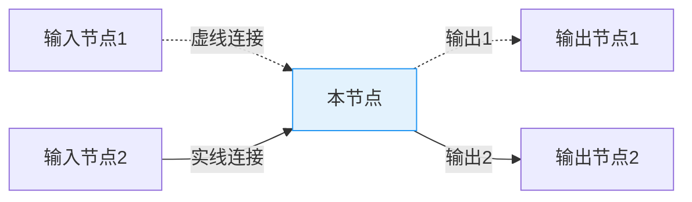
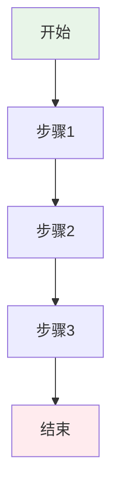

# QLib高级模块节点文档模板

> **模块名称**: {模块名称}
> **阶段**: {Research/Validation/Production}
> **节点类型**: 增强节点（可选）
> **优先级**: {P0/P1/P2/P3}
> **最后更新**: {日期}

---

## 🎯 节点概述

### 节点定义
```yaml
节点ID: {模块简称}_{阶段简称}_{功能简称}
节点名称: {中文名称}
所属模块: {QLib模块名称}
所属阶段: {阶段名称}
节点类型: 增强节点（可选）
优先级: {P0/P1/P2/P3}
```

### 功能描述
{简要描述该节点在当前阶段的功能和作用}

### 在工作流中的位置
{描述该节点在当前阶段工作流中的位置，与哪些核心节点有连接}

---

## 🔗 节点连接关系

### 输入连接（从哪些节点接收数据/信号）

| 源节点 | 连接类型 | 传递内容 | 触发条件 |
|--------|----------|----------|----------|
| {节点1} | 虚线/实线 | {数据/信号} | {条件} |
| {节点2} | 虚线/实线 | {数据/信号} | {条件} |

### 输出连接（向哪些节点发送数据/信号）

| 目标节点 | 连接类型 | 传递内容 | 触发条件 |
|---------|----------|----------|----------|
| {节点1} | 虚线/实线 | {数据/信号} | {条件} |
| {节点2} | 虚线/实线 | {数据/信号} | {条件} |

### Mermaid连接图



---

## 📥 输入输出规范

### 输入数据格式

```python
# 输入数据结构示例
input_data = {
    "字段1": "类型说明",
    "字段2": "类型说明",
    # ...
}
```

### 输出数据格式

```python
# 输出数据结构示例
output_data = {
    "字段1": "类型说明",
    "字段2": "类型说明",
    # ...
}
```

---

## ⚙️ 核心功能

### 功能列表

1. **功能1**: {描述}
2. **功能2**: {描述}
3. **功能3**: {描述}

### 处理流程



### 关键算法/逻辑

```python
# 核心算法伪代码
def process_function(input_data):
    # 步骤1
    result = step1(input_data)

    # 步骤2
    result = step2(result)

    # 步骤3
    return step3(result)
```

---

## 🔧 技术实现

### 技术栈
- **语言**: {Python/JavaScript/TypeScript}
- **框架**: {FastAPI/Vue/React}
- **库**: {主要依赖库}

### API接口

#### 接口1: {接口名称}

```yaml
路径: /api/path
方法: POST/GET/PUT/DELETE
描述: {接口描述}
```

**请求参数**:
```json
{
    "param1": "类型",
    "param2": "类型"
}
```

**响应格式**:
```json
{
    "code": 200,
    "message": "成功",
    "data": {}
}
```

### 数据存储

**存储路径**: `{path}`

**存储格式**: {格式说明}

**数据模型**:
```python
class DataModel:
    def __init__(self):
        self.field1 = None
        self.field2 = None
```

---

## 📊 性能指标

### 关键指标

| 指标名称 | 目标值 | 当前值 | 备注 |
|---------|--------|--------|------|
| 处理延迟 | < 100ms | - | - |
| 吞吐量 | > 1000/s | - | - |
| 准确率 | > 95% | - | - |

### 资源消耗

| 资源类型 | 预估消耗 | 峰值消耗 |
|---------|----------|----------|
| CPU | - | - |
| 内存 | - | - |
| 存储 | - | - |

---

## 🧪 测试验证

### 测试场景

1. **场景1**: {描述}
   - 输入: {测试数据}
   - 预期输出: {预期结果}
   - 验证方法: {方法}

2. **场景2**: {描述}
   - 输入: {测试数据}
   - 预期输出: {预期结果}
   - 验证方法: {方法}

### 测试用例

```python
def test_node_function():
    # Arrange
    input_data = {...}

    # Act
    result = node_function(input_data)

    # Assert
    assert result["expected_field"] == expected_value
```

---

## 📝 开发状态

### 当前进度
- [ ] 节点定义完成
- [ ] 接口设计完成
- [ ] 核心逻辑实现
- [ ] 单元测试完成
- [ ] 集成测试完成
- [ ] 文档更新完成

### 待办事项
- [ ] {待办1}
- [ ] {待办2}
- [ ] {待办3}

### 已知问题
- {问题1}: {描述}
- {问题2}: {描述}

---

## 📚 相关文档

- [模块概述](./概述.md)
- [上一阶段节点](./上一阶段节点.md)
- [下一阶段节点](./下一阶段节点.md)
- [API设计](./API设计.md)
- [数据模型](./数据模型.md)

---

## 🔄 版本历史

| 版本 | 日期 | 作者 | 变更说明 |
|------|------|------|----------|
| 1.0.0 | {日期} | {作者} | 初始版本 |

---

**创建时间**: {日期}
**最后更新**: {日期}
**状态**: {规划中/开发中/已完成}
**优先级**: {P0/P1/P2/P3}
