# QLib三大高级模块 - 完整架构图

> **文档版本**: v1.0
> **最后更新**: 2026-02-23
> **适用范围**: MyQuant v10.0.0

---

## 🎯 架构概述

本文档展示QLib三大高级模块（Meta Controller、Online Serving、Reinforcement Learning）在三阶段中的完整节点架构和连接关系。

---

## 📊 整体架构图

### 三阶段模块全景图

```mermaid
graph TB
    %% ==================== Research阶段 ====================
    subgraph Research["🔬 Research阶段 - 核心工作流"]
        direction TB
        R_L1[Layer 1: 数据探索层]
        R_L2[Layer 2: 因子计算层]
        R_L3[Layer 3: 因子分析层]
        R_L4[Layer 4: 因子评估层]
        R_L5[Layer 5: AI助手层]
        R_L6[Layer 6: 模型训练层]
        R_L7[Layer 7: 投资组合策略层]
        R_L8[Layer 8: 初步验证层]

        R_L1 --> R_L2 --> R_L3 --> R_L4 --> R_L6 --> R_L7 --> R_L8
        R_L5 -.-> R_L2
    end

    %% ==================== Meta Controller Research节点 ====================
    subgraph MC_Research["Meta Controller - Research (P2)"]
        direction TB
        MC_R_Task[MC_R_MetaTask<br/>Meta Task构建]
        MC_R_Dataset[MC_R_Dataset<br/>Meta Dataset管理]
        MC_R_Model[MC_R_Model<br/>Meta Model训练]
        MC_R_Inference[MC_R_Inference<br/>Meta推理验证]

        MC_R_Task --> MC_R_Dataset --> MC_R_Model --> MC_R_Inference
    end

    %% ==================== Online Serving Research节点 ====================
    subgraph OS_Research["Online Serving - Research (P2)"]
        direction TB
        OS_R_Calc[OS_R_Calc<br/>在线因子计算]
        OS_R_Cache[OS_R_Cache<br/>因子缓存服务]
        OS_R_Update[OS_R_Update<br/>实时因子更新]

        OS_R_Calc --> OS_R_Cache --> OS_R_Update
    end

    %% ==================== RL Research节点 ====================
    subgraph RL_Research["Reinforcement Learning - Research (P2)"]
        direction TB
        RL_R_Env[RL_R_Env<br/>RL环境构建]
        RL_R_Train[RL_R_Train<br/>策略网络训练]
        RL_R_Optimize[RL_R_Optimize<br/>Portfolio参数优化]
        RL_R_Eval[RL_R_Eval<br/>策略评估]

        RL_R_Env --> RL_R_Train --> RL_R_Optimize --> RL_R_Eval
    end

    %% ==================== Research阶段集成 ====================
    R_L4 -.->|提供元信息| MC_R_Task
    R_L6 -.->|指导训练| MC_R_Model
    R_L8 -.->|验证效果| MC_R_Inference

    R_L3 -.->|请求计算| OS_R_Calc
    OS_R_Cache -.->|返回数据| R_L3

    R_L7 -.->|优化参数| RL_R_Optimize
    RL_R_Optimize -.->|返回参数| R_L7

    %% ==================== Validation阶段 ====================
    subgraph Validation["🧪 Validation阶段 - 核心工作流"]
        direction LR
        V_Backtest[历史回测]
        V_Simulator[模拟交易]
        V_Monitor[性能监控]
        V_Reporter[报告生成]

        V_Backtest --> V_Simulator --> V_Monitor --> V_Reporter
    end

    %% ==================== Meta Controller Validation节点 ====================
    subgraph MC_Validation["Meta Controller - Validation (P2)"]
        direction LR
        MC_V_Inference[MC_V_Inference<br/>Meta Model推理]
        MC_V_Apply[MC_V_Apply<br/>指导信息应用]
        MC_V_Compare[MC_V_Compare<br/>性能对比]
        MC_V_Transfer[MC_V_Transfer<br/>跨数据集验证]

        MC_V_Inference --> MC_V_Apply --> MC_V_Compare --> MC_V_Transfer
    end

    %% ==================== Online Serving Validation节点 ====================
    subgraph OS_Validation["Online Serving - Validation (P1)"]
        direction LR
        OS_V_Sim[OS_V_Sim<br/>历史模拟服务]
        OS_V_Paper[OS_V_Paper<br/>模拟盘服务]
        OS_V_Monitor[OS_V_Monitor<br/>性能监控]

        OS_V_Sim --> OS_V_Paper --> OS_V_Monitor
    end

    %% ==================== RL Validation节点 ====================
    subgraph RL_Validation["Reinforcement Learning - Validation (P2)"]
        direction LR
        RL_V_Val[RL_V_Val<br/>策略验证]
        RL_V_Robust[RL_V_Robust<br/>鲁棒性测试]
        RL_V_Compare[RL_V_Compare<br/>策略对比]

        RL_V_Val --> RL_V_Robust --> RL_V_Compare
    end

    %% ==================== Validation阶段集成 ====================
    V_Monitor -.->|请求推理| MC_V_Inference
    MC_V_Transfer -.->|验证完成| RL_V_Val

    V_Simulator -.->|模拟验证| OS_V_Sim
    OS_V_Monitor -.->|监控结果| V_Monitor

    V_Monitor -.->|验证策略| RL_V_Val

    %% ==================== Production阶段 ====================
    subgraph Production["🚀 Production阶段 - 核心工作流"]
        direction LR
        P_DataFeeder[实时数据]
        P_Signal[ML信号]
        P_Position[仓位管理]
        P_RiskCheck[风险控制]
        P_Executor[实盘交易]

        P_DataFeeder --> P_Signal --> P_Position --> P_RiskCheck --> P_Executor
    end

    %% ==================== Meta Controller Production节点 ====================
    subgraph MC_Production["Meta Controller - Production (P1)"]
        direction LR
        MC_P_Online[MC_P_Online<br/>在线Meta学习]
        MC_P_Guide[MC_P_Guide<br/>实时预测指导]
        MC_P_Adapt[MC_P_Adapt<br/>自适应调整]
        MC_P_Monitor[MC_P_Monitor<br/>Meta性能监控]

        MC_P_Online --> MC_P_Guide --> MC_P_Adapt --> MC_P_Monitor
    end

    %% ==================== Online Serving Production节点 ====================
    subgraph OS_Production["Online Serving - Production (P0)"]
        direction LR
        OS_P_Deploy[OS_P_Deploy<br/>模型部署管理]
        OS_P_Predict[OS_P_Predict<br/>实时预测服务]
        OS_P_Signal[OS_P_Signal<br/>信号准备服务]
        OS_P_Routine[OS_P_Routine<br/>例行更新流程]

        OS_P_Deploy --> OS_P_Predict --> OS_P_Signal --> OS_P_Routine
    end

    %% ==================== RL Production节点 ====================
    subgraph RL_Production["Reinforcement Learning - Production (P2/P3)"]
        direction LR
        RL_P_Exec[RL_P_Exec<br/>智能订单执行]
        RL_P_Risk[RL_P_Risk<br/>风险决策]
        RL_P_Pos[RL_P_Pos<br/>仓位管理]

        RL_P_Exec --> RL_P_Risk --> RL_P_Pos
    end

    %% ==================== Production阶段集成 ====================
    P_RiskCheck -.->|在线学习| MC_P_Online
    MC_P_Guide -.->|指导预测| P_Signal

    P_DataFeeder -.->|增量数据| OS_P_Routine
    OS_P_Predict -.->|实时预测| P_Signal
    OS_P_Signal -.->|模型状态| P_RiskCheck

    P_Executor -.->|智能执行| RL_P_Exec
    RL_P_Risk -.->|风险决策| P_RiskCheck
    RL_P_Pos -.->|仓位建议| P_Position

    %% ==================== 跨阶段连接 ====================
    Research -->|模型可行| Validation
    Validation -->|验证通过| Production

    MC_R_Inference -.->|训练完成| MC_V_Inference
    MC_V_Transfer -.->|验证通过| MC_P_Online

    OS_R_Update -.->|服务就绪| OS_V_Sim
    OS_V_Monitor -.->|验证通过| OS_P_Deploy

    RL_R_Eval -.->|训练完成| RL_V_Val
    RL_V_Compare -.->|验证通过| RL_P_Exec

    %% ==================== 样式定义 ====================
    style Research fill:#1e3a5f,stroke:#3b82f6,color:#fff
    style Validation fill:#3d1f5f,stroke:#9c27b0,color:#fff
    style Production fill:#1f3d1f,stroke:#4caf50,color:#fff

    style MC_Research fill:#e3f2fd,stroke:#2196f3,stroke-dasharray: 3 3
    style MC_Validation fill:#f3e5f5,stroke:#9c27b0,stroke-dasharray: 3 3
    style MC_Production fill:#e8f5e8,stroke:#4caf50,stroke-dasharray: 3 3

    style OS_Research fill:#e8f5e8,stroke:#4caf50,stroke-dasharray: 3 3
    style OS_Validation fill:#fff3e0,stroke:#ff9800,stroke-dasharray: 3 3
    style OS_Production fill:#ffebee,stroke:#f44336,stroke-dasharray: 3 3

    style RL_Research fill:#fff3e0,stroke:#ff9800,stroke-dasharray: 3 3
    style RL_Validation fill:#fce4ec,stroke:#e91e63,stroke-dasharray: 3 3
    style RL_Production fill:#f3e5f5,stroke:#9c27b0,stroke-dasharray: 3 3
```

---

## 🔗 节点详细连接表

### Meta Controller模块连接

| 阶段 | 源节点 | 目标节点 | 连接类型 | 数据流 |
|------|--------|---------|---------|--------|
| Research | Layer 4: 因子评估层 | MC_R_MetaTask | 虚线 | 提供元信息 |
| Research | MC_R_Model | Layer 6: 模型训练层 | 虚线 | 指导训练 |
| Research | Layer 8: 初步验证层 | MC_R_Inference | 虚线 | 验证效果 |
| Validation | 性能监控 | MC_V_Inference | 虚线 | 请求推理 |
| Production | 风险控制 | MC_P_Online | 虚线 | 在线学习 |
| Production | MC_P_Guide | ML信号 | 虚线 | 实时指导 |

### Online Serving模块连接

| 阶段 | 源节点 | 目标节点 | 连接类型 | 数据流 |
|------|--------|---------|---------|--------|
| Research | Layer 3: 因子分析层 | OS_R_Calc | 虚线 | 请求计算 |
| Research | OS_R_Cache | Layer 3: 因子分析层 | 虚线 | 返回数据 |
| Validation | 模拟交易 | OS_V_Sim | 虚线 | 模拟验证 |
| Production | 实时数据 | OS_P_Routine | 虚线 | 增量数据 |
| Production | OS_P_Predict | ML信号 | 虚线 | 实时预测 |
| Production | OS_P_Signal | 风险控制 | 虚线 | 模型状态 |

### Reinforcement Learning模块连接

| 阶段 | 源节点 | 目标节点 | 连接类型 | 数据流 |
|------|--------|---------|---------|--------|
| Research | Layer 7: Portfolio Strategy | RL_R_Optimize | 虚线 | 优化参数 |
| Research | RL_R_Optimize | Layer 7: Portfolio Strategy | 虚线 | 返回参数 |
| Validation | 性能监控 | RL_V_Val | 虚线 | 验证策略 |
| Production | 实盘交易 | RL_P_Exec | 虚线 | 智能执行 |
| Production | RL_P_Risk | 风险控制 | 虚线 | 风险决策 |
| Production | RL_P_Pos | 仓位管理 | 虚线 | 仓位建议 |

---

## 📋 节点清单

### Meta Controller模块（12个节点）

| 节点ID | 节点名称 | 阶段 | 优先级 | 状态 |
|--------|---------|------|--------|------|
| MC_R_MetaTask | Meta Task构建 | Research | P2 | 规划中 |
| MC_R_Dataset | Meta Dataset管理 | Research | P2 | 规划中 |
| MC_R_Model | Meta Model训练 | Research | P2 | 规划中 |
| MC_R_Inference | Meta推理验证 | Research | P2 | 规划中 |
| MC_V_Inference | Meta Model推理 | Validation | P2 | 规划中 |
| MC_V_Apply | 指导信息应用 | Validation | P2 | 规划中 |
| MC_V_Compare | 性能对比 | Validation | P2 | 规划中 |
| MC_V_Transfer | 跨数据集验证 | Validation | P2 | 规划中 |
| MC_P_Online | 在线Meta学习 | Production | P1 | 规划中 |
| MC_P_Guide | 实时预测指导 | Production | P1 | 规划中 |
| MC_P_Adapt | 自适应调整 | Production | P1 | 规划中 |
| MC_P_Monitor | Meta性能监控 | Production | P1 | 规划中 |

### Online Serving模块（9个节点）

| 节点ID | 节点名称 | 阶段 | 优先级 | 状态 |
|--------|---------|------|--------|------|
| OS_R_Calc | 在线因子计算 | Research | P2 | 规划中 |
| OS_R_Cache | 因子缓存服务 | Research | P2 | 规划中 |
| OS_R_Update | 实时因子更新 | Research | P2 | 规划中 |
| OS_V_Sim | 历史模拟服务 | Validation | P1 | 规划中 |
| OS_V_Paper | 模拟盘服务 | Validation | P1 | 规划中 |
| OS_V_Monitor | 性能监控 | Validation | P1 | 规划中 |
| OS_P_Deploy | 模型部署管理 | Production | P0 | 规划中 |
| OS_P_Predict | 实时预测服务 | Production | P0 | 规划中 |
| OS_P_Signal | 信号准备服务 | Production | P0 | 规划中 |
| OS_P_Routine | 例行更新流程 | Production | P0 | 规划中 |

### Reinforcement Learning模块（10个节点）

| 节点ID | 节点名称 | 阶段 | 优先级 | 状态 |
|--------|---------|------|--------|------|
| RL_R_Env | RL环境构建 | Research | P2 | 规划中 |
| RL_R_Train | 策略网络训练 | Research | P2 | 规划中 |
| RL_R_Optimize | Portfolio参数优化 | Research | P2 | 规划中 |
| RL_R_Eval | 策略评估 | Research | P2 | 规划中 |
| RL_V_Val | 策略验证 | Validation | P2 | 规划中 |
| RL_V_Robust | 鲁棒性测试 | Validation | P2 | 规划中 |
| RL_V_Compare | 策略对比 | Validation | P2 | 规划中 |
| RL_P_Exec | 智能订单执行 | Production | P2 | 规划中 |
| RL_P_Risk | 风险决策 | Production | P2 | 规划中 |
| RL_P_Pos | 仓位管理 | Production | P2 | 规划中 |

---

## 🎯 实施优先级

### Phase 1: P0核心功能（Production阶段Online Serving）
- OS_P_Deploy: 模型部署管理
- OS_P_Predict: 实时预测服务
- OS_P_Signal: 信号准备服务
- OS_P_Routine: 例行更新流程

### Phase 2: P1重要功能（Production阶段Meta Controller）
- MC_P_Online: 在线Meta学习
- MC_P_Guide: 实时预测指导
- MC_P_Adapt: 自适应调整
- MC_P_Monitor: Meta性能监控

### Phase 3: P2增强功能（Research和Validation阶段）
- Meta Controller完整流程
- Online Serving研究阶段功能
- Reinforcement Learning完整流程

---

**创建时间**: 2026-02-23
**最后更新**: 2026-02-23
**文档状态**: 完成
