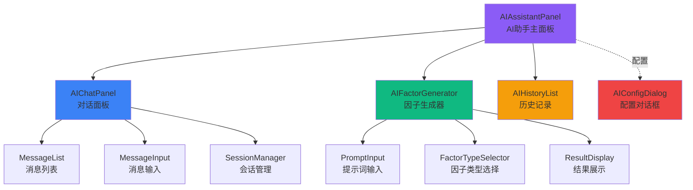

# AI助手模块 - 前端组件 v2.0

> **阶段**: Research阶段
> **模块**: AI助手
> **版本**: v2.0
> **状态**: ⏸️ 待开发（后端API已完成）
> **最后更新**: 2026-02-11

> **对应章节**: [相关章节](../../../项目设计/MyQuant完整架构与工作流V3/08-前端实现示例.html)

---

## 🎯 当前状态

### v2.0开发进度

| 模块 | 状态 | 说明 |
|------|------|------|
| 后端API | ⏸️ 代码已编写 | 10个RESTful端点已实现 |
| 前端UI | ❌ 未开发 | 组件设计如下，待实现 |
| 集成测试 | ❌ 未测试 | 需要前后端联调 |

**说明**：
- ✅ 后端代码已编写完成（~2,748行）
- ⏸️ 待测试验证（integration-tester）
- ❌ 前端UI尚未开发

本文档提供前端组件的**设计方案**，供未来实现参考。

---

## 🎨 组件架构设计

### 核心组件列表

1. **AIAssistantPanel** - AI助手主面板
2. **AIChatPanel** - AI对话面板（支持多轮对话）
3. **AIConfigDialog** - AI配置对话框
4. **AIFactorGenerator** - AI因子生成器
5. **AIHistoryList** - AI生成历史列表

### 组件层次结构



---

## 🧩 组件详细设计

### 1. AIAssistantPanel（AI助手主面板）

**组件路径**: `frontend/src/views/research/ai-assistant/AIAssistantPanel.vue`

**功能说明**：
- AI助手的主入口页面
- 集成对话、生成、历史功能
- 管理AI配置状态

**Props**:
```typescript
interface Props {
  initialTab?: 'chat' | 'generate' | 'history';
}
```

**组件结构**:
```vue
<template>
  <div class="ai-assistant-panel">
    <!-- 页面标题 -->
    <div class="page-header">
      <h2>AI助手</h2>
      <el-button @click="showConfig = true">配置</el-button>
    </div>

    <!-- 标签页 -->
    <el-tabs v-model="activeTab">
      <!-- 对话标签 -->
      <el-tab-pane label="对话" name="chat">
        <AIChatPanel
          :session-id="currentSessionId"
          @message-sent="handleMessageSent"
        />
      </el-tab-pane>

      <!-- 因子生成标签 -->
      <el-tab-pane label="因子生成" name="generate">
        <AIFactorGenerator
          @generated="handleFactorGenerated"
        />
      </el-tab-pane>

      <!-- 历史记录标签 -->
      <el-tab-pane label="历史记录" name="history">
        <AIHistoryList />
      </el-tab-pane>
    </el-tabs>

    <!-- 配置对话框 -->
    <AIConfigDialog v-model="showConfig" />
  </div>
</template>

<script setup lang="ts">
import { ref } from 'vue';
import AIChatPanel from './AIChatPanel.vue';
import AIFactorGenerator from './AIFactorGenerator.vue';
import AIHistoryList from './AIHistoryList.vue';
import AIConfigDialog from './AIConfigDialog.vue';

const activeTab = ref('chat');
const showConfig = ref(false);
const currentSessionId = ref<string | null>(null);

const handleMessageSent = () => {
  console.log('消息已发送');
};

const handleFactorGenerated = (result: any) => {
  console.log('因子生成结果:', result);
};
</script>
```

---

### 2. AIChatPanel（AI对话面板）

**组件路径**: `frontend/src/views/research/ai-assistant/AIChatPanel.vue`

**功能说明**：
- 多轮对话界面
- 会话管理（创建、切换）
- 消息展示（支持流式输出）

**Props**:
```typescript
interface Props {
  sessionId?: string | null;
}
```

**Events**:
```typescript
interface Emits {
  (e: 'message-sent'): void;
  (e: 'session-changed', sessionId: string): void;
}
```

**API调用**:
```typescript
// 创建会话
POST /api/v1/research/ai/sessions/create
{
  "title": "对话标题",
  "user_goal": "用户目标"
}

// 添加消息
POST /api/v1/research/ai/sessions/{id}/messages
{
  "message": "用户消息",
  "role": "user"
}

// 获取历史
GET /api/v1/research/ai/sessions/{id}/history?limit=50

// 会话列表
GET /api/v1/research/ai/sessions
```

**组件结构**:
```vue
<template>
  <div class="ai-chat-panel">
    <!-- 会话列表 -->
    <div class="session-list">
      <div class="list-header">
        <h3>会话</h3>
        <el-button size="small" @click="createSession">新建</el-button>
      </div>
      <el-list :data="sessions">
        <el-list-item
          v-for="session in sessions"
          :key="session.session_id"
          :class="{ active: session.session_id === currentSessionId }"
          @click="switchSession(session.session_id)"
        >
          <div class="session-title">{{ session.title }}</div>
          <div class="session-time">{{ formatTime(session.created_at) }}</div>
        </el-list-item>
      </el-list>
    </div>

    <!-- 对话区域 -->
    <div class="chat-area">
      <!-- 消息列表 -->
      <div class="message-list" ref="messageListRef">
        <div
          v-for="msg in messages"
          :key="msg.id"
          :class="['message', msg.role]"
        >
          <div class="message-content">{{ msg.content }}</div>
          <div class="message-meta">
            <span class="tokens">{{ msg.tokens }} tokens</span>
          </div>
        </div>
      </div>

      <!-- 输入区域 -->
      <div class="input-area">
        <el-input
          v-model="inputMessage"
          type="textarea"
          :rows="3"
          placeholder="输入消息..."
          @keydown.enter.ctrl="sendMessage"
        />
        <div class="input-actions">
          <el-button @click="sendMessage" :loading="sending">
            发送 (Ctrl+Enter)
          </el-button>
        </div>
      </div>
    </div>
  </div>
</template>

<script setup lang="ts">
import { ref, onMounted } from 'vue';

const props = defineProps<{
  sessionId?: string | null;
}>();

const emit = defineEmits<{
  (e: 'message-sent'): void;
  (e: 'session-changed', sessionId: string): void;
}>();

const sessions = ref([]);
const currentSessionId = ref(props.sessionId);
const messages = ref([]);
const inputMessage = ref('');
const sending = ref(false);

// 创建会话
const createSession = async () => {
  const response = await fetch('/api/v1/research/ai/sessions/create', {
    method: 'POST',
    headers: { 'Content-Type': 'application/json' },
    body: JSON.stringify({
      title: '新对话',
      user_goal: ''
    })
  });
  const result = await response.json();
  currentSessionId.value = result.session_id;
  emit('session-changed', result.session_id);
  loadSessions();
};

// 切换会话
const switchSession = async (sessionId: string) => {
  currentSessionId.value = sessionId;
  await loadHistory();
};

// 发送消息
const sendMessage = async () => {
  if (!inputMessage.value.trim() || !currentSessionId.value) return;

  sending.value = true;
  try {
    await fetch(`/api/v1/research/ai/sessions/${currentSessionId.value}/messages`, {
      method: 'POST',
      headers: { 'Content-Type': 'application/json' },
      body: JSON.stringify({
        message: inputMessage.value,
        role: 'user'
      })
    });

    // TODO: 调用AI生成响应
    // 目前后端只有消息存储，AI响应需要另外实现

    inputMessage.value = '';
    await loadHistory();
    emit('message-sent');
  } finally {
    sending.value = false;
  }
};

// 加载历史
const loadHistory = async () => {
  if (!currentSessionId.value) return;

  const response = await fetch(
    `/api/v1/research/ai/sessions/${currentSessionId.value}/history?limit=50`
  );
  const result = await response.json();
  messages.value = result.messages || [];
};

// 加载会话列表
const loadSessions = async () => {
  const response = await fetch('/api/v1/research/ai/sessions');
  const result = await response.json();
  sessions.value = result.sessions || [];
};

onMounted(() => {
  loadSessions();
  if (currentSessionId.value) {
    loadHistory();
  }
});
</script>
```

---

### 3. AIConfigDialog（AI配置对话框）

**组件路径**: `frontend/src/views/research/ai-assistant/AIConfigDialog.vue`

**功能说明**：
- 配置DeepSeek API密钥
- 配置模型参数
- 测试API连接

**Props**:
```typescript
interface Props {
  modelValue: boolean;
}
```

**Events**:
```typescript
interface Emits {
  (e: 'update:modelValue', value: boolean): void;
  (e: 'configured'): void;
}
```

**API调用**:
```typescript
// 保存配置
POST /api/v1/research/ai/config/save
{
  "config_key": "deepseek_api_key",
  "config_value": "sk-xxxxx",
  "config_type": "api_key"
}

// 获取配置
GET /api/v1/research/ai/config/{config_key}

// 健康检查
GET /api/v1/research/ai/health
```

**组件结构**:
```vue
<template>
  <el-dialog
    :model-value="modelValue"
    title="AI配置"
    width="600px"
    @update:model-value="$emit('update:modelValue', $event)"
  >
    <el-form :model="form" label-width="120px">
      <el-form-item label="API密钥">
        <el-input
          v-model="form.apiKey"
          type="password"
          placeholder="sk-xxxxxxxxxxxxxxxxxxxx"
          show-password
        />
        <div class="form-tip">
          从 <a href="https://platform.deepseek.com" target="_blank">DeepSeek平台</a> 获取
        </div>
      </el-form-item>

      <el-form-item label="API URL">
        <el-input
          v-model="form.apiUrl"
          placeholder="https://api.deepseek.com/v1"
        />
      </el-form-item>

      <el-form-item label="模型">
        <el-input
          v-model="form.model"
          placeholder="deepseek-chat"
        />
      </el-form-item>

      <el-form-item label="Temperature">
        <el-slider
          v-model="form.temperature"
          :min="0"
          :max="2"
          :step="0.1"
          :marks="{ 0: '精确', 1: '平衡', 2: '创意' }"
        />
      </el-form-item>

      <el-form-item label="Max Tokens">
        <el-input-number
          v-model="form.maxTokens"
          :min="100"
          :max="8000"
          :step="100"
        />
      </el-form-item>
    </el-form>

    <template #footer>
      <el-button @click="$emit('update:modelValue', false)">
        取消
      </el-button>
      <el-button
        type="info"
        :loading="testing"
        @click="testConnection"
      >
        测试连接
      </el-button>
      <el-button
        type="primary"
        :loading="saving"
        @click="saveConfig"
      >
        保存配置
      </el-button>
    </template>
  </el-dialog>
</template>

<script setup lang="ts">
import { reactive, onMounted } from 'vue';

defineProps<{
  modelValue: boolean;
}>();

const emit = defineEmits<{
  (e: 'update:modelValue', value: boolean): void;
  (e: 'configured'): void;
}>();

const form = reactive({
  apiKey: '',
  apiUrl: 'https://api.deepseek.com/v1',
  model: 'deepseek-chat',
  temperature: 0.7,
  maxTokens: 2000
});

const testing = ref(false);
const saving = ref(false);

// 加载现有配置
const loadConfig = async () => {
  try {
    const keys = ['deepseek_api_key', 'deepseek_api_url', 'deepseek_model', 'temperature', 'max_tokens'];
    for (const key of keys) {
      const response = await fetch(`/api/v1/research/ai/config/${key}`);
      const result = await response.json();
      if (result.success && result.data) {
        const configKey = key.replace('deepseek_', '');
        // 映射到表单字段
        if (configKey === 'api_key') form.apiKey = result.data.config_value;
        else if (configKey === 'api_url') form.apiUrl = result.data.config_value;
        else if (configKey === 'model') form.model = result.data.config_value;
        else if (key === 'temperature') form.temperature = parseFloat(result.data.config_value);
        else if (key === 'max_tokens') form.maxTokens = parseInt(result.data.config_value);
      }
    }
  } catch (error) {
    console.error('加载配置失败:', error);
  }
};

// 测试连接
const testConnection = async () => {
  testing.value = true;
  try {
    const response = await fetch('/api/v1/research/ai/health');
    const result = await response.json();
    if (result.status === 'healthy') {
      alert('✅ 连接成功！');
    } else {
      alert('❌ 连接失败');
    }
  } catch (error) {
    alert('❌ 连接失败: ' + error);
  } finally {
    testing.value = false;
  }
};

// 保存配置
const saveConfig = async () => {
  saving.value = true;
  try {
    const configs = [
      { key: 'deepseek_api_key', value: form.apiKey, type: 'api_key' },
      { key: 'deepseek_api_url', value: form.apiUrl, type: 'api_url' },
      { key: 'deepseek_model', value: form.model, type: 'model' },
      { key: 'temperature', value: form.temperature.toString(), type: 'parameter' },
      { key: 'max_tokens', value: form.maxTokens.toString(), type: 'parameter' }
    ];

    for (const config of configs) {
      await fetch('/api/v1/research/ai/config/save', {
        method: 'POST',
        headers: { 'Content-Type': 'application/json' },
        body: JSON.stringify({
          config_key: config.key,
          config_value: config.value,
          config_type: config.type
        })
      });
    }

    alert('✅ 配置已保存');
    emit('configured');
    emit('update:modelValue', false);
  } finally {
    saving.value = false;
  }
};

onMounted(() => {
  loadConfig();
});
</script>
```

---

### 4. AIFactorGenerator（AI因子生成器）

**组件路径**: `frontend/src/views/research/ai-assistant/AIFactorGenerator.vue`

**功能说明**：
- 输入提示词生成因子
- 选择因子类型
- 展示生成结果
- 保存到数据库

**Props**:
```typescript
interface Props {
  sessionId?: string;
}

interface GenerationResult {
  factor_code: string;
  expression: string;
  description: string;
  model: string;
  tokens_used: number;
}
```

**Events**:
```typescript
interface Emits {
  (e: 'generated', result: GenerationResult): void;
}
```

**API调用**:
```typescript
// 生成因子
POST /api/v1/research/ai/factor/generate
{
  "prompt": "生成一个动量因子",
  "factor_type": "momentum",
  "stock_pool": ["000001.SZ"],
  "time_range": "2024-01-01 to 2024-12-31",
  "session_id": "uuid"
}

// 保存因子
POST /api/v1/research/ai/factor/save
{
  "factor_code": "volume_momentum_5d",
  "expression": "$volume / Ref($volume, 5) - 1",
  "description": "基于5日成交量的动量因子",
  "generation_method": "ai",
  "category": "momentum",
  "tags": ["volume", "momentum"]
}
```

**组件结构**:
```vue
<template>
  <el-card class="ai-factor-generator">
    <template #header>
      <h3>AI因子生成</h3>
    </template>

    <el-form :model="form" label-width="100px">
      <!-- 提示词 -->
      <el-form-item label="提示词">
        <el-input
          v-model="form.prompt"
          type="textarea"
          :rows="3"
          placeholder="例如: 生成一个基于成交量的动量因子"
        />
      </el-form-item>

      <!-- 因子类型 -->
      <el-form-item label="因子类型">
        <el-select v-model="form.factorType">
          <el-option label="动量因子" value="momentum" />
          <el-option label="反转因子" value="reversal" />
          <el-option label="波动率因子" value="volatility" />
          <el-option label="成交量因子" value="volume" />
          <el-option label="自定义" value="custom" />
        </el-select>
      </el-form-item>

      <!-- 股票池 -->
      <el-form-item label="股票池">
        <el-select
          v-model="form.stockPool"
          multiple
          placeholder="选择股票（可选）"
        >
          <el-option label="沪深300" value="000300.SH" />
          <el-option label="中证500" value="000905.SH" />
        </el-select>
      </el-form-item>

      <!-- 时间范围 -->
      <el-form-item label="时间范围">
        <el-date-picker
          v-model="form.timeRange"
          type="daterange"
          placeholder="选择时间范围"
        />
      </el-form-item>

      <!-- 生成按钮 -->
      <el-form-item>
        <el-button
          type="primary"
          :loading="generating"
          :disabled="!form.prompt"
          @click="generateFactor"
        >
          生成因子
        </el-button>
      </el-form-item>
    </el-form>

    <!-- 生成结果 -->
    <div v-if="result" class="result-section">
      <el-divider>生成结果</el-divider>

      <el-descriptions :column="2" border>
        <el-descriptions-item label="因子代码">
          <code>{{ result.factor_code }}</code>
        </el-descriptions-item>
        <el-descriptions-item label="模型">
          {{ result.model }}
        </el-descriptions-item>
        <el-descriptions-item label="Token消耗">
          {{ result.tokens_used }}
        </el-descriptions-item>
        <el-descriptions-item label="描述" :span="2">
          {{ result.description }}
        </el-descriptions-item>
        <el-descriptions-item label="表达式" :span="2">
          <el-input
            :model-value="result.expression"
            type="textarea"
            :rows="3"
            readonly
          />
        </el-descriptions-item>
      </el-descriptions>

      <!-- 操作按钮 -->
      <el-button-group style="margin-top: 20px">
        <el-button
          type="success"
          @click="saveFactor"
        >
          保存因子
        </el-button>
        <el-button @click="copyExpression">
          复制表达式
        </el-button>
      </el-button-group>
    </div>
  </el-card>
</template>

<script setup lang="ts">
import { reactive, ref } from 'vue';

const props = defineProps<{
  sessionId?: string;
}>();

const emit = defineEmits<{
  (e: 'generated', result: any): void;
}>();

const form = reactive({
  prompt: '',
  factorType: 'momentum',
  stockPool: [],
  timeRange: null
});

const generating = ref(false);
const result = ref(null);

// 生成因子
const generateFactor = async () => {
  generating.value = true;
  try {
    const response = await fetch('/api/v1/research/ai/factor/generate', {
      method: 'POST',
      headers: { 'Content-Type': 'application/json' },
      body: JSON.stringify({
        prompt: form.prompt,
        factor_type: form.factorType,
        stock_pool: form.stockPool,
        time_range: form.timeRange ? `${form.timeRange[0]} to ${form.timeRange[1]}` : null,
        session_id: props.sessionId
      })
    });
    const res = await response.json();
    if (res.success) {
      result.value = res;
      emit('generated', res);
    } else {
      alert('生成失败: ' + res.error);
    }
  } finally {
    generating.value = false;
  }
};

// 保存因子
const saveFactor = async () => {
  if (!result.value) return;

  const response = await fetch('/api/v1/research/ai/factor/save', {
    method: 'POST',
    headers: { 'Content-Type': 'application/json' },
    body: JSON.stringify({
      factor_code: result.value.factor_code,
      expression: result.value.expression,
      description: result.value.description,
      generation_method: 'ai',
      source_conversation_id: null,
      category: form.factorType,
      tags: [form.factorType]
    })
  });
  const res = await response.json();
  if (res.success) {
    alert('✅ 因子已保存');
  }
};

// 复制表达式
const copyExpression = () => {
  if (!result.value) return;
  navigator.clipboard.writeText(result.value.expression);
  alert('✅ 表达式已复制');
};
</script>
```

---

### 5. AIHistoryList（AI生成历史列表）

**组件路径**: `frontend/src/views/research/ai-assistant/AIHistoryList.vue`

**功能说明**：
- 显示AI生成的因子历史
- 查看详情
- 复用之前的生成结果

**Props**:
```typescript
interface Props {
  pageSize?: number;
}
```

**组件结构**:
```vue
<template>
  <el-card class="ai-history-list">
    <template #header>
      <div class="card-header">
        <h3>生成历史</h3>
        <el-button size="small" :loading="loading" @click="loadHistory">
          刷新
        </el-button>
      </div>
    </template>

    <el-table
      :data="history"
      stripe
      v-loading="loading"
    >
      <el-table-column prop="factor_id" label="因子ID" width="200" />
      <el-table-column prop="category" label="分类" width="120" />
      <el-table-column prop="description" label="描述" show-overflow-tooltip />
      <el-table-column prop="created_at" label="创建时间" width="180" />
      <el-table-column prop="is_saved" label="已保存" width="80">
        <template #default="{ row }">
          <el-tag :type="row.is_saved ? 'success' : 'info'">
            {{ row.is_saved ? '是' : '否' }}
          </el-tag>
        </template>
      </el-table-column>
      <el-table-column label="操作" width="200">
        <template #default="{ row }">
          <el-button-group>
            <el-button size="small" @click="viewDetail(row)">
              查看
            </el-button>
            <el-button
              size="small"
              type="primary"
              @click="reuse(row)"
            >
              复用
            </el-button>
          </el-button-group>
        </template>
      </el-table-column>
    </el-table>
  </el-card>
</template>

<script setup lang="ts">
import { ref, onMounted } from 'vue';

const loading = ref(false);
const history = ref([]);

// 加载历史
const loadHistory = async () => {
  loading.value = true;
  try {
    // TODO: 调用API获取生成历史
    // 目前后端没有专门的"获取所有生成因子"的端点
    // 可能需要添加: GET /api/v1/research/ai/factors
  } finally {
    loading.value = false;
  }
};

const viewDetail = (item: any) => {
  console.log('查看详情:', item);
};

const reuse = (item: any) => {
  console.log('复用:', item);
};

onMounted(() => {
  loadHistory();
});
</script>
```

---

## 🔗 API端点总结

### 后端已实现的10个端点

| 端点 | 方法 | 前端调用位置 |
|------|------|-------------|
| `/sessions/create` | POST | AIChatPanel.createSession() |
| `/sessions/{id}/messages` | POST | AIChatPanel.sendMessage() |
| `/sessions/{id}/history` | GET | AIChatPanel.loadHistory() |
| `/sessions` | GET | AIChatPanel.loadSessions() |
| `/factor/generate` | POST | AIFactorGenerator.generateFactor() |
| `/factor/save` | POST | AIFactorGenerator.saveFactor() |
| `/config/save` | POST | AIConfigDialog.saveConfig() |
| `/config/{key}` | GET | AIConfigDialog.loadConfig() |
| `/health` | GET | AIConfigDialog.testConnection() |

**基础URL**: `/api/v1/research/ai`

---

## 📝 待实现功能

### 前端待开发项

- [ ] AIAssistantPanel 主面板
- [ ] AIChatPanel 对话面板（支持流式输出）
- [ ] AIConfigDialog 配置对话框
- [ ] AIFactorGenerator 因子生成器
- [ ] AIHistoryList 历史记录列表
- [ ] SessionManager 会话管理组件
- [ ] MessageList 消息列表组件
- [ ] 流式响应支持（SSE）

### 后端待补充项

- [ ] GET `/factors` - 获取所有AI生成的因子列表（供历史列表使用）

---

## 🔗 相关文档

- [概述](./概述.md) - 模块概述
- [API设计](./API设计.md) - API端点完整定义
- [数据模型](./数据模型.md) - 数据表结构
- [实施记录](./实施记录.md) - v2.0实施记录

---

**创建时间**: 2026-02-11
**v2.0更新**: 2026-02-11
**状态**: ⏸️ 组件设计完成，待实现
**维护者**: Claude (AI Assistant Service)
