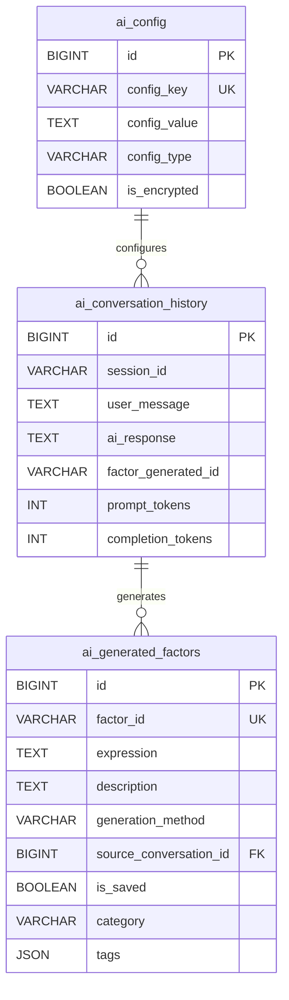

# AI助手模块 - 数据模型 v2.0

> **阶段**: Research阶段
> **模块**: AI助手
> **版本**: v2.0
> **状态**: ⏸️ 代码已编写，待测试验证
> **最后更新**: 2026-02-11

> **对应章节**: [相关章节](../../../项目设计/MyQuant完整架构与工作流V3/02-Research阶段工作流.html)

---

## 🎯 模块定位

AI助手模块v2.0负责AI配置、对话历史和生成因子的管理，包括：
- AI配置存储（API密钥、模型参数）
- 对话历史记录（多轮对话）
- AI生成因子库（因子归档）

---

## 📊 数据表结构

### 1. AI配置表 (ai_config)

**表名**: `ai_config`

**说明**: 存储AI配置信息（API密钥、模型参数等）

| 字段名 | 类型 | 允许空 | 说明 |
|--------|------|--------|------|
| id | BIGINT | ❌ | 主键，自增 |
| config_key | VARCHAR(100) | ❌ | 配置键（唯一） |
| config_value | TEXT | ❌ | 配置值 |
| config_type | VARCHAR(50) | ❌ | 配置类型（api_key/model/temperature等） |
| is_encrypted | BOOLEAN | ❌ | 是否加密（默认false） |
| created_at | DATETIME | ❌ | 创建时间 |
| updated_at | DATETIME | ❌ | 更新时间（自动更新） |

**索引**:
- PRIMARY KEY: `id`
- UNIQUE INDEX: `config_key`
- INDEX: `config_type`

**默认配置（种子数据）**:
```sql
INSERT INTO ai_config (config_key, config_value, config_type) VALUES
('deepseek_api_key', '', 'api_key'),
('deepseek_api_url', 'https://api.deepseek.com/v1', 'api_url'),
('deepseek_model', 'deepseek-chat', 'model'),
('temperature', '0.7', 'parameter'),
('max_tokens', '2000', 'parameter'),
('context_messages', '10', 'system');
```

---

### 2. AI对话历史表 (ai_conversation_history)

**表名**: `ai_conversation_history`

**说明**: 存储AI对话历史记录（多轮对话）

| 字段名 | 类型 | 允许空 | 说明 |
|--------|------|--------|------|
| id | BIGINT | ❌ | 主键，自增 |
| session_id | VARCHAR(100) | ❌ | 会话ID |
| user_message | TEXT | ❌ | 用户消息 |
| ai_response | TEXT | ❌ | AI响应 |
| factor_generated_id | VARCHAR(100) | ✅ | 生成的因子ID（如果有） |
| prompt_tokens | INT | ❌ | 提示词Token数（默认0） |
| completion_tokens | INT | ❌ | 响应Token数（默认0） |
| model_name | VARCHAR(50) | ❌ | 模型名称（默认deepseek-chat） |
| temperature | FLOAT | ❌ | 温度参数（默认0.7） |
| created_at | DATETIME | ❌ | 创建时间 |

**索引**:
- PRIMARY KEY: `id`
- INDEX: `session_id`
- INDEX: `created_at`

**示例数据**:
```json
{
  "id": 1,
  "session_id": "uuid-string",
  "user_message": "帮我生成一个动量因子",
  "ai_response": "好的，我来生成一个基于价格的动量因子...",
  "factor_generated_id": "ai_factor_001",
  "prompt_tokens": 15,
  "completion_tokens": 350,
  "model_name": "deepseek-chat",
  "temperature": 0.7,
  "created_at": "2026-02-11 10:00:00"
}
```

---

### 3. AI生成因子表 (ai_generated_factors)

**表名**: `ai_generated_factors`

**说明**: 存储AI生成的因子（因子库）

| 字段名 | 类型 | 允许空 | 说明 |
|--------|------|--------|------|
| id | BIGINT | ❌ | 主键，自增 |
| factor_id | VARCHAR(100) | ❌ | 因子ID（唯一） |
| expression | TEXT | ❌ | 因子表达式 |
| description | TEXT | ❌ | 因子描述 |
| generation_method | VARCHAR(50) | ❌ | 生成方式（ai/manual） |
| source_conversation_id | BIGINT | ✅ | 来源对话ID（外键） |
| is_saved | BOOLEAN | ❌ | 是否已保存（默认false） |
| category | VARCHAR(50) | ❌ | 分类（默认uncategorized） |
| tags | JSON | ✅ | 标签（JSON数组） |
| created_at | DATETIME | ❌ | 创建时间 |
| updated_at | DATETIME | ❌ | 更新时间 |

**索引**:
- PRIMARY KEY: `id`
- UNIQUE INDEX: `factor_id`
- INDEX: `category`
- INDEX: `is_saved`
- FOREIGN KEY: `source_conversation_id` → `ai_conversation_history(id)` ON DELETE SET NULL

**示例数据**:
```json
{
  "id": 1,
  "factor_id": "volume_momentum_5d",
  "expression": "$volume / Ref($volume, 5) - 1",
  "description": "基于5日成交量的动量因子",
  "generation_method": "ai",
  "source_conversation_id": 123,
  "is_saved": true,
  "category": "momentum",
  "tags": ["volume", "momentum", "5d"],
  "created_at": "2026-02-11 10:00:00"
}
```

---

## 🔗 数据关系

### ER图



### 关系说明

1. **ai_config → ai_conversation_history**
   - 一对多关系
   - 一个配置可用于多个对话
   - 通过model_name和temperature字段关联

2. **ai_conversation_history → ai_generated_factors**
   - 一对多关系
   - 一个对话可以生成多个因子
   - 通过source_conversation_id外键关联
   - 级联删除：对话删除时，因子的source_conversation_id设为NULL

---

## 💾 存储设计

### API密钥加密

**加密方案**:
- 使用Fernet对称加密（AES-128）
- 密钥存储在环境变量`ENCRYPTION_KEY`中
- 数据库中只存储加密后的密钥

**加密标识**:
- `is_encrypted = true`: API密钥已加密
- `is_encrypted = false`: 普通配置（不需要加密）

**加密示例**:
```python
from cryptography.fernet import Fernet
import os

# 加载加密密钥
encryption_key = os.getenv('ENCRYPTION_KEY')
if not encryption_key:
    # 生成新密钥
    encryption_key = Fernet.generate_key()
    print(f"请设置环境变量: ENCRYPTION_KEY={encryption_key.decode()}")

cipher = Fernet(encryption_key)

# 加密API密钥
api_key = "sk-xxxxxxxxxxxxxxxxxxxx"
encrypted_key = cipher.encrypt(api_key.encode()).decode()

# 解密API密钥
decrypted_key = cipher.decrypt(encrypted_key.encode()).decode()
```

### JSON字段使用

**tags字段**（ai_generated_factors表）:
```json
{
  "tags": ["volume", "momentum", "5d", "short-term"]
}
```

**查询示例**:
```sql
-- 查询包含特定标签的因子
SELECT * FROM ai_generated_factors
WHERE JSON_CONTAINS(tags, '"momentum"');
```

---

## 📝 数据操作示例

### Python SQLAlchemy示例

```python
from sqlalchemy import create_engine, Column, Integer, String, Text, Boolean, DateTime, Float, JSON
from sqlalchemy.ext.declarative import declarative_base
from sqlalchemy.orm import sessionmaker
from datetime import datetime

Base = declarative_base()

class AIConfig(Base):
    __tablename__ = 'ai_config'

    id = Column(Integer, primary_key=True, autoincrement=True)
    config_key = Column(String(100), nullable=False, unique=True)
    config_value = Column(Text, nullable=False)
    config_type = Column(String(50), nullable=False)
    is_encrypted = Column(Boolean, nullable=False, default=False)
    created_at = Column(DateTime, nullable=False, default=datetime.now)
    updated_at = Column(DateTime, nullable=False, default=datetime.now, onupdate=datetime.now)

class AIConversationHistory(Base):
    __tablename__ = 'ai_conversation_history'

    id = Column(Integer, primary_key=True, autoincrement=True)
    session_id = Column(String(100), nullable=False)
    user_message = Column(Text, nullable=False)
    ai_response = Column(Text, nullable=False)
    factor_generated_id = Column(String(100))
    prompt_tokens = Column(Integer, nullable=False, default=0)
    completion_tokens = Column(Integer, nullable=False, default=0)
    model_name = Column(String(50), nullable=False, default='deepseek-chat')
    temperature = Column(Float, nullable=False, default=0.7)
    created_at = Column(DateTime, nullable=False, default=datetime.now)

class AIGeneratedFactor(Base):
    __tablename__ = 'ai_generated_factors'

    id = Column(Integer, primary_key=True, autoincrement=True)
    factor_id = Column(String(100), nullable=False, unique=True)
    expression = Column(Text, nullable=False)
    description = Column(Text, nullable=False)
    generation_method = Column(String(50), nullable=False, default='ai')
    source_conversation_id = Column(Integer)
    is_saved = Column(Boolean, nullable=False, default=False)
    category = Column(String(50), nullable=False, default='uncategorized')
    tags = Column(JSON)
    created_at = Column(DateTime, nullable=False, default=datetime.now)
    updated_at = Column(DateTime, nullable=False, default=datetime.now, onupdate=datetime.now)

# 创建AI配置
config = AIConfig(
    config_key="deepseek_api_key",
    config_value="encrypted_key_here",
    config_type="api_key",
    is_encrypted=True
)
session.add(config)
session.commit()

# 创建对话历史
history = AIConversationHistory(
    session_id="uuid-string",
    user_message="帮我生成一个动量因子",
    ai_response="好的，我来生成...",
    factor_generated_id="ai_factor_001",
    prompt_tokens=15,
    completion_tokens=350,
    model_name="deepseek-chat",
    temperature=0.7
)
session.add(history)
session.commit()

# 创建AI生成因子
factor = AIGeneratedFactor(
    factor_id="volume_momentum_5d",
    expression="$volume / Ref($volume, 5) - 1",
    description="基于5日成交量的动量因子",
    generation_method="ai",
    source_conversation_id=history.id,
    is_saved=True,
    category="momentum",
    tags=["volume", "momentum", "5d"]
)
session.add(factor)
session.commit()

# 查询示例
configs = session.query(AIConfig).filter_by(config_type="api_key").all()
conversations = session.query(AIConversationHistory).filter_by(session_id="uuid-string").all()
factors = session.query(AIGeneratedFactor).filter_by(is_saved=True).all()
```

---

## 🔧 初始化与维护

### 数据库初始化

**DDL脚本位置**: [backend/database/schema/ai_assistant_tables.sql](../../../../../backend/database/schema/ai_assistant_tables.sql) (200行)

**初始化命令**:
```bash
python backend/database/init_ai_assistant_db.py
```

**初始化脚本功能**:
1. 创建3张表（ai_config, ai_conversation_history, ai_generated_factors）
2. 插入6条默认配置（种子数据）
3. 创建索引和外键约束
4. 创建数据清理存储过程

### 数据清理

**清理过期对话**（默认保留30天）:
```sql
CALL cleanup_old_conversations(30);
```

**清理未保存因子**:
```sql
DELETE FROM ai_generated_factors
WHERE is_saved = false
AND created_at < DATE_SUB(NOW(), INTERVAL 7 DAY);
```

---

## 🔗 相关文档

- [概述](./概述.md) - 模块概述
- [API设计](./API设计.md) - API端点定义
- [前端组件](./前端组件.md) - 前端UI组件文档
- [实施记录](./实施记录.md) - v2.0实施记录

---

## 📝 实现文件

**DDL脚本**: [backend/database/schema/ai_assistant_tables.sql](../../../../../backend/database/schema/ai_assistant_tables.sql) (200行)

**ORM模型**: [backend/database/models/ai_assistant_models.py](../../../../../backend/database/models/ai_assistant_models.py) (230行)

**初始化脚本**: [backend/database/init_ai_assistant_db.py](../../../../../backend/database/init_ai_assistant_db.py) (200行)

**种子数据**: [backend/database/seed_ai_config.py](../../../../../backend/database/seed_ai_config.py) (100行)

---

**维护说明**: 本文档与数据库schema保持同步，如有表结构变更请及时更新
**创建时间**: 2026-02-11
**v2.0更新**: 2026-02-11
**状态**: ⏸️ 代码已编写，待测试验证
**维护者**: Claude (AI Assistant Service)
