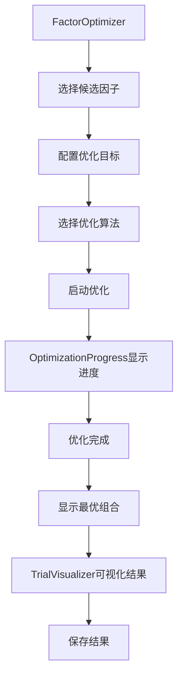

# Meta Controller模块 - 前端组件

> **阶段**: Research阶段
> **模块**: Meta Controller
> **状态**: ✅ 文档完成
> **版本**: v1.0
> **最后更新**: 2026-02-10
> **文档状态**: ✅ 已完成 | **优先级**: P2高级功能
> **更新日期**: 2026-02-10

---

## 🎯 模块UI组件列表

### 核心组件
1. `OptimizationTaskManager` - 优化任务管理器
2. `FactorOptimizer` - 因子组合优化器
3. `ModelSelector` - 模型选择器
4. `HyperparameterTuner` - 超参数调优器
5. `TrialVisualizer` - 试验可视化组件
6. `ScheduledTaskManager` - 自动任务调度管理器

---

## 📦 组件详细说明

### 1. OptimizationTaskManager - 优化任务管理器

**功能**: 管理所有Meta Controller优化任务

**Props**:
```typescript
interface OptimizationTaskManagerProps {
  taskType?: 'factor' | 'model' | 'hpo' | 'all';  // 任务类型筛选
  status?: 'running' | 'completed' | 'failed' | 'all';  // 状态筛选
}
```

**Events**:
```typescript
interface OptimizationTaskManagerEvents {
  'task-created': (task: OptimizationTask) => void;
  'task-deleted': (taskId: string) => void;
  'task-selected': (task: OptimizationTask) => void;
}
```

**状态管理**:
```typescript
interface OptimizationTaskState {
  tasks: OptimizationTask[];
  loading: boolean;
  error: string | null;
  filters: TaskFilters;
}
```

---

### 2. FactorOptimizer - 因子组合优化器

**功能**: 配置和执行因子组合优化

**Props**:
```typescript
interface FactorOptimizerProps {
  candidateFactors: Factor[];  // 候选因子列表
  onOptimizationStart?: (config: FactorOptimizationConfig) => void;
  onOptimizationComplete?: (result: FactorOptimizationResult) => void;
}
```

**子组件**:
- `FactorSelector` - 因子选择器
- `OptimizationConfigForm` - 优化配置表单
- `OptimizationProgress` - 优化进度显示
- `CombinationResults` - 组合结果展示

**使用示例**:
```vue
<template>
  <FactorOptimizer
    :candidate-factors="factors"
    @optimization-start="handleStart"
    @optimization-complete="handleComplete"
  />
</template>

<script setup lang="ts">
import { ref } from 'vue';

const factors = ref([
  { id: 'factor_001', name: 'MA60偏离度', ic: 0.052 },
  { id: 'factor_002', name: '成交量比率', ic: 0.048 },
  // ...
]);

const handleStart = (config) => {
  console.log('开始优化:', config);
};

const handleComplete = (result) => {
  console.log('优化完成:', result.bestCombination);
};
</script>
```

---

### 3. ModelSelector - 模型选择器

**功能**: 自动选择最佳模型

**Props**:
```typescript
interface ModelSelectorProps {
  modelSpace: ModelSpace;  // 模型空间定义
  dataset: DatasetConfig;  // 数据集配置
  searchStrategy: 'grid' | 'random' | 'bayesian';
  maxTrials?: number;  // 最大试验次数
}
```

**状态管理**:
```typescript
interface ModelSelectionState {
  currentTask: ModelSelectionTask | null;
  bestModel: ModelConfig | null;
  allModels: ModelEvaluationResult[];
  trials: TrialRecord[];
  progress: number;
}
```

**组件层次**:
```
ModelSelector
├── ModelSpaceConfigurator - 模型空间配置器
├── SearchStrategySelector - 搜索策略选择器
├── TrainingProgress - 训练进度
├── ModelComparisonTable - 模型对比表
└── BestModelDetail - 最优模型详情
```

---

### 4. HyperparameterTuner - 超参数调优器

**功能**: 超参数优化配置与执行

**Props**:
```typescript
interface HyperparameterTunerProps {
  modelType: string;
  hyperparameterSpace: HyperparameterSpace;
  searchMethod: 'grid' | 'random' | 'bayesian';
  onOptimizationComplete?: (bestParams: Hyperparameters) => void;
}
```

**核心功能**:
- 参数空间可视化
- 实时优化进度
- 试验历史记录
- 参数重要性分析
- 最优参数展示

**可视化组件**:
```vue
<template>
  <div class="hpo-dashboard">
    <!-- 参数空间定义 -->
    <ParameterSpaceConfigurator
      v-model="paramSpace"
      @parameter-add="addParameter"
      @parameter-remove="removeParameter"
    />

    <!-- 优化进度 -->
    <OptimizationProgress
      :progress="optimizationProgress"
      :best-score="bestScore"
      :current-trial="currentTrial"
    />

    <!-- 试验历史 -->
    <TrialHistoryTable
      :trials="trials"
      @trial-click="showTrialDetail"
    />

    <!-- 参数重要性 -->
    <ParameterImportanceChart
      :importance="paramImportance"
    />

    <!-- 最优参数 -->
    <BestParametersDisplay
      :params="bestParams"
      :metrics="bestMetrics"
    />
  </div>
</template>
```

---

### 5. TrialVisualizer - 试验可视化组件

**功能**: 可视化优化试验结果

**Props**:
```typescript
interface TrialVisualizerProps {
  trials: TrialRecord[];
  optimizationMetric: string;
  visualizationType: 'scatter' | 'parallel' | 'heatmap';
}
```

**图表类型**:
1. **散点图** - 参数vs评分
2. **平行坐标图** - 多维参数可视化
3. **热力图** - 参数组合热力图

**使用示例**:
```vue
<template>
  <TrialVisualizer
    :trials="trials"
    optimization-metric="ic"
    visualization-type="parallel"
  />
</template>
```

---

### 6. ScheduledTaskManager - 自动任务调度管理器

**功能**: 管理自动优化任务调度

**Props**:
```typescript
interface ScheduledTaskManagerProps {
  tasks: ScheduledTask[];
  onTaskCreate?: (task: ScheduledTaskConfig) => void;
  onTaskUpdate?: (taskId: string, updates: Partial<ScheduledTask>) => void;
  onTaskDelete?: (taskId: string) => void;
}
```

**核心功能**:
- 创建调度任务
- 配置调度频率（日/周/月/季度）
- 设置通知方式
- 查看运行历史
- 启用/禁用任务

**界面示例**:
```vue
<template>
  <div class="scheduled-task-manager">
    <!-- 任务列表 -->
    <ScheduledTaskList
      :tasks="scheduledTasks"
      @task-enable="enableTask"
      @task-disable="disableTask"
      @task-delete="deleteTask"
    />

    <!-- 创建任务对话框 -->
    <CreateTaskDialog
      v-model:visible="showCreateDialog"
      @create="handleCreateTask"
    />

    <!-- 任务详情 -->
    <TaskDetailDrawer
      v-model:visible="showDetailDrawer"
      :task="selectedTask"
    />
  </div>
</template>
```

---

## 🔄 组件交互流程

### 典型工作流：因子组合优化



---

## 📊 状态管理方案

### Pinia Store定义

```typescript
// stores/metaController.ts
import { defineStore } from 'pinia';

export const useMetaControllerStore = defineStore('metaController', {
  state: () => ({
    // 优化任务
    tasks: [] as OptimizationTask[],
    currentTask: null as OptimizationTask | null,

    // 因子优化
    factorCombinations: [] as FactorCombination[],
    bestFactorCombination: null as FactorCombination | null,

    // 模型选择
    modelTrials: [] as ModelTrial[],
    bestModel: null as ModelConfig | null,

    // 超参数优化
    hpoTrials: [] as HPOTrial[],
    bestHyperparameters: null as Hyperparameters | null,

    // UI状态
    loading: false,
    error: null as string | null,
  }),

  actions: {
    // 任务管理
    async createTask(config: TaskConfig) {
      this.loading = true;
      try {
        const task = await api.meta.createTask(config);
        this.tasks.push(task);
        return task;
      } finally {
        this.loading = false;
      }
    },

    async getTaskStatus(taskId: string) {
      const status = await api.meta.getTaskStatus(taskId);
      const task = this.tasks.find(t => t.id === taskId);
      if (task) {
        task.status = status.status;
        task.result = status.result;
      }
      return status;
    },

    // 因子优化
    async optimizeFactors(config: FactorOptimizationConfig) {
      this.loading = true;
      try {
        const result = await api.meta.optimizeFactors(config);
        this.bestFactorCombination = result.bestCombination;
        this.factorCombinations = result.allCombinations;
        return result;
      } finally {
        this.loading = false;
      }
    },

    // 模型选择
    async selectModel(config: ModelSelectionConfig) {
      this.loading = true;
      try {
        const result = await api.meta.selectModel(config);
        this.bestModel = result.bestModel;
        this.modelTrials = result.allModels;
        return result;
      } finally {
        this.loading = false;
      }
    },

    // 超参数优化
    async optimizeHyperparameters(config: HPOConfig) {
      this.loading = true;
      try {
        const result = await api.meta.optimizeHyperparameters(config);
        this.bestHyperparameters = result.bestParams;
        this.hpoTrials = result.trials;
        return result;
      } finally {
        this.loading = false;
      }
    },
  },
});
```

---

## 🎨 UI设计要点

### 1. 优化进度展示
- 实时显示当前最优结果
- 试验进度条
- 剩余时间估计
- 实时性能曲线

### 2. 结果可视化
- 散点图：参数vs性能
- 平行坐标图：多维参数
- 热力图：参数组合
- 重要性排序：参数影响

### 3. 交互设计
- 拖拽式参数配置
- 实时预览
- 快速对比
- 一键导出

---

## 🔗 相关文档

- [API设计](./API设计.md) - 后端API接口
- [数据模型](./数据模型.md) - 数据表结构
- [Research阶段README](../README.md) - 阶段概述

---

**最后更新**: 2026-02-10
