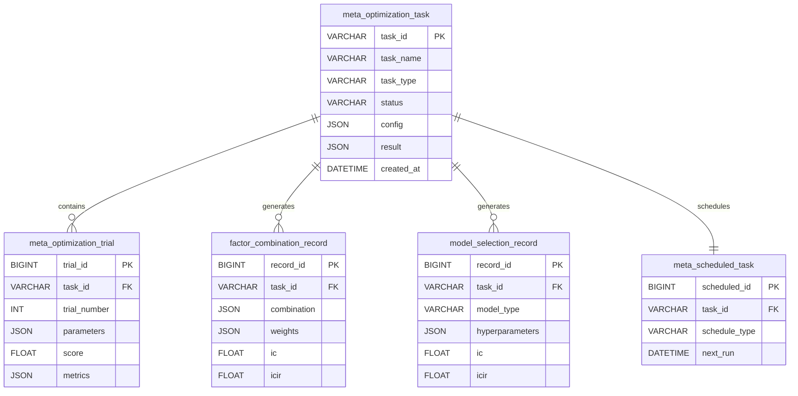

# Meta Controller模块 - 数据模型

> **阶段**: Research阶段
> **模块**: Meta Controller
> **状态**: ✅ 文档完成
> **版本**: v1.0
> **最后更新**: 2026-02-10
> **文档状态**: ✅ 已完成 | **优先级**: P2高级功能
> **更新日期**: 2026-02-10

---

## 📊 数据表结构

### 1. 优化任务表 (meta_optimization_task)

存储所有Meta Controller优化任务。

| 字段名 | 类型 | 说明 | 索引 |
|--------|------|------|------|
| task_id | VARCHAR(50) | 任务ID | PK |
| task_name | VARCHAR(100) | 任务名称 | |
| task_type | VARCHAR(20) | 任务类型(factor/model/hpo) | IDX |
| status | VARCHAR(20) | 状态(running/completed/failed) | IDX |
| config | JSON | 配置参数 | |
| result | JSON | 优化结果 | |
| created_at | DATETIME | 创建时间 | IDX |
| updated_at | DATETIME | 更新时间 | |
| completed_at | DATETIME | 完成时间 | |

### 2. 优化试验表 (meta_optimization_trial)

存储每次优化试验的详细信息。

| 字段名 | 类型 | 说明 | 索引 |
|--------|------|------|------|
| trial_id | BIGINT | 试验ID | PK, AUTO |
| task_id | VARCHAR(50) | 关联任务ID | FK, IDX |
| trial_number | INT | 试验序号 | IDX |
| parameters | JSON | 试验参数 | |
| score | FLOAT | 评分 | |
| metrics | JSON | 详细指标 | |
| started_at | DATETIME | 开始时间 | |
| completed_at | DATETIME | 完成时间 | |
| duration | FLOAT | 耗时(秒) | |

### 3. 因子组合记录表 (factor_combination_record)

存储因子组合优化记录。

| 字段名 | 类型 | 说明 | 索引 |
|--------|------|------|------|
| record_id | BIGINT | 记录ID | PK, AUTO |
| task_id | VARCHAR(50) | 关联任务ID | FK, IDX |
| combination | JSON | 因子组合 | |
| weights | JSON | 因子权重 | |
| ic | FLOAT | IC值 | |
| icir | FLOAT | ICIR值 | |
| rank_ic | FLOAT | Rank IC值 | |
| sharpe | FLOAT | 夏普比率 | |
| evaluated_at | DATETIME | 评估时间 | |

### 4. 模型选择记录表 (model_selection_record)

存储模型选择记录。

| 字段名 | 类型 | 说明 | 索引 |
|--------|------|------|------|
| record_id | BIGINT | 记录ID | PK, AUTO |
| task_id | VARCHAR(50) | 关联任务ID | FK, IDX |
| model_type | VARCHAR(20) | 模型类型 | IDX |
| hyperparameters | JSON | 超参数 | |
| ic | FLOAT | IC值 | IDX |
| icir | FLOAT | ICIR值 | |
| rank_ic | FLOAT | Rank IC值 | |
| train_ic | FLOAT | 训练集IC | |
| test_ic | FLOAT | 测试集IC | |
| evaluated_at | DATETIME | 评估时间 | |

### 5. 自动任务调度表 (meta_scheduled_task)

存储自动优化任务的调度信息。

| 字段名 | 类型 | 说明 | 索引 |
|--------|------|------|------|
| scheduled_id | BIGINT | 调度ID | PK, AUTO |
| task_id | VARCHAR(50) | 关联任务ID | FK, UNIQUE |
| task_name | VARCHAR(100) | 任务名称 | |
| schedule_type | VARCHAR(20) | 调度类型(daily/weekly/monthly/quarterly) | |
| schedule_config | JSON | 调度配置 | |
| enabled | BOOLEAN | 是否启用 | |
| last_run | DATETIME | 上次运行时间 | |
| next_run | DATETIME | 下次运行时间 | IDX |
| notification_config | JSON | 通知配置 | |
| created_at | DATETIME | 创建时间 | |

---

## 🔗 数据关系图



---

## 📈 数据使用示例

### 示例1: 创建优化任务

```sql
INSERT INTO meta_optimization_task (
    task_id, task_name, task_type, status, config, created_at
) VALUES (
    'hpo_20240210_001',
    'LightGBM超参数优化',
    'hpo',
    'running',
    '{
        "model_type": "lgb",
        "hyperparameter_space": {
            "num_leaves": {"type": "int", "range": [31, 127]},
            "learning_rate": {"type": "float", "range": [0.01, 0.1]}
        },
        "search_method": "bayesian",
        "n_trials": 100
    }',
    NOW()
);
```

### 示例2: 记录试验结果

```sql
INSERT INTO meta_optimization_trial (
    task_id, trial_number, parameters, score, metrics,
    started_at, completed_at, duration
) VALUES (
    'hpo_20240210_001',
    1,
    '{"num_leaves": 63, "learning_rate": 0.05}',
    0.072,
    '{"ic": 0.072, "icir": 0.91, "rank_ic": 0.075}',
    NOW() - INTERVAL 5 MINUTE,
    NOW(),
    300
);
```

### 示例3: 查询最优结果

```sql
SELECT
    trial_id,
    parameters,
    score,
    metrics
FROM meta_optimization_trial
WHERE task_id = 'hpo_20240210_001'
ORDER BY score DESC
LIMIT 1;
```

---

## 🔑 索引设计说明

### 性能优化索引

1. **meta_optimization_task表**:
   - `idx_task_type_status`: (task_type, status) - 按类型和状态查询
   - `idx_created_at`: 按创建时间查询

2. **meta_optimization_trial表**:
   - `idx_task_id_trial_number`: (task_id, trial_number) - 按任务查询试验
   - `idx_score`: 按评分排序

3. **factor_combination_record表**:
   - `idx_task_id`: 按任务查询
   - `idx_ic`: 按IC排序

4. **model_selection_record表**:
   - `idx_task_id`: 按任务查询
   - `idx_model_type_ic`: (model_type, ic) - 按模型类型和IC查询

---

**最后更新**: 2026-02-10
