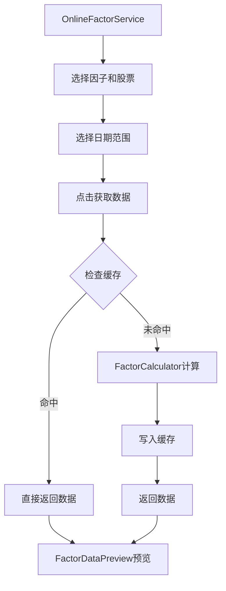

# Online Serving模块 - 前端组件

> **阶段**: Research阶段
> **模块**: Online Serving
> **状态**: 📋 设计中
> **版本**: v1.0
> **最后更新**: 2026-02-23

---

## 🎯 模块UI组件列表

### 核心组件
1. `OnlineFactorService` - 在线因子服务面板
2. `FactorCacheManager` - 因子缓存管理器
3. `FactorCalculator` - 因子计算器
4. `CacheStatusMonitor` - 缓存状态监控
5. `IncrementalUpdater` - 增量更新器

---

## 📦 组件详细说明

### 1. OnlineFactorService - 在线因子服务面板

**功能**: 在线因子服务的主入口面板，集成到因子分析步骤

**Props**:
```typescript
interface OnlineFactorServiceProps {
  researchId: string;           // 研究ID
  factorNames?: string[];       // 预选因子列表
  stockCodes?: string[];        // 预选股票列表
  dateRange?: DateRange;        // 日期范围
}
```

**Events**:
```typescript
interface OnlineFactorServiceEvents {
  'factors-loaded': (factors: FactorData[]) => void;
  'cache-status-change': (status: CacheStatus) => void;
  'error': (error: Error) => void;
}
```

**子组件**:
```
OnlineFactorService
├── FactorSelector - 因子选择器
├── StockSelector - 股票选择器
├── DateRangePicker - 日期范围选择
├── CalculateButton - 计算按钮
├── CacheStatusMonitor - 缓存状态
└── FactorDataPreview - 数据预览
```

**使用示例**:
```vue
<template>
  <OnlineFactorService
    :research-id="currentResearchId"
    :factor-names="selectedFactors"
    @factors-loaded="handleFactorsLoaded"
  />
</template>

<script setup lang="ts">
import { ref } from 'vue';

const currentResearchId = ref('research_001');
const selectedFactors = ref(['factor_001', 'factor_002']);

const handleFactorsLoaded = (factors) => {
  console.log('因子数据加载完成:', factors.length);
};
</script>
```

---

### 2. FactorCacheManager - 因子缓存管理器

**功能**: 管理因子缓存的查看、清除、刷新

**Props**:
```typescript
interface FactorCacheManagerProps {
  visible?: boolean;            // 是否显示
  cacheStats?: CacheStatistics; // 缓存统计
}
```

**状态管理**:
```typescript
interface CacheManagerState {
  cachedFactors: CachedFactor[];
  totalKeys: number;
  memoryUsed: string;
  hitRate: number;
  loading: boolean;
}
```

**核心功能**:
- 查看已缓存因子列表
- 查看缓存命中率
- 清除单个因子缓存
- 清除全部缓存
- 刷新缓存状态

**界面示例**:
```vue
<template>
  <div class="cache-manager">
    <!-- 缓存统计卡片 -->
    <el-row :gutter="16">
      <el-col :span="6">
        <StatCard title="缓存因子" :value="cacheStats.factorCount" />
      </el-col>
      <el-col :span="6">
        <StatCard title="内存占用" :value="cacheStats.memoryUsed" />
      </el-col>
      <el-col :span="6">
        <StatCard title="命中率" :value="`${cacheStats.hitRate}%`" />
      </el-col>
      <el-col :span="6">
        <StatCard title="数据点数" :value="cacheStats.dataPoints" />
      </el-col>
    </el-row>

    <!-- 缓存因子列表 -->
    <el-table :data="cachedFactors" style="margin-top: 16px">
      <el-table-column prop="name" label="因子名称" />
      <el-table-column prop="cachedAt" label="缓存时间" />
      <el-table-column prop="expiresAt" label="过期时间" />
      <el-table-column prop="dataPoints" label="数据点数" />
      <el-table-column label="操作">
        <template #default="{ row }">
          <el-button @click="refreshCache(row.name)" size="small">刷新</el-button>
          <el-button @click="clearCache(row.name)" size="small" type="danger">清除</el-button>
        </template>
      </el-table-column>
    </el-table>

    <!-- 批量操作 -->
    <div style="margin-top: 16px">
      <el-button @click="refreshAllCache">全部刷新</el-button>
      <el-button @click="clearAllCache" type="danger">全部清除</el-button>
    </div>
  </div>
</template>
```

---

### 3. FactorCalculator - 因子计算器

**功能**: 配置和执行因子计算任务

**Props**:
```typescript
interface FactorCalculatorProps {
  factorNames: string[];        // 要计算的因子
  stockCodes: string[];         // 股票代码
  dateRange: DateRange;         // 日期范围
  useCache?: boolean;           // 是否使用缓存
  parallel?: boolean;           // 是否并行计算
}
```

**Events**:
```typescript
interface FactorCalculatorEvents {
  'calculate-start': (config: CalculateConfig) => void;
  'calculate-progress': (progress: number) => void;
  'calculate-complete': (result: CalculateResult) => void;
  'calculate-error': (error: Error) => void;
}
```

**组件层次**:
```
FactorCalculator
├── ConfigPanel - 配置面板
│   ├── FactorMultiSelect - 因子多选
│   ├── StockMultiSelect - 股票多选
│   └── DateRangeSelector - 日期选择
├── ProgressIndicator - 进度指示器
├── ResultPreview - 结果预览
└── ActionButtons - 操作按钮
```

**使用示例**:
```vue
<template>
  <FactorCalculator
    :factor-names="selectedFactors"
    :stock-codes="selectedStocks"
    :date-range="dateRange"
    :use-cache="true"
    @calculate-complete="handleComplete"
  />
</template>
```

---

### 4. CacheStatusMonitor - 缓存状态监控

**功能**: 实时监控缓存状态

**Props**:
```typescript
interface CacheStatusMonitorProps {
  refreshInterval?: number;     // 刷新间隔（秒）
  compact?: boolean;            // 紧凑模式
}
```

**状态显示**:
- 服务状态（运行/停止）
- 缓存连接状态
- 内存使用率
- 命中率
- 数据点总数

**界面示例**:
```vue
<template>
  <div class="cache-status-monitor">
    <div class="status-row">
      <StatusIndicator
        :status="serviceStatus"
        :text="serviceStatus === 'running' ? '服务运行中' : '服务已停止'"
      />
      <StatusIndicator
        :status="cacheStatus"
        :text="cacheStatus === 'connected' ? '缓存已连接' : '缓存未连接'"
      />
    </div>
    <div class="metrics-row" v-if="!compact">
      <MetricItem label="内存" :value="memoryUsed" />
      <MetricItem label="命中率" :value="`${hitRate}%`" />
      <MetricItem label="数据点" :value="dataPoints" />
    </div>
  </div>
</template>
```

---

### 5. IncrementalUpdater - 增量更新器

**功能**: 配置和执行因子数据增量更新

**Props**:
```typescript
interface IncrementalUpdaterProps {
  factorNames: string[];        // 要更新的因子
  updateType?: 'daily' | 'weekly' | 'monthly';
  scheduled?: boolean;          // 是否定时执行
}
```

**核心功能**:
- 手动触发增量更新
- 配置自动更新计划
- 查看更新历史
- 更新进度监控

**界面示例**:
```vue
<template>
  <div class="incremental-updater">
    <!-- 更新配置 -->
    <el-form :model="updateConfig" label-width="100px">
      <el-form-item label="更新类型">
        <el-select v-model="updateConfig.updateType">
          <el-option label="每日" value="daily" />
          <el-option label="每周" value="weekly" />
          <el-option label="每月" value="monthly" />
        </el-select>
      </el-form-item>
      <el-form-item label="更新日期">
        <el-date-picker v-model="updateConfig.date" />
      </el-form-item>
    </el-form>

    <!-- 操作按钮 -->
    <el-button type="primary" @click="executeUpdate" :loading="updating">
      执行更新
    </el-button>

    <!-- 更新结果 -->
    <div v-if="updateResult" class="update-result">
      <p>更新因子: {{ updateResult.updatedFactors }}</p>
      <p>更新股票: {{ updateResult.updatedStocks }}</p>
      <p>更新数据点: {{ updateResult.updatedDataPoints }}</p>
      <p>耗时: {{ updateResult.updateTime }}s</p>
    </div>
  </div>
</template>
```

---

## 🔄 组件交互流程

### 典型工作流：获取因子数据



---

## 📊 状态管理方案

### Pinia Store定义

```typescript
// stores/onlineServing.ts
import { defineStore } from 'pinia';

export const useOnlineServingStore = defineStore('onlineServing', {
  state: () => ({
    // 缓存状态
    cacheStatus: {
      connected: false,
      memoryUsed: '0MB',
      hitRate: 0,
      keys: 0,
    },

    // 缓存因子列表
    cachedFactors: [] as CachedFactor[],

    // 计算任务
    calculateTask: null as CalculateTask | null,
    calculateProgress: 0,

    // 增量更新
    updateTask: null as UpdateTask | null,

    // UI状态
    loading: false,
    error: null as string | null,
  }),

  actions: {
    // 获取缓存状态
    async fetchCacheStatus() {
      this.loading = true;
      try {
        const status = await api.onlineServing.getCacheStatus();
        this.cacheStatus = status;
      } finally {
        this.loading = false;
      }
    },

    // 获取因子数据
    async getFactorData(params: GetFactorParams) {
      this.loading = true;
      this.error = null;
      try {
        const result = await api.onlineServing.getFactorData(params);
        return result;
      } catch (e) {
        this.error = e.message;
        throw e;
      } finally {
        this.loading = false;
      }
    },

    // 计算因子
    async calculateFactors(params: CalculateParams) {
      this.calculateTask = { id: Date.now().toString(), status: 'running' };
      this.calculateProgress = 0;

      try {
        const result = await api.onlineServing.calculateFactors(params);
        this.calculateTask.status = 'completed';
        return result;
      } catch (e) {
        this.calculateTask.status = 'failed';
        throw e;
      }
    },

    // 清除缓存
    async clearCache(factorNames?: string[]) {
      await api.onlineServing.clearCache(factorNames);
      await this.fetchCacheStatus();
    },

    // 增量更新
    async incrementalUpdate(params: UpdateParams) {
      this.updateTask = { id: Date.now().toString(), status: 'running' };
      try {
        const result = await api.onlineServing.incrementalUpdate(params);
        this.updateTask.status = 'completed';
        return result;
      } catch (e) {
        this.updateTask.status = 'failed';
        throw e;
      }
    },
  },
});
```

---

## 🎨 UI设计要点

### 1. 缓存状态展示
- 实时显示缓存命中率
- 内存使用进度条
- 因子缓存列表
- 过期时间倒计时

### 2. 计算进度展示
- 进度条动画
- 当前计算因子
- 剩余时间估计
- 取消按钮

### 3. 交互设计
- 拖拽选择因子
- 快速日期选择
- 缓存状态刷新
- 一键获取数据

---

## 📁 文件结构

```
frontend/src/
├── api/
│   └── onlineServing.ts              # API调用封装
├── stores/
│   └── onlineServing.ts              # 状态管理
└── views/research/
    └── components/
        └── steps/
            └── ResearchStep3FactorAnalysis/
                └── OnlineFactorService/
                    ├── Index.vue              # 主组件
                    ├── FactorSelector.vue     # 因子选择器
                    ├── CacheManager.vue       # 缓存管理
                    ├── CacheMonitor.vue       # 缓存监控
                    ├── Calculator.vue         # 计算器
                    ├── Updater.vue            # 更新器
                    └── types.ts               # 类型定义
```

---

## 🔗 相关文档

- [概述](./概述.md) - 模块概述
- [API设计](./API设计.md) - 后端API接口
- [数据模型](./数据模型.md) - 数据结构定义

---

**最后更新**: 2026-02-23
