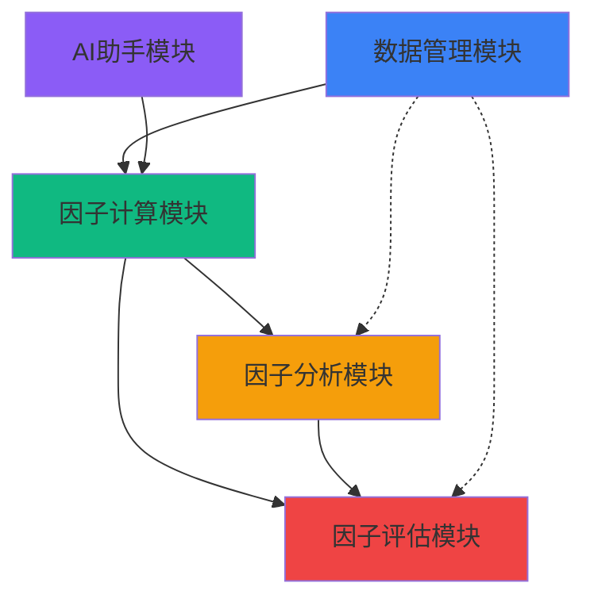

# Research阶段开发指南

> **对应章节**: [第2章 - Research阶段工作流](../../项目设计/MyQuant完整架构与工作流V3/02-Research阶段工作流.html)
> **更新日期**: 2026-02-10

---

## 🎯 阶段目标

**核心公式**: 因子发现 + 因子测试 + 因子训练 + 简单测试 = 可行性判断

---

## 📦 核心模块

### 1. 数据管理模块 📊

**模块定位**: Research阶段的数据基础设施

**核心功能**:
- 股票数据缓存管理
- 数据源配置
- 数据刷新与更新
- 缓存状态查询
- 数据索引管理

**API端点（5个）**:
- `POST /api/v1/research/data/refresh` - 刷新数据
- `GET /api/v1/research/data/cache-stats` - 缓存统计
- `GET /api/v1/research/data/config` - 数据配置
- `POST /api/v1/research/data/index` - 重建索引
- `DELETE /api/v1/research/data/clear` - 清空缓存

**数据模型**: 见 [数据模型.md](./数据管理模块/数据模型.md)
**API设计**: 见 [API设计.md](./数据管理模块/API设计.md)
**前端组件**: 见 [前端组件.md](./数据管理模块/前端组件.md)
**实施记录**: 见 [实施记录.md](./数据管理模块/实施记录.md) ⭐

---

### 2. 因子计算模块 🧮

**模块定位**: 因子表达式计算引擎

**核心功能**:
- 因子表达式计算
- 自定义因子注册
- Alpha158/360因子库
- 因子数据导出
- 保存为QLib格式

**API端点（4个）**:
- `POST /api/v1/research/factor/calculate` - 计算因子
- `GET /api/v1/research/factor/status` - 查询计算状态
- `GET /api/v1/research/factor/export` - 导出因子数据
- `POST /api/v1/research/factor/save-qlib` - 保存为QLib格式

**数据模型**: 见 [因子计算模块/数据模型.md](./因子计算模块/数据模型.md)
**API设计**: 见 [因子计算模块/API设计.md](./因子计算模块/API设计.md)
**前端组件**: 见 [因子计算模块/前端组件.md](./因子计算模块/前端组件.md)
**实施记录**: 见 [实施记录.md](./因子计算模块/实施记录.md) ⭐

---

### 3. 因子分析模块 📈

**模块定位**: 因子质量分析与评估

**核心功能**:
- IC/IR分析
- 因子分布分析
- 因子相关性分析
- 多因子组合分析

**API端点（3个）**:
- `POST /api/v1/research/analysis/ic-ir` - IC/IR分析
- `POST /api/v1/research/analysis/distribution` - 分布分析
- `POST /api/v1/research/analysis/correlation` - 相关性分析

**数据模型**: 见 [因子分析模块/数据模型.md](./因子分析模块/数据模型.md)
**API设计**: 见 [因子分析模块/API设计.md](./因子分析模块/API设计.md)
**前端组件**: 见 [因子分析模块/前端组件.md](./因子分析模块/前端组件.md)
**实施记录**: 见 [实施记录.md](./因子分析模块/实施记录.md) ⭐

---

### 4. 因子评估模块 ✅

**模块定位**: 因子有效性评估

**核心功能**:
- 因子有效性验证
- 因子组合评估
- 预测能力分析

**API端点（2个）**:
- `POST /api/v1/research/eval/validity` - 有效性验证
- `POST /api/v1/research/eval/combine` - 组合评估

**数据模型**: 见 [因子评估模块/数据模型.md](./因子评估模块/数据模型.md)
**API设计**: 见 [因子评估模块/API设计.md](./因子评估模块/API设计.md)
**前端组件**: 见 [因子评估模块/前端组件.md](./因子评估模块/前端组件.md)
**实施记录**: 见 [实施记录.md](./因子评估模块/实施记录.md) ⭐

---

### 5. AI助手模块 🤖

**模块定位**: AI辅助因子研发

**核心功能**:
- DeepSeek API集成
- 因子生成建议
- 因子解释说明
- API密钥管理

**API端点（5个）**:
- `POST /api/v1/research/ai/config` - 保存DeepSeek API密钥
- `GET /api/v1/research/ai/config` - 获取API配置
- `POST /api/v1/research/ai/generate` - 生成因子
- `POST /api/v1/research/ai/save` - 保存生成的因子
- `GET /api/v1/research/ai/history` - 查看历史记录

**数据模型**: 见 [AI助手模块/数据模型.md](./AI助手模块/数据模型.md)
**API设计**: 见 [AI助手模块/API设计.md](./AI助手模块/API设计.md)
**前端组件**: 见 [AI助手模块/前端组件.md](./AI助手模块/前端组件.md)
**实施记录**: 见 [实施记录.md](./AI助手模块/实施记录.md) ⭐

---

## 🔗 模块依赖关系

---

## 🤖 QLib高级模块在Research阶段的应用

> **重要**: QLib三大高级模块是**跨阶段**的核心能力，每个模块在三阶段都有不同应用

### Meta Controller - 自动研究 ⭐ P2

**应用说明**: 自动化因子组合优化、模型选择、超参数搜索

**核心功能**:
- 自动因子组合优化
- 自动模型选择（LGB/XGBoost/MLP）
- 超参数优化（网格搜索/贝叶斯优化）
- 自动优化任务调度

**详细文档**: [Meta Controller模块](./Meta%20Controller模块/)

**文档清单**:
- API设计: 见 [API设计.md](./Meta%20Controller模块/API设计.md)
- 数据模型: 见 [数据模型.md](./Meta%20Controller模块/数据模型.md)
- 前端组件: 见 [前端组件.md](./Meta%20Controller模块/前端组件.md)
- 实施记录: 见 [实施记录.md](./Meta%20Controller模块/实施记录.md) ⭐

**优先级**: P2（大幅提升研究效率）

---

### Reinforcement Learning - 策略优化 P2

**应用说明**: 使用强化学习优化交易策略

**核心功能**:
- RL环境构建（市场环境模拟）
- 策略网络训练（PPO/A2C/DDPG）
- 奖励函数设计
- 策略性能评估

**详细文档**: [RL策略优化模块](./RL策略优化模块/)

**文档清单**:
- API设计: 见 [API设计.md](./RL策略优化模块/API设计.md)
- 数据模型: 见 [数据模型.md](./RL策略优化模块/数据模型.md)
- 前端组件: 见 [前端组件.md](./RL策略优化模块/前端组件.md)
- 实施记录: 见 [实施记录.md](./RL策略优化模块/实施记录.md) ⭐

**优先级**: P2（研究阶段可选）

---

### Online Serving - 在线因子服务 P2

**应用说明**: 大规模因子在线计算服务（可选）

**核心功能**:
- 在线因子计算
- 因子缓存服务
- 实时因子更新

**详细文档**: 见[Validation阶段](../Validation阶段/在线服务模块/)（核心应用）

**优先级**: P2（可选，仅在需要时使用）

---

## 📈 开发优先级

### P0 - 核心功能
- ✅ 数据管理模块
- ✅ 因子计算模块
- ✅ 因子分析模块

### P1 - 扩展功能
- ⚠️ 因子评估模块（部分实现）
- 🔄 AI助手模块（集成中）

---

## 📚 相关文档

### 主文档
- [第2章 - Research阶段工作流](../../项目设计/MyQuant完整架构与工作流V3/02-Research阶段工作流.html)
- [第7章 - 完整API参考](../../项目设计/MyQuant完整架构与工作流V3/07-完整API参考.html)

### QLib参考资料
- [QLib参考资料 - Data Layer](../../QLib参考资料/)
- [QLib-API完整模块清单](../../QLib参考资料/QLib-API完整模块清单.md)

### 实施指南
- [后端开发规范](../backend/)
- [前端开发规范](../frontend/)

---

**维护说明**: 本指南基于V3文档生成，与主文档保持同步
**最后更新**: 2026-02-10
