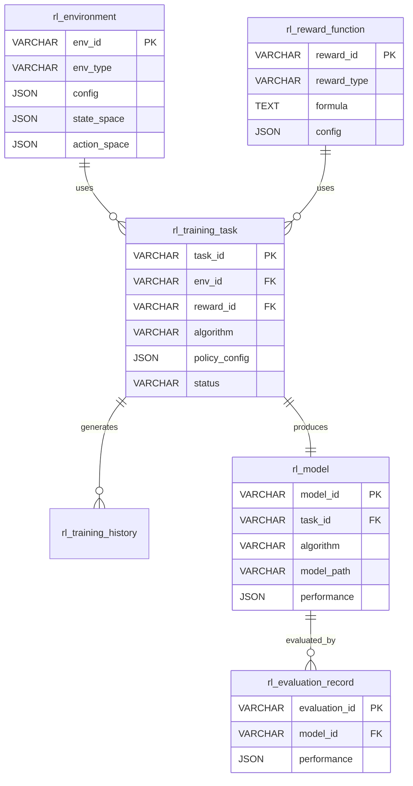

# RL策略优化模块 - 数据模型

> **阶段**: Research阶段
> **模块**: RL策略优化
> **状态**: ✅ 文档完成
> **版本**: v1.0
> **最后更新**: 2026-02-10
> **文档状态**: ✅ 已完成 | **优先级**: P2高级功能
> **更新日期**: 2026-02-10

---

## 📊 数据表结构

### 1. RL环境表 (rl_environment)

存储所有创建的RL环境配置。

| 字段名 | 类型 | 说明 | 索引 |
|--------|------|------|------|
| env_id | VARCHAR(50) | 环境ID | PK |
| env_type | VARCHAR(20) | 环境类型 | IDX |
| config | JSON | 环境配置 | |
| state_space | JSON | 状态空间定义 | |
| action_space | JSON | 动作空间定义 | |
| reward_range | JSON | 奖励范围 | |
| max_steps | INT | 最大步数 | |
| created_at | DATETIME | 创建时间 | |

### 2. RL奖励函数表 (rl_reward_function)

存储奖励函数配置。

| 字段名 | 类型 | 说明 | 索引 |
|--------|------|------|------|
| reward_id | VARCHAR(50) | 奖励函数ID | PK |
| reward_type | VARCHAR(20) | 奖励类型 | IDX |
| formula | TEXT | 奖励公式 | |
| config | JSON | 配置参数 | |
| statistics | JSON | 统计信息 | |
| created_at | DATETIME | 创建时间 | |

### 3. RL训练任务表 (rl_training_task)

存储RL训练任务。

| 字段名 | 类型 | 说明 | 索引 |
|--------|------|------|------|
| task_id | VARCHAR(50) | 任务ID | PK |
| env_id | VARCHAR(50) | 环境ID | FK, IDX |
| reward_id | VARCHAR(50) | 奖励函数ID | FK |
| algorithm | VARCHAR(20) | 算法类型 | IDX |
| policy_config | JSON | 策略网络配置 | |
| training_config | JSON | 训练配置 | |
| status | VARCHAR(20) | 状态 | IDX |
| current_timestep | INT | 当前时间步 | |
| model_path | VARCHAR(255) | 模型路径 | |
| performance | JSON | 性能指标 | |
| created_at | DATETIME | 创建时间 | IDX |
| started_at | DATETIME | 开始时间 | |
| completed_at | DATETIME | 完成时间 | |

### 4. RL训练历史表 (rl_training_history)

存储训练过程中的详细数据。

| 字段名 | 类型 | 说明 | 索引 |
|--------|------|------|------|
| history_id | BIGINT | 历史ID | PK, AUTO |
| task_id | VARCHAR(50) | 任务ID | FK, IDX |
| timestep | INT | 时间步 | IDX |
| episode | INT | 回合数 | |
| episode_reward | FLOAT | 回合奖励 | |
| episode_length | INT | 回合长度 | |
| sharpe | FLOAT | 夏普比率 | |
| returns | FLOAT | 收益率 | |
| timestamp | DATETIME | 时间戳 | |

### 5. RL模型表 (rl_model)

存储已保存的RL模型。

| 字段名 | 类型 | 说明 | 索引 |
|--------|------|------|------|
| model_id | VARCHAR(50) | 模型ID | PK |
| model_name | VARCHAR(100) | 模型名称 | |
| task_id | VARCHAR(50) | 关联任务ID | FK |
| algorithm | VARCHAR(20) | 算法类型 | IDX |
| model_path | VARCHAR(255) | 模型路径 | |
| description | TEXT | 描述 | |
| tags | JSON | 标签 | |
| performance | JSON | 性能指标 | IDX |
| created_at | DATETIME | 创建时间 | IDX |

### 6. RL评估记录表 (rl_evaluation_record)

存储策略评估记录。

| 字段名 | 类型 | 说明 | 索引 |
|--------|------|------|------|
| evaluation_id | VARCHAR(50) | 评估ID | PK |
| model_id | VARCHAR(50) | 模型ID | FK, IDX |
| env_id | VARCHAR(50) | 环境ID | FK |
| n_episodes | INT | 评估回合数 | |
| performance | JSON | 性能指标 | |
| episode_details | JSON | 回合详情 | |
| comparison | JSON | 对比结果 | |
| created_at | DATETIME | 创建时间 | |

---

## 🔗 数据关系图

---

**最后更新**: 2026-02-10
