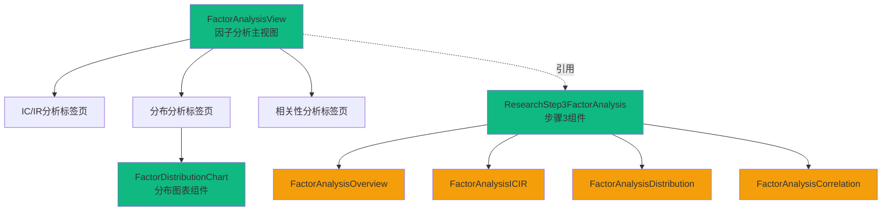

# 因子分析模块 - 前端组件

> **阶段**: Research阶段
> **模块**: 因子分析
> **状态**: ✅ 已实现
> **版本**: v2.0
> **最后更新**: 2026-02-22

> **对应章节**: [相关章节](../../../项目设计/MyQuant完整架构与工作流V3/08-前端实现示例.html)

---

## 🎯 模块UI组件列表

### 核心组件
1. `FactorAnalysisView` - 因子分析主视图（已实现）
2. `FactorDistributionChart` - 分布图表组件（已实现）
3. `ResearchStep3FactorAnalysis` - Research步骤3组件（已实现）

### 子组件（拆分后）
1. `FactorAnalysisOverview` - 概览面板
2. `FactorAnalysisICIR` - IC/IR分析面板
3. `FactorAnalysisDistribution` - 分布分析面板
4. `FactorAnalysisCorrelation` - 相关性分析面板

---

## 📦 组件层次结构



---

## 🧩 组件详细定义

### 1. FactorAnalysisView（因子分析主视图）

**组件路径**: `frontend/src/views/research/FactorAnalysisView.vue`

**状态**: ✅ 已实现 (~750行)

**功能标签页**:
- IC/IR分析
- 分布分析
- 相关性分析

**Props**: 无（使用路由参数）

**核心功能**:
```vue
<template>
  <div class="factor-analysis-view">
    <!-- 页面头部 -->
    <div class="page-header">...</div>

    <!-- 功能标签页 -->
    <el-tabs v-model="activeTab">
      <!-- IC/IR分析 -->
      <el-tab-pane label="IC/IR分析" name="icir">
        <!-- 分析表单 -->
        <el-form>
          <el-form-item label="因子名称">
            <el-select v-model="icirForm.factor_name">...</el-select>
          </el-form-item>
          <el-form-item label="时间范围">
            <el-date-picker v-model="icirForm.dateRange" type="daterange"/>
          </el-form-item>
          <el-form-item label="周期">
            <el-select v-model="icirForm.period">
              <el-option label="日线" value="1d" />
              <el-option label="周线" value="1w" />
              <el-option label="1分钟" value="1m" />
            </el-select>
          </el-form-item>
        </el-form>

        <!-- IC/IR分析结果 -->
        <div v-if="icirResult" class="icir-result">
          <!-- 统计指标卡片 -->
          <el-row :gutter="20">
            <el-col :span="6">
              <el-card>IC均值: {{ icirResult.ic.mean.toFixed(4) }}</el-card>
            </el-col>
            <el-col :span="6">
              <el-card>IR: {{ icirResult.ir.toFixed(4) }}</el-card>
            </el-col>
            <el-col :span="6">
              <el-card>IC正数占比: {{ (icirResult.ic_positive_ratio * 100).toFixed(2) }}%</el-card>
            </el-col>
            <el-col :span="6">
              <el-card>t统计量: {{ icirResult.t_stat.toFixed(4) }}</el-card>
            </el-col>
          </el-row>

          <!-- IC序列图（简化版柱状图） -->
          <div class="ic-series-chart">...</div>
        </div>
      </el-tab-pane>

      <!-- 分布分析 -->
      <el-tab-pane label="分布分析" name="distribution">
        <!-- 引用FactorDistributionChart组件 -->
        <FactorDistributionChart
          :task-id="taskId"
          :bins="distributionForm.bins"
          :is-zh="true"
        />
      </el-tab-pane>

      <!-- 相关性分析 -->
      <el-tab-pane label="相关性分析" name="correlation">
        <!-- 相关性分析表单和结果 -->
      </el-tab-pane>
    </el-tabs>
  </div>
</template>
```

**API调用**:
```typescript
// IC/IR分析
const response = await axios.post('/api/v1/research/analysis/ic-ir', {
  factor_name: this.icirForm.factor_name,
  start_date: startDate,
  end_date: endDate,
  period: this.icirForm.period
})

// 分布分析
const response = await axios.post('/api/v1/research/analysis/distribution', {
  factor_name: this.distributionForm.factor_name,
  bins: this.distributionForm.bins
})

// 相关性分析
const response = await axios.post('/api/v1/research/analysis/correlation', {
  factor_names: this.correlationForm.factor_names,
  method: this.correlationForm.method
})
```

---

### 2. FactorDistributionChart（分布图表组件）

**组件路径**: `frontend/src/views/research/FactorDistributionChart.vue`

**状态**: ✅ 已实现 (~950行)

**功能**:
- 统计量卡片展示（均值、标准差、最小值、最大值、中位数、分位数、样本数）
- ECharts直方图可视化
- 理论分布曲线对比
- 中位数参考线
- 理想区域标记（±0.1）
- 可切换显示/隐藏各元素

**Props**:
```typescript
interface Props {
  taskId: string
  bins?: number
  isZh?: boolean
}
```

**核心功能**:
```vue
<template>
  <div class="factor-distribution-chart">
    <!-- 统计量卡片 -->
    <div class="stats-cards">
      <div class="stat-card">
        <div class="stat-label">均值</div>
        <div class="stat-value">{{ statistics.mean }}</div>
      </div>
      <div class="stat-card">
        <div class="stat-label">标准差</div>
        <div class="stat-value">{{ statistics.std }}</div>
      </div>
      <div class="stat-card">
        <div class="stat-label">中位数</div>
        <div class="stat-value">{{ statistics.median }}</div>
      </div>
      <!-- 更多统计量... -->
    </div>

    <!-- 直方图 -->
    <div class="chart-container">
      <div class="chart-header">
        <h3>因子分布直方图</h3>
        <el-input-number v-model="localBins" :min="10" :max="200" />
      </div>
      <div ref="chartRef" class="chart" v-loading="loading"></div>
    </div>
  </div>
</template>
```

**ECharts图表配置**:
```typescript
const option: echarts.EChartsOption = {
  xAxis: {
    type: 'category',
    data: binCenters,
    name: '因子值'
  },
  yAxis: {
    type: 'value',
    name: '样本数'
  },
  series: [
    {
      name: '实际分布',
      type: 'bar',
      data: counts,
      itemStyle: {
        color: new echarts.graphic.LinearGradient(0, 0, 0, 1, [
          { offset: 0, color: '#2962ff' },
          { offset: 1, color: '#1e88e5' }
        ])
      },
      markArea: {
        // 理想区域标记
        data: [[
          { xAxis: findXAxisIndex(binCenters, -0.1) },
          { xAxis: findXAxisIndex(binCenters, 0.1) }
        ]]
      },
      markLine: {
        // 中位数参考线
        data: [{
          xAxis: findXAxisIndex(binCenters, statistics.median),
          lineStyle: { color: getMedianQualityColor(statistics.median) }
        }]
      }
    },
    {
      name: '理论分布',
      type: 'line',
      data: generateNormalDistributionCurve(binCenters, statistics.mean, statistics.std),
      smooth: true,
      lineStyle: { color: '#ffa726', type: 'dashed' }
    }
  ]
}
```

**API调用**:
```typescript
const loadDistributionData = async () => {
  const response = await axios.post('/api/v1/research/analysis/distribution', {
    task_id: props.taskId,
    bins: localBins.value,
    factor_name: selectedFactor.value
  })

  if (response.data.success) {
    statistics.value = response.data.data.statistics
    distributionData.value = {
      bins: response.data.data.bins,
      counts: response.data.data.counts
    }
    renderChart()
  }
}
```

---

### 3. ResearchStep3FactorAnalysis（步骤3组件）

**组件路径**: `frontend/src/views/research/components/ResearchStep3FactorAnalysis.vue`

**状态**: ✅ 已实现

**功能**: Research流程中第3步的因子分析组件

**子组件结构**:
```
ResearchStep3FactorAnalysis.vue
├── FactorAnalysisOverview.vue      概览面板
├── FactorAnalysisICIR.vue          IC/IR分析面板
├── FactorAnalysisDistribution.vue   分布分析面板
└── FactorAnalysisCorrelation.vue    相关性分析面板
```

---

## 📁 已实现文件清单

### 前端文件
```
frontend/
├── src/views/research/
│   ├── FactorAnalysisView.vue                  ✅ ~750行 - 主视图
│   ├── FactorDistributionChart.vue            ✅ ~950行 - 分布图表组件
│   └── components/
│       ├── ResearchStep3FactorAnalysis.vue    ✅ - 步骤3组件
│       └── steps/
│           └── ResearchStep3FactorAnalysis/
│               ├── FactorAnalysisOverview.vue      ✅ - 概览面板
│               ├── FactorAnalysisICIR.vue          ✅ - IC/IR分析面板
│               ├── FactorAnalysisDistribution.vue   ✅ - 分布分析面板
│               └── FactorAnalysisCorrelation.vue    ✅ - 相关性分析面板
```

---

## 🔄 设计变更说明

### 与原设计文档的差异

| 原设计 | 实际实现 | 原因 |
|--------|---------|------|
| `DistributionChart.vue` | `FactorDistributionChart.vue` | 命名规范调整 |
| `ICIRChart.vue` | 内嵌在 `FactorAnalysisView.vue` | 简化组件结构 |
| `CorrelationHeatmap.vue` | 内嵌在相关性分析标签页 | 按需实现 |
| 使用 `LineChart.vue` 通用组件 | 使用 ECharts 直接渲染 | 更灵活的图表定制 |

### 新增功能（原设计未包含）

1. **中位数质量评估** - 根据中位数偏离程度动态显示颜色
2. **理想区域标记** - 在图表上标记 ±0.1 的理想区域
3. **图例切换** - 可切换显示/隐藏实际分布、理论分布、中位数线、理想区域
4. **API降级处理** - API调用失败时自动使用模拟数据

---

## 🔗 API端点对接

### IC/IR分析
```typescript
POST /api/v1/research/analysis/ic-ir
Request: { factor_name, start_date, end_date, period }
Response: { ic: { mean, std, min, max, ic_series }, ir, ic_positive_ratio, t_stat, p_value }
```

### 分布分析
```typescript
POST /api/v1/research/analysis/distribution
Request: { factor_name, start_date, end_date, bins }
Response: { statistics: { count, mean, std, min, max, skewness, kurtosis }, histogram: { bins, counts }, percentiles }
```

### 相关性分析
```typescript
POST /api/v1/research/analysis/correlation
Request: { factor_names, start_date, end_date, method }
Response: { factor_names, correlation_matrix, method }
```

---

## 📝 实现经验

### 图表库选择
- 使用 **ECharts** 而非自建组件
- 支持深色主题
- 丰富的交互功能（tooltip、dataZoom、markLine、markArea）

### API降级策略
```typescript
try {
  const response = await axios.post('/api/v1/research/analysis/distribution', {...})
  // 处理真实数据
} catch (error) {
  console.warn('API调用失败，使用模拟数据:', error.message)
  loadMockData()  // 降级到模拟数据
}
```

### 中位数质量颜色计算
```typescript
const getMedianQualityColor = (median: number): string => {
  const absMedian = Math.abs(median)
  if (absMedian <= 0.1) return '#ef5350'      // 红色：优秀
  if (absMedian <= 0.3) return '#ffa726'      // 橙色：良好，需标准化
  if (absMedian <= 0.5) return '#afb42b'      // 黄绿色：一般
  return '#26a69a'                          // 绿色：有问题
}
```

---

## 📚 相关文档

- [API设计](./API设计.md) - API端点定义
- [数据模型](./数据模型.md) - 数据表结构
- [实施记录](./实施记录.md) - 开发实施记录
- [测试报告](./测试报告.md) - 测试覆盖情况
- [Research阶段README](../README.md) - 阶段概述

---

**维护说明**: 本文档与前端代码保持同步，如有组件变更请及时更新
**最后更新**: 2026-02-22
**状态**: ✅ 已实现，真实数据集成测试全部通过（10/10）
