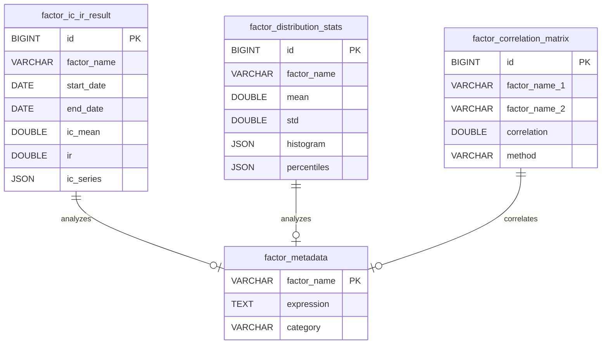

# 因子分析模块 - 数据模型

> **阶段**: Research阶段
> **模块**: 因子分析
> **状态**: ✅ 文档完成
> **版本**: v1.0
> **最后更新**: 2026-02-10

> **对应章节**: [相关章节](../../../项目设计/MyQuant完整架构与工作流V3/02-Research阶段工作流.html)

---

## 🎯 模块定位

因子分析模块负责因子分析结果的管理和存储，包括：
- IC/IR分析结果
- 因子分布统计
- 因子相关性矩阵
- 分析任务记录

---

## 📊 数据表结构

### 1. IC/IR分析结果表 (factor_ic_ir_result)

**表名**: `factor_ic_ir_result`

**说明**: 存储IC/IR分析结果

| 字段名 | 类型 | 长度 | 允许空 | 说明 |
|--------|------|------|--------|------|
| id | BIGINT | - | ❌ | 主键，自增 |
| factor_name | VARCHAR | 100 | ❌ | 因子名称 |
| start_date | DATE | - | ❌ | 分析开始日期 |
| end_date | DATE | - | ❌ | 分析结束日期 |
| ic_mean | DOUBLE | - | ❌ | IC均值 |
| ic_std | DOUBLE | - | ❌ | IC标准差 |
| ic_min | DOUBLE | - | ❌ | IC最小值 |
| ic_max | DOUBLE | - | ❌ | IC最大值 |
| ir | DOUBLE | - | ❌ | IR值（IC均值/IC标准差） |
| ic_positive_ratio | DOUBLE | - | ❌ | IC正数占比 |
| t_stat | DOUBLE | - | ❌ | t统计量 |
| p_value | DOUBLE | - | ❌ | p值 |
| ic_series | JSON | - | ✅ | IC时间序列（JSON格式） |
| created_at | DATETIME | - | ❌ | 创建时间 |

**索引**:
- PRIMARY KEY: `id`
- UNIQUE INDEX: `factor_name`, `start_date`, `end_date`
- INDEX: `factor_name`, `created_at`

**示例数据**:
```json
{
  "id": 1,
  "factor_name": "custom_factor_001",
  "start_date": "2020-01-01",
  "end_date": "2024-12-31",
  "ic_mean": 0.0523,
  "ic_std": 0.1234,
  "ic_min": -0.2345,
  "ic_max": 0.3456,
  "ir": 0.4238,
  "ic_positive_ratio": 0.5678,
  "t_stat": 3.4567,
  "p_value": 0.0001,
  "ic_series": [
    {"date": "2020-01-01", "ic": 0.0456},
    {"date": "2020-01-02", "ic": 0.0678}
  ],
  "created_at": "2024-02-10 10:00:00"
}
```

---

### 2. 因子分布统计表 (factor_distribution_stats)

**表名**: `factor_distribution_stats`

**说明**: 存储因子分布统计信息

| 字段名 | 类型 | 长度 | 允许空 | 说明 |
|--------|------|------|--------|------|
| id | BIGINT | - | ❌ | 主键，自增 |
| factor_name | VARCHAR | 100 | ❌ | 因子名称 |
| start_date | DATE | - | ✅ | 分析开始日期 |
| end_date | DATE | - | ✅ | 分析结束日期 |
| count | BIGINT | - | ❌ | 数据量 |
| mean | DOUBLE | - | ❌ | 均值 |
| std | DOUBLE | - | ❌ | 标准差 |
| min | DOUBLE | - | ❌ | 最小值 |
| max | DOUBLE | - | ❌ | 最大值 |
| skewness | DOUBLE | - | ❌ | 偏度 |
| kurtosis | DOUBLE | - | ❌ | 峰度 |
| histogram | JSON | - | ✅ | 直方图数据（JSON格式） |
| percentiles | JSON | - | ✅ | 百分位数（JSON格式） |
| created_at | DATETIME | - | ❌ | 创建时间 |

**索引**:
- PRIMARY KEY: `id`
- INDEX: `factor_name`, `created_at`

**示例数据**:
```json
{
  "id": 1,
  "factor_name": "custom_factor_001",
  "start_date": "2020-01-01",
  "end_date": "2024-12-31",
  "count": 100000,
  "mean": 0.0523,
  "std": 0.1234,
  "min": -0.5678,
  "max": 0.7890,
  "skewness": 0.1234,
  "kurtosis": 2.5678,
  "histogram": {
    "bins": [-0.5, -0.4, -0.3, 0.0, 0.3, 0.4, 0.5],
    "counts": [100, 500, 2000, 50000, 2000, 500, 100]
  },
  "percentiles": {
    "1%": -0.3456,
    "5%": -0.2345,
    "25%": -0.1234,
    "50%": 0.0456,
    "75%": 0.2345,
    "95%": 0.4567,
    "99%": 0.5678
  },
  "created_at": "2024-02-10 10:00:00"
}
```

---

### 3. 因子相关性矩阵表 (factor_correlation_matrix)

**表名**: `factor_correlation_matrix`

**说明**: 存储因子相关性矩阵

| 字段名 | 类型 | 长度 | 允许空 | 说明 |
|--------|------|------|--------|------|
| id | BIGINT | - | ❌ | 主键，自增 |
| factor_name_1 | VARCHAR | 100 | ❌ | 因子1名称 |
| factor_name_2 | VARCHAR | 100 | ❌ | 因子2名称 |
| correlation | DOUBLE | - | ❌ | 相关系数 |
| p_value | DOUBLE | - | ✅ | p值 |
| method | VARCHAR | 20 | ❌ | 相关性方法（pearson, spearman） |
| start_date | DATE | - | ✅ | 分析开始日期 |
| end_date | DATE | - | ✅ | 分析结束日期 |
| created_at | DATETIME | - | ❌ | 创建时间 |

**索引**:
- PRIMARY KEY: `id`
- UNIQUE INDEX: `factor_name_1`, `factor_name_2`, `method`, `start_date`, `end_date`
- INDEX: `factor_name_1`, `created_at`
- INDEX: `factor_name_2`, `created_at`

**示例数据**:
```json
{
  "id": 1,
  "factor_name_1": "custom_factor_001",
  "factor_name_2": "custom_factor_002",
  "correlation": 0.2345,
  "p_value": 0.0001,
  "method": "pearson",
  "start_date": "2020-01-01",
  "end_date": "2024-12-31",
  "created_at": "2024-02-10 10:00:00"
}
```

---

## 🔗 数据关系

### ER图



---

## 💾 存储设计

### 存储方案

**JSON字段存储**:
- `ic_series`: 存储IC时间序列数据
- `histogram`: 存储直方图数据（bins, counts）
- `percentiles`: 存储百分位数数据

**优化建议**:
- 为常用查询字段添加索引
- 定期清理旧的分析结果
- 考虑使用时序数据库存储IC时间序列

---

## 📝 数据操作示例

### Python SQLAlchemy示例

```python
from sqlalchemy import create_engine, Column, String, Integer, Double, Date, DateTime, JSON
from sqlalchemy.ext.declarative import declarative_base
from sqlalchemy.orm import sessionmaker

Base = declarative_base()

class FactorICIRResult(Base):
    __tablename__ = 'factor_ic_ir_result'

    id = Column(Integer, primary_key=True, autoincrement=True)
    factor_name = Column(String(100), nullable=False)
    start_date = Column(Date, nullable=False)
    end_date = Column(Date, nullable=False)
    ic_mean = Column(Double, nullable=False)
    ic_std = Column(Double, nullable=False)
    ir = Column(Double, nullable=False)
    ic_positive_ratio = Column(Double, nullable=False)
    ic_series = Column(JSON)

# 创建IC/IR分析结果
ic_ir_result = FactorICIRResult(
    factor_name="custom_factor_001",
    start_date="2020-01-01",
    end_date="2024-12-31",
    ic_mean=0.0523,
    ic_std=0.1234,
    ir=0.4238,
    ic_positive_ratio=0.5678,
    ic_series=[
        {"date": "2020-01-01", "ic": 0.0456},
        {"date": "2020-01-02", "ic": 0.0678}
    ]
)

session.add(ic_ir_result)
session.commit()
```

---

## 🔗 相关文档

- [API设计](./API设计.md) - API端点定义
- [前端组件](./前端组件.md) - 前端UI组件文档
- [Research阶段README](../README.md) - 阶段概述

---

**维护说明**: 本文档与数据库schema保持同步，如有表结构变更请及时更新
**最后更新**: 2026-02-10
