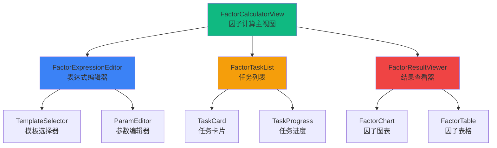

# 因子计算模块 - 前端组件

> **阶段**: Research阶段
> **模块**: 因子计算
> **状态**: ✅ 文档完成
> **版本**: v1.0
> **最后更新**: 2026-02-10

> **对应章节**: [相关章节](../../../项目设计/MyQuant完整架构与工作流V3/08-前端实现示例.html)

---

## 🎯 模块UI组件列表

### 核心组件
1. `FactorCalculator` - 因子计算器
2. `FactorExpressionEditor` - 因子表达式编辑器
3. `FactorTaskList` - 因子任务列表
4. `FactorResultViewer` - 因子结果查看器

---

## 📦 组件层次结构



---

## 🧩 组件详细定义

### 1. FactorExpressionEditor（因子表达式编辑器）

**组件路径**: `frontend/src/views/research/factor-calculator/FactorExpressionEditor.vue`

**Props**:
```typescript
interface Template {
  template_id: string;
  name: string;
  expression: string;
  description: string;
  parameters: Record<string, Parameter>;
}

interface Parameter {
  type: 'integer' | 'float' | 'string';
  default: any;
  min?: number;
  max?: number;
  description: string;
}

interface Props {
  templates: Template[];  // 表达式模板列表
  loading?: boolean;
}
```

**Events**:
```typescript
interface Emits {
  (e: 'submit', data: {
    expression: string;
    instruments: string[];
    start_date: string;
    end_date: string;
    frequency: string;
  }): void;
  (e: 'validate', expression: string): void;
}
```

**组件代码**:
```vue
<template>
  <el-card class="expression-editor">
    <h3>因子表达式编辑器</h3>

    <!-- 模板选择 -->
    <el-form-item label="选择模板">
      <el-select
        v-model="selectedTemplate"
        placeholder="选择模板或自定义表达式"
        @change="handleTemplateChange"
      >
        <el-option label="自定义表达式" value="" />
        <el-option
          v-for="tpl in templates"
          :key="tpl.template_id"
          :label="tpl.name"
          :value="tpl.template_id"
        />
      </el-select>
    </el-form-item>

    <!-- 表达式输入 -->
    <el-form-item label="因子表达式">
      <el-input
        v-model="expression"
        type="textarea"
        :rows="4"
        placeholder="输入因子表达式，例如: Ref($close, 1) / $close - 1"
        @blur="$emit('validate', expression)"
      />
      <div class="expression-hint" v-if="selectedTemplate">
        {{ getTemplateDescription(selectedTemplate) }}
      </div>
    </el-form-item>

    <!-- 参数编辑 -->
    <div v-if="parameters.length > 0" class="param-editor">
      <h4>参数配置</h4>
      <el-form-item
        v-for="param in parameters"
        :key="param.name"
        :label="param.description"
      >
        <el-input-number
          v-if="param.type === 'integer' || param.type === 'float'"
          v-model="paramValues[param.name]"
          :min="param.min"
          :max="param.max"
          @change="updateExpression"
        />
        <el-input
          v-else
          v-model="paramValues[param.name]"
          @change="updateExpression"
        />
      </el-form-item>
    </div>

    <!-- 股票选择 -->
    <el-form-item label="股票列表">
      <el-select
        v-model="instruments"
        multiple
        filterable
        placeholder="选择股票（默认全部）"
      >
        <el-option label="全部股票" value="all" />
      </el-select>
    </el-form-item>

    <!-- 日期范围 -->
    <el-form-item label="日期范围">
      <el-date-picker
        v-model="dateRange"
        type="daterange"
        range-separator="至"
        start-placeholder="开始日期"
        end-placeholder="结束日期"
      />
    </el-form-item>

    <!-- 频率选择 -->
    <el-form-item label="频率">
      <el-radio-group v-model="frequency">
        <el-radio-button label="1d">日线</el-radio-button>
        <el-radio-button label="1w">周线</el-radio-button>
        <el-radio-button label="1m">月线</el-radio-button>
      </el-radio-group>
    </el-form-item>

    <!-- 提交按钮 -->
    <el-button
      type="primary"
      :loading="loading"
      @click="handleSubmit"
    >
      开始计算
    </el-button>
  </el-card>
</template>

<script setup lang="ts">
import { ref, computed } from 'vue';

interface Template {
  template_id: string;
  name: string;
  expression: string;
  description: string;
  parameters: Record<string, any>;
}

const props = defineProps<{
  templates: Template[];
  loading?: boolean;
}>();

const emit = defineEmits<{
  (e: 'submit', data: any): void;
  (e: 'validate', expression: string): void;
}>();

const selectedTemplate = ref('');
const expression = ref('');
const instruments = ref<string[]>([]);
const dateRange = ref<[Date, Date] | null>(null);
const frequency = ref('1d');
const paramValues = ref<Record<string, any>>({});

const parameters = computed(() => {
  if (!selectedTemplate.value) return [];
  const tpl = props.templates.find(t => t.template_id === selectedTemplate.value);
  return tpl ? Object.entries(tpl.parameters || {}).map(([name, config]) => ({
    name,
    ...config
  })) : [];
});

const handleTemplateChange = (templateId: string) => {
  if (templateId) {
    const tpl = props.templates.find(t => t.template_id === templateId);
    if (tpl) {
      expression.value = tpl.expression;
      // 设置默认参数值
      Object.entries(tpl.parameters || {}).forEach(([name, config]) => {
        paramValues.value[name] = config.default;
      });
    }
  }
};

const updateExpression = () => {
  // 根据参数更新表达式
  let expr = expression.value;
  parameters.value.forEach(param => {
    expr = expr.replace(new RegExp(`\\b${param.name}\\b`, 'g'), paramValues.value[param.name]);
  });
  expression.value = expr;
};

const handleSubmit = () => {
  emit('submit', {
    expression: expression.value,
    instruments: instruments.value,
    start_date: dateRange.value?.[0].toISOString().split('T')[0],
    end_date: dateRange.value?.[1].toISOString().split('T')[0],
    frequency: frequency.value
  });
};

const getTemplateDescription = (templateId: string) => {
  const tpl = props.templates.find(t => t.template_id === templateId);
  return tpl?.description || '';
};
</script>

<style scoped>
.expression-editor {
  margin-bottom: 20px;
}
.expression-hint {
  margin-top: 5px;
  font-size: 12px;
  color: #94a3b8;
}
.param-editor {
  margin: 15px 0;
  padding: 15px;
  background: rgba(26, 26, 46, 0.5);
  border-radius: 8px;
}
</style>
```

---

### 2. FactorTaskList（因子任务列表）

**组件路径**: `frontend/src/views/research/factor-calculator/FactorTaskList.vue`

**Props**:
```typescript
interface TaskInfo {
  task_id: string;
  expression: string;
  status: 'pending' | 'running' | 'completed' | 'failed';
  progress: {
    total: number;
    completed: number;
    percentage: number;
  };
  created_at: string;
}

interface Props {
  tasks: TaskInfo[];
  loading?: boolean;
}
```

**Events**:
```typescript
interface Emits {
  (e: 'refresh'): void;
  (e: 'view-result', taskId: string): void;
  (e: 'retry', taskId: string): void;
  (e: 'delete', taskId: string): void;
}
```

**组件代码**:
```vue
<template>
  <el-card class="task-list">
    <template #header>
      <div class="card-header">
        <h3>计算任务</h3>
        <el-button
          size="small"
          :loading="loading"
          @click="$emit('refresh')"
        >
          刷新
        </el-button>
      </div>
    </template>

    <el-table :data="tasks" stripe>
      <el-table-column prop="task_id" label="任务ID" width="200" />
      <el-table-column prop="expression" label="表达式" show-overflow-tooltip />
      <el-table-column label="状态" width="100">
        <template #default="{ row }">
          <el-tag :type="getStatusType(row.status)">
            {{ getStatusText(row.status) }}
          </el-tag>
        </template>
      </el-table-column>
      <el-table-column label="进度" width="150">
        <template #default="{ row }">
          <el-progress
            v-if="row.status === 'running'"
            :percentage="row.progress.percentage"
          />
          <span v-else>{{ row.progress.completed }} / {{ row.progress.total }}</span>
        </template>
      </el-table-column>
      <el-table-column prop="created_at" label="创建时间" width="180" />
      <el-table-column label="操作" width="200">
        <template #default="{ row }">
          <el-button-group>
            <el-button
              v-if="row.status === 'completed'"
              size="small"
              @click="$emit('view-result', row.task_id)"
            >
              查看结果
            </el-button>
            <el-button
              v-if="row.status === 'failed'"
              size="small"
              @click="$emit('retry', row.task_id)"
            >
              重试
            </el-button>
            <el-button
              size="small"
              type="danger"
              @click="$emit('delete', row.task_id)"
            >
              删除
            </el-button>
          </el-button-group>
        </template>
      </el-table-column>
    </el-table>
  </el-card>
</template>

<script setup lang="ts">
interface TaskInfo {
  task_id: string;
  expression: string;
  status: 'pending' | 'running' | 'completed' | 'failed';
  progress: {
    total: number;
    completed: number;
    percentage: number;
  };
  created_at: string;
}

defineProps<{
  tasks: TaskInfo[];
  loading?: boolean;
}>();

defineEmits<{
  (e: 'refresh'): void;
  (e: 'view-result', taskId: string): void;
  (e: 'retry', taskId: string): void;
  (e: 'delete', taskId: string): void;
}>();

const getStatusType = (status: string) => {
  const map: Record<string, any> = {
    pending: 'info',
    running: 'warning',
    completed: 'success',
    failed: 'danger'
  };
  return map[status] || 'info';
};

const getStatusText = (status: string) => {
  const map: Record<string, string> = {
    pending: '待执行',
    running: '计算中',
    completed: '已完成',
    failed: '失败'
  };
  return map[status] || status;
};
</script>

<style scoped>
.card-header {
  display: flex;
  justify-content: space-between;
  align-items: center;
}
.task-list {
  margin-bottom: 20px;
}
</style>
```

---

### 3. FactorResultViewer（因子结果查看器）

**组件路径**: `frontend/src/views/research/factor-calculator/FactorResultViewer.vue`

**Props**:
```typescript
interface FactorData {
  instrument: string;
  datetime: string;
  value: number;
}

interface FactorResult {
  factor_name: string;
  data: FactorData[];
  statistics: {
    count: number;
    mean: number;
    std: number;
    min: number;
    max: number;
  };
}

interface Props {
  result: FactorResult | null;
  loading?: boolean;
}
```

**Events**:
```typescript
interface Emits {
  (e: 'export', format: 'csv' | 'excel' | 'parquet'): void;
  (e: 'save-qlib'): void;
}
```

**组件代码**:
```vue
<template>
  <el-card v-if="result" class="result-viewer">
    <template #header>
      <div class="card-header">
        <h3>因子结果: {{ result.factor_name }}</h3>
        <el-button-group>
          <el-button size="small" @click="$emit('export', 'csv')">
            导出CSV
          </el-button>
          <el-button size="small" @click="$emit('export', 'excel')">
            导出Excel
          </el-button>
          <el-button size="small" @click="$emit('save-qlib')">
            保存为QLib格式
          </el-button>
        </el-button-group>
      </div>
    </template>

    <!-- 统计信息 -->
    <el-row :gutter="20" class="stats-row">
      <el-col :span="6">
        <el-statistic title="数据量" :value="result.statistics.count" />
      </el-col>
      <el-col :span="6">
        <el-statistic title="均值" :value="result.statistics.mean" :precision="4" />
      </el-col>
      <el-col :span="6">
        <el-statistic title="标准差" :value="result.statistics.std" :precision="4" />
      </el-col>
      <el-col :span="6">
        <el-statistic title="最小值" :value="result.statistics.min" :precision="4" />
      </el-col>
    </el-row>

    <!-- 因子图表 -->
    <el-card class="chart-card">
      <h4>因子分布</h4>
      <FactorHistogram :data="result.data" />
    </el-card>

    <!-- 因子表格 -->
    <el-card class="table-card">
      <h4>因子数据</h4>
      <el-table
        :data="paginatedData"
        stripe
        max-height="400"
      >
        <el-table-column prop="instrument" label="股票代码" />
        <el-table-column prop="datetime" label="时间" />
        <el-table-column prop="value" label="因子值">
          <template #default="{ row }">
            {{ row.value.toFixed(4) }}
          </template>
        </el-table-column>
      </el-table>

      <el-pagination
        v-model:current-page="currentPage"
        :page-size="pageSize"
        :total="result.data.length"
        layout="prev, pager, next, total"
      />
    </el-card>
  </el-card>
</template>

<script setup lang="ts">
import { ref, computed } from 'vue';

interface FactorData {
  instrument: string;
  datetime: string;
  value: number;
}

interface FactorResult {
  factor_name: string;
  data: FactorData[];
  statistics: {
    count: number;
    mean: number;
    std: number;
    min: number;
    max: number;
  };
}

defineProps<{
  result: FactorResult | null;
  loading?: boolean;
}>();

defineEmits<{
  (e: 'export', format: string): void;
  (e: 'save-qlib'): void;
}>();

const currentPage = ref(1);
const pageSize = 50;

const paginatedData = computed(() => {
  // 实现分页逻辑
  return [];
});
</script>

<style scoped>
.card-header {
  display: flex;
  justify-content: space-between;
  align-items: center;
}
.stats-row {
  margin-bottom: 20px;
}
.chart-card,
.table-card {
  margin-top: 20px;
}
</style>
```

---

## 🔗 相关文档

- [API设计](./API设计.md) - API端点定义
- [数据模型](./数据模型.md) - 数据表结构
- [Research阶段README](../README.md) - 阶段概述
- [第8章 - 前端实现示例](../../../项目设计/MyQuant完整架构与工作流V3/08-前端实现示例.html) - 更多前端示例

---

**维护说明**: 本文档与前端代码保持同步，如有组件变更请及时更新
**最后更新**: 2026-02-10
