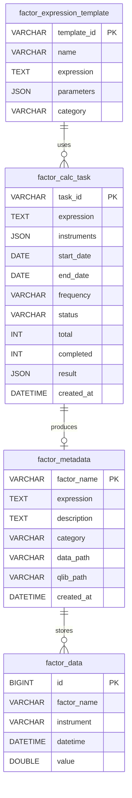

# 因子计算模块 - 数据模型

> **阶段**: Research阶段
> **模块**: 因子计算
> **状态**: ✅ 文档完成
> **版本**: v1.0
> **最后更新**: 2026-02-10

> **对应章节**: [相关章节](../../../项目设计/MyQuant完整架构与工作流V3/02-Research阶段工作流.html)

---

## 🎯 模块定位

因子计算模块负责因子计算任务的管理和结果存储，包括：
- 因子计算任务记录
- 因子数据存储
- 因子元数据管理
- 因子表达式模板

---

## 📊 数据表结构

### 1. 因子计算任务表 (factor_calc_task)

**表名**: `factor_calc_task`

**说明**: 记录因子计算任务

| 字段名 | 类型 | 长度 | 允许空 | 说明 |
|--------|------|------|--------|------|
| task_id | VARCHAR | 50 | ❌ | 主键，任务ID |
| expression | TEXT | - | ❌ | 因子表达式 |
| instruments | JSON | - | ✅ | 股票列表（JSON数组） |
| start_date | DATE | - | ❌ | 开始日期 |
| end_date | DATE | - | ❌ | 结束日期 |
| frequency | VARCHAR | 10 | ❌ | 频率（1d, 1w, 1m） |
| status | VARCHAR | 20 | ❌ | 状态（pending, running, completed, failed） |
| total | INT | - | ✅ | 总数 |
| completed | INT | - | ✅ | 已完成数 |
| error_message | TEXT | - | ✅ | 错误信息 |
| result | JSON | - | ✅ | 计算结果（JSON格式） |
| created_at | DATETIME | - | ❌ | 创建时间 |
| updated_at | DATETIME | - | ❌ | 更新时间 |
| completed_at | DATETIME | - | ✅ | 完成时间 |

**索引**:
- PRIMARY KEY: `task_id`
- INDEX: `status`, `created_at`
- INDEX: `start_date`, `end_date`

**示例数据**:
```json
{
  "task_id": "factor_calc_20240210_123456",
  "expression": "Ref($close, 1) / $close - 1",
  "instruments": ["000001.SZ", "000002.SZ"],
  "start_date": "2020-01-01",
  "end_date": "2024-12-31",
  "frequency": "1d",
  "status": "completed",
  "total": 100,
  "completed": 100,
  "error_message": null,
  "result": {
    "factor_name": "custom_factor_001",
    "data_path": "/data/factors/custom_factor_001.pkl",
    "records": 10000
  },
  "created_at": "2024-02-10 10:00:00",
  "updated_at": "2024-02-10 10:05:30",
  "completed_at": "2024-02-10 10:05:30"
}
```

---

### 2. 因子元数据表 (factor_metadata)

**表名**: `factor_metadata`

**说明**: 存储因子元数据

| 字段名 | 类型 | 长度 | 允许空 | 说明 |
|--------|------|------|--------|------|
| factor_name | VARCHAR | 100 | ❌ | 主键，因子名称 |
| expression | TEXT | - | ❌ | 因子表达式 |
| description | TEXT | - | ✅ | 因子描述 |
| category | VARCHAR | 50 | ✅ | 因子类别（alpha158, alpha360, custom） |
| created_by | VARCHAR | 50 | ✅ | 创建者 |
| created_at | DATETIME | - | ❌ | 创建时间 |
| updated_at | DATETIME | - | ❌ | 更新时间 |
| data_path | VARCHAR | 255 | ✅ | 数据文件路径 |
| qlib_path | VARCHAR | 255 | ✅ | QLib格式路径 |

**索引**:
- PRIMARY KEY: `factor_name`
- INDEX: `category`, `created_at`

**示例数据**:
```json
{
  "factor_name": "custom_factor_001",
  "expression": "Ref($close, 1) / $close - 1",
  "description": "前一日收益率因子",
  "category": "custom",
  "created_by": "user_001",
  "created_at": "2024-02-10 10:00:00",
  "updated_at": "2024-02-10 10:05:30",
  "data_path": "/data/factors/custom_factor_001.pkl",
  "qlib_path": "/qlib/data/custom_factor_001.pkl"
}
```

---

### 3. 因子数据表 (factor_data)

**表名**: `factor_data`

**说明**: 存储因子数据（或者使用文件系统存储）

| 字段名 | 类型 | 长度 | 允许空 | 说明 |
|--------|------|------|--------|------|
| id | BIGINT | - | ❌ | 主键，自增 |
| factor_name | VARCHAR | 100 | ❌ | 因子名称 |
| instrument | VARCHAR | 20 | ❌ | 股票代码 |
| datetime | DATETIME | - | ❌ | 时间 |
| value | DOUBLE | - | ❌ | 因子值 |

**索引**:
- PRIMARY KEY: `id`
- UNIQUE INDEX: `factor_name`, `instrument`, `datetime`
- INDEX: `factor_name`, `datetime`

**示例数据**:
```json
{
  "id": 1,
  "factor_name": "custom_factor_001",
  "instrument": "000001.SZ",
  "datetime": "2020-01-01 00:00:00",
  "value": 0.025
}
```

---

### 4. 因子表达式模板表 (factor_expression_template)

**表名**: `factor_expression_template`

**说明**: 存储常用因子表达式模板

| 字段名 | 类型 | 长度 | 允许空 | 说明 |
|--------|------|------|--------|------|
| template_id | VARCHAR | 50 | ❌ | 主键，模板ID |
| name | VARCHAR | 100 | ❌ | 模板名称 |
| expression | TEXT | - | ❌ | 因子表达式 |
| description | TEXT | - | ✅ | 模板描述 |
| parameters | JSON | - | ✅ | 参数定义（JSON格式） |
| category | VARCHAR | 50 | ✅ | 类别 |
| created_at | DATETIME | - | ❌ | 创建时间 |

**索引**:
- PRIMARY KEY: `template_id`
- INDEX: `category`

**示例数据**:
```json
{
  "template_id": "tpl_momentum_5d",
  "name": "5日动量因子",
  "expression": "Ref($close, N) / $close - 1",
  "description": "N日动量因子模板",
  "parameters": {
    "N": {
      "type": "integer",
      "default": 5,
      "min": 1,
      "max": 30,
      "description": "回看天数"
    }
  },
  "category": "momentum",
  "created_at": "2024-02-10 10:00:00"
}
```

---

## 🔗 数据关系

### ER图



---

## 💾 存储设计

### 存储方案选择

**方案1: 数据库存储（适合小数据量）**
- 使用MySQL/PostgreSQL存储因子数据
- 适合因子的快速查询和筛选
- 不适合大规模因子数据

**方案2: 文件系统存储（推荐）**
- 使用HDF5/Parquet格式存储
- 适合大规模因子数据
- 配合元数据表使用

**推荐架构**:
```
元数据（MySQL） + 因子数据（HDF5/Parquet）
```

---

## 📝 数据操作示例

### Python SQLAlchemy示例

```python
from sqlalchemy import create_engine, Column, String, Integer, Text, DateTime, Date, JSON, Float
from sqlalchemy.ext.declarative import declarative_base
from sqlalchemy.orm import sessionmaker

Base = declarative_base()

class FactorMetadata(Base):
    __tablename__ = 'factor_metadata'

    factor_name = Column(String(100), primary_key=True)
    expression = Column(Text, nullable=False)
    description = Column(Text)
    category = Column(String(50))
    data_path = Column(String(255))
    qlib_path = Column(String(255))
    created_at = Column(DateTime, nullable=False)
    updated_at = Column(DateTime, nullable=False)

# 创建因子元数据
metadata = FactorMetadata(
    factor_name="custom_factor_001",
    expression="Ref($close, 1) / $close - 1",
    description="前一日收益率因子",
    category="custom",
    data_path="/data/factors/custom_factor_001.pkl"
)

session.add(metadata)
session.commit()
```

### HDF5存储示例

```python
import h5py
import pandas as pd

# 保存因子数据到HDF5
def save_factor_to_hdf5(factor_name: str, data: pd.DataFrame):
    with h5py.File(f'/data/factors/{factor_name}.h5', 'w') as f:
        for instrument, group_data in data.groupby('instrument'):
            grp = f.create_group(instrument)
            grp.create_dataset('datetime', data=group_data['datetime'].values)
            grp.create_dataset('value', data=group_data['value'].values)

# 读取因子数据
def load_factor_from_hdf5(factor_name: str):
    with h5py.File(f'/data/factors/{factor_name}.h5', 'r') as f:
        data = []
        for instrument in f.keys():
            grp = f[instrument]
            datetimes = grp['datetime'][:]
            values = grp['value'][:]
            for dt, val in zip(datetimes, values):
                data.append({
                    'instrument': instrument,
                    'datetime': dt,
                    'value': val
                })
        return pd.DataFrame(data)
```

---

## 🔗 相关文档

- [API设计](./API设计.md) - API端点定义
- [前端组件](./前端组件.md) - 前端UI组件文档
- [Research阶段README](../README.md) - 阶段概述

---

**维护说明**: 本文档与数据库schema保持同步，如有表结构变更请及时更新
**最后更新**: 2026-02-10
