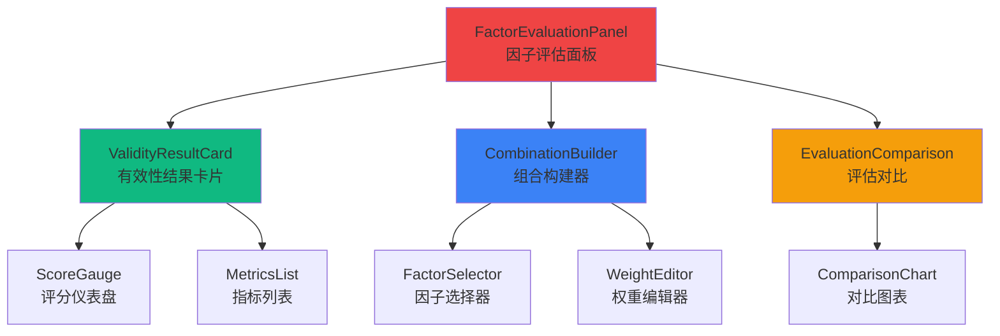

# 因子评估模块 - 前端组件

> **阶段**: Research阶段
> **模块**: 因子评估
> **状态**: ⚠️ 部分完成
> **版本**: v1.0
> **最后更新**: 2026-02-10

> **对应章节**: [相关章节](../../../项目设计/MyQuant完整架构与工作流V3/08-前端实现示例.html)

---

## 🎯 模块UI组件列表

### 核心组件
1. `FactorEvaluationPanel` - 因子评估面板
2. `ValidityResultCard` - 有效性结果卡片
3. `CombinationBuilder` - 组合构建器
4. `EvaluationComparison` - 评估对比

---

## 📦 组件层次结构



---

## 🧩 组件详细定义

### 1. FactorEvaluationPanel（因子评估面板）

**组件路径**: `frontend/src/views/research/factor-evaluation/FactorEvaluationPanel.vue`

**Props**:
```typescript
interface EvaluationConfig {
  factorName: string;
  startDate: string;
  endDate: string;
}

interface Props {
  config: EvaluationConfig;
}
```

**组件代码**:
```vue
<template>
  <div class="factor-evaluation-panel">
    <h2>因子评估</h2>

    <!-- 有效性评估 -->
    <ValidityResultCard
      :factor-name="config.factorName"
      :start-date="config.startDate"
      :end-date="config.endDate"
      @evaluate="handleEvaluateValidity"
    />

    <!-- 组合评估 -->
    <CombinationBuilder
      @evaluate="handleEvaluateCombination"
    />

    <!-- 评估对比 -->
    <EvaluationComparison
      :factors="evaluatedFactors"
    />
  </div>
</template>

<script setup lang="ts">
import { ref } from 'vue';
import ValidityResultCard from './ValidityResultCard.vue';
import CombinationBuilder from './CombinationBuilder.vue';
import EvaluationComparison from './EvaluationComparison.vue';

interface EvaluationConfig {
  factorName: string;
  startDate: string;
  endDate: string;
}

defineProps<{
  config: EvaluationConfig;
}>();

const evaluatedFactors = ref<any[]>([]);

const handleEvaluateValidity = (result: any) => {
  console.log('有效性评估结果:', result);
};

const handleEvaluateCombination = (result: any) => {
  console.log('组合评估结果:', result);
  evaluatedFactors.value.push(result);
};
</script>
```

---

### 2. ValidityResultCard（有效性结果卡片）

**组件路径**: `frontend/src/views/research/factor-evaluation/ValidityResultCard.vue`

**Props**:
```typescript
interface ValidityResult {
  factor_name: string;
  is_valid: boolean;
  overall_score: number;
  metrics: Record<string, any>;
  recommendation: string;
}

interface Props {
  factorName: string;
  startDate: string;
  endDate: string;
}
```

**Events**:
```typescript
interface Emits {
  (e: 'evaluate', result: ValidityResult): void;
}
```

**组件代码**:
```vue
<template>
  <el-card class="validity-result-card">
    <template #header>
      <div class="card-header">
        <h3>有效性评估</h3>
        <el-button
          type="primary"
          :loading="loading"
          @click="evaluate"
        >
          开始评估
        </el-button>
      </div>
    </template>

    <div v-if="result">
      <!-- 总体评分 -->
      <div class="score-section">
        <h4>总体评分</h4>
        <el-progress
          type="circle"
          :percentage="Math.round(result.overall_score * 100)"
          :color="getScoreColor(result.overall_score)"
        />
        <el-tag :type="result.is_valid ? 'success' : 'danger'" style="margin-left: 20px">
          {{ result.is_valid ? '因子有效' : '因子无效' }}
        </el-tag>
      </div>

      <!-- 详细指标 -->
      <div class="metrics-section">
        <h4>详细指标</h4>
        <el-table :data="metricsData" stripe>
          <el-table-column prop="name" label="指标" />
          <el-table-column prop="value" label="值">
            <template #default="{ row }">
              {{ row.value.toFixed(4) }}
            </template>
          </el-table-column>
          <el-table-column prop="threshold" label="阈值">
            <template #default="{ row }">
              {{ row.threshold.toFixed(4) }}
            </template>
          </el-table-column>
          <el-table-column prop="passed" label="是否通过">
            <template #default="{ row }">
              <el-tag :type="row.passed ? 'success' : 'danger'">
                {{ row.passed ? '通过' : '未通过' }}
              </el-tag>
            </template>
          </el-table-column>
          <el-table-column prop="score" label="评分">
            <template #default="{ row }">
              <el-progress
                :percentage="Math.round(row.score * 100)"
                :show-text="false"
              />
            </template>
          </el-table-column>
        </el-table>
      </div>

      <!-- 建议 -->
      <div v-if="result.recommendation" class="recommendation-section">
        <el-alert
          :title="result.recommendation"
          :type="result.is_valid ? 'success' : 'warning'"
          :closable="false"
        />
      </div>
    </div>
  </el-card>
</template>

<script setup lang="ts">
import { ref, computed } from 'vue';

interface ValidityResult {
  factor_name: string;
  is_valid: boolean;
  overall_score: number;
  metrics: Record<string, any>;
  recommendation: string;
}

const props = defineProps<{
  factorName: string;
  startDate: string;
  endDate: string;
}>();

const emit = defineEmits<{
  (e: 'evaluate', result: ValidityResult): void;
}>();

const loading = ref(false);
const result = ref<ValidityResult | null>(null);

const metricsData = computed(() => {
  if (!result.value) return [];
  return Object.entries(result.value.metrics).map(([name, data]: [string, any]) => ({
    name,
    ...data
  }));
});

const evaluate = async () => {
  loading.value = true;
  try {
    const response = await fetch('/api/v1/research/eval/validity', {
      method: 'POST',
      headers: { 'Content-Type': 'application/json' },
      body: JSON.stringify({
        factor_name: props.factorName,
        start_date: props.startDate,
        end_date: props.endDate
      })
    });
    const res = await response.json();
    result.value = res.data;
    emit('evaluate', result.value);
  } finally {
    loading.value = false;
  }
};

const getScoreColor = (score: number) => {
  if (score >= 0.8) return '#67c23a';
  if (score >= 0.6) return '#e6a23c';
  return '#f56c6c';
};
</script>

<style scoped>
.card-header {
  display: flex;
  justify-content: space-between;
  align-items: center;
}
.score-section {
  display: flex;
  align-items: center;
  justify-content: center;
  padding: 20px;
}
.metrics-section {
  margin-top: 20px;
}
.recommendation-section {
  margin-top: 20px;
}
</style>
```

---

### 3. CombinationBuilder（组合构建器）

**组件路径**: `frontend/src/views/research/factor-evaluation/CombinationBuilder.vue`

**Props**:
```typescript
interface AvailableFactor {
  factor_name: string;
  category: string;
}

interface Props {
  availableFactors?: AvailableFactor[];
}
```

**组件代码**:
```vue
<template>
  <el-card class="combination-builder">
    <template #header>
      <h3>因子组合评估</h3>
    </template>

    <!-- 因子选择 -->
    <el-form-item label="选择因子">
      <el-select
        v-model="selectedFactors"
        multiple
        placeholder="选择要组合的因子"
      >
        <el-option
          v-for="factor in availableFactors"
          :key="factor.factor_name"
          :label="factor.factor_name"
          :value="factor.factor_name"
        />
      </el-select>
    </el-form-item>

    <!-- 组合方法 -->
    <el-form-item label="组合方法">
      <el-radio-group v-model="combinationMethod">
        <el-radio-button label="equal_weight">等权重</el-radio-button>
        <el-radio-button label="ic_weight">IC加权</el-radio-button>
        <el-radio-button label="optimization">优化</el-radio-button>
      </el-radio-group>
    </el-form-item>

    <!-- 自定义权重 -->
    <div v-if="combinationMethod === 'custom'" class="weight-editor">
      <h4>自定义权重</h4>
      <el-form-item
        v-for="factor in selectedFactors"
        :key="factor"
        :label="factor"
      >
        <el-slider
          v-model="customWeights[factor]"
          :min="0"
          :max="1"
          :step="0.01"
          :show-input="true"
        />
      </el-form-item>
    </div>

    <!-- 评估按钮 -->
    <el-button
      type="primary"
      :loading="loading"
      :disabled="selectedFactors.length < 2"
      @click="evaluate"
    >
      开始评估
    </el-button>

    <!-- 评估结果 -->
    <div v-if="result" class="result-section">
      <h4>评估结果</h4>
      <el-descriptions :column="2" border>
        <el-descriptions-item label="组合因子名称">
          {{ result.combined_factor_name }}
        </el-descriptions-item>
        <el-descriptions-item label="组合方法">
          {{ result.combination_method }}
        </el-descriptions-item>
        <el-descriptions-item label="IC均值">
          {{ result.evaluation.ic_mean.toFixed(4) }}
        </el-descriptions-item>
        <el-descriptions-item label="IR">
          {{ result.evaluation.ir.toFixed(4) }}
        </el-descriptions-item>
      </el-descriptions>

      <!-- 权重分布 -->
      <div class="weights-chart">
        <h5>权重分布</h5>
        <PieChart
          :data="weightsChartData"
        />
      </div>
    </div>
  </el-card>
</template>

<script setup lang="ts">
import { ref, computed } from 'vue';
import PieChart from '@/components/charts/PieChart.vue';

interface AvailableFactor {
  factor_name: string;
  category: string;
}

defineProps<{
  availableFactors?: AvailableFactor[];
}>();

const emit = defineEmits<{
  (e: 'evaluate', result: any): void;
}>();

const selectedFactors = ref<string[]>([]);
const combinationMethod = ref('equal_weight');
const customWeights = ref<Record<string, number>>({});
const loading = ref(false);
const result = ref<any>(null);

const weightsChartData = computed(() => {
  if (!result.value) return [];
  return Object.entries(result.value.weights).map(([name, weight]) => ({
    name,
    value: weight
  }));
});

const evaluate = async () => {
  loading.value = true;
  try {
    const response = await fetch('/api/v1/research/eval/combine', {
      method: 'POST',
      headers: { 'Content-Type': 'application/json' },
      body: JSON.stringify({
        factor_names: selectedFactors.value,
        combination_method: combinationMethod.value,
        weights: combinationMethod.value === 'custom' ? customWeights.value : undefined
      })
    });
    const res = await response.json();
    result.value = res.data;
    emit('evaluate', result.value);
  } finally {
    loading.value = false;
  }
};
</script>

<style scoped>
.weight-editor {
  margin: 20px 0;
  padding: 20px;
  background: rgba(26, 26, 46, 0.5);
  border-radius: 8px;
}
.result-section {
  margin-top: 20px;
}
.weights-chart {
  margin-top: 20px;
}
</style>
```

---

## 🔗 相关文档

- [API设计](./API设计.md) - API端点定义
- [数据模型](./数据模型.md) - 数据表结构
- [Research阶段README](../README.md) - 阶段概述
- [第8章 - 前端实现示例](../../../项目设计/MyQuant完整架构与工作流V3/08-前端实现示例.html) - 更多前端示例

---

**维护说明**: 本文档与前端代码保持同步，如有组件变更请及时更新
**最后更新**: 2026-02-10
