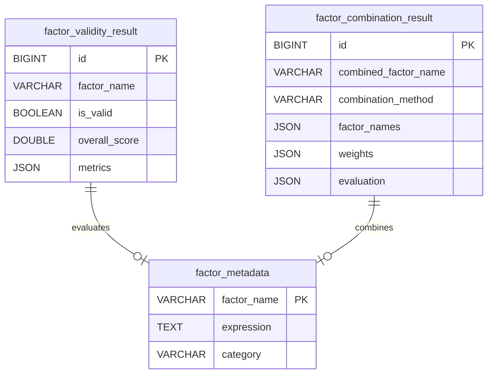

# 因子评估模块 - 数据模型

> **阶段**: Research阶段
> **模块**: 因子评估
> **状态**: ⚠️ 部分完成
> **版本**: v1.0
> **最后更新**: 2026-02-10

> **对应章节**: [相关章节](../../../项目设计/MyQuant完整架构与工作流V3/02-Research阶段工作流.html)

---

## 🎯 模块定位

因子评估模块负责因子评估结果的管理和存储，包括：
- 因子有效性评估结果
- 因子组合评估结果
- 评估任务记录

---

## 📊 数据表结构

### 1. 因子有效性评估结果表 (factor_validity_result)

**表名**: `factor_validity_result`

**说明**: 存储因子有效性评估结果

| 字段名 | 类型 | 长度 | 允许空 | 说明 |
|--------|------|------|--------|------|
| id | BIGINT | - | ❌ | 主键，自增 |
| factor_name | VARCHAR | 100 | ❌ | 因子名称 |
| start_date | DATE | - | ❌ | 评估开始日期 |
| end_date | DATE | - | ❌ | 评估结束日期 |
| is_valid | BOOLEAN | - | ❌ | 是否有效 |
| overall_score | DOUBLE | - | ❌ | 总体评分 |
| ic_mean_score | DOUBLE | - | ❌ | IC均值评分 |
| ir_score | DOUBLE | - | ❌ | IR评分 |
| ic_positive_ratio_score | DOUBLE | - | ❌ | IC正数占比评分 |
| metrics | JSON | - | ❌ | 详细指标（JSON格式） |
| recommendation | TEXT | - | ✅ | 建议 |
| created_at | DATETIME | - | ❌ | 创建时间 |

**索引**:
- PRIMARY KEY: `id`
- UNIQUE INDEX: `factor_name`, `start_date`, `end_date`
- INDEX: `is_valid`, `overall_score`

**示例数据**:
```json
{
  "id": 1,
  "factor_name": "custom_factor_001",
  "start_date": "2020-01-01",
  "end_date": "2024-12-31",
  "is_valid": true,
  "overall_score": 0.75,
  "ic_mean_score": 0.8,
  "ir_score": 0.6,
  "ic_positive_ratio_score": 0.85,
  "metrics": {
    "ic_mean": {
      "value": 0.0523,
      "threshold": 0.03,
      "passed": true
    },
    "ir": {
      "value": 0.4238,
      "threshold": 0.5,
      "passed": false
    }
  },
  "recommendation": "因子有效，建议进入Validation阶段",
  "created_at": "2024-02-10 10:00:00"
}
```

---

### 2. 因子组合评估结果表 (factor_combination_result)

**表名**: `factor_combination_result`

**说明**: 存储因子组合评估结果

| 字段名 | 类型 | 长度 | 允许空 | 说明 |
|--------|------|------|--------|------|
| id | BIGINT | - | ❌ | 主键，自增 |
| combined_factor_name | VARCHAR | 100 | ❌ | 组合因子名称 |
| combination_method | VARCHAR | 50 | ❌ | 组合方法 |
| factor_names | JSON | - | ❌ | 因子名称列表（JSON数组） |
| weights | JSON | - | ❌ | 权重（JSON格式） |
| start_date | DATE | - | ❌ | 评估开始日期 |
| end_date | DATE | - | ❌ | 评估结束日期 |
| evaluation | JSON | - | ❌ | 评估结果（JSON格式） |
| comparison | JSON | - | ✅ | 对比结果（JSON格式） |
| created_at | DATETIME | - | ❌ | 创建时间 |

**索引**:
- PRIMARY KEY: `id`
- UNIQUE INDEX: `combined_factor_name`, `start_date`, `end_date`
- INDEX: `combination_method`, `created_at`

**示例数据**:
```json
{
  "id": 1,
  "combined_factor_name": "combined_factor_20240210",
  "combination_method": "equal_weight",
  "factor_names": [
    "custom_factor_001",
    "custom_factor_002",
    "alpha158_001"
  ],
  "weights": {
    "custom_factor_001": 0.333,
    "custom_factor_002": 0.333,
    "alpha158_001": 0.333
  },
  "start_date": "2020-01-01",
  "end_date": "2024-12-31",
  "evaluation": {
    "ic_mean": 0.0623,
    "ir": 0.5234,
    "ic_positive_ratio": 0.6123
  },
  "comparison": {
    "best_single_factor": "custom_factor_001",
    "improvement": {
      "ic_mean": 0.01,
      "ir": 0.0996
    }
  },
  "created_at": "2024-02-10 10:00:00"
}
```

---

## 🔗 数据关系

### ER图



---

## 💾 存储设计

### JSON字段存储

**metrics字段**:
```json
{
  "ic_mean": {
    "value": 0.0523,
    "threshold": 0.03,
    "passed": true,
    "score": 0.8
  },
  "ir": {
    "value": 0.4238,
    "threshold": 0.5,
    "passed": false,
    "score": 0.6
  }
}
```

**weights字段**:
```json
{
  "custom_factor_001": 0.333,
  "custom_factor_002": 0.333,
  "alpha158_001": 0.333
}
```

---

## 📝 数据操作示例

### Python SQLAlchemy示例

```python
from sqlalchemy import create_engine, Column, String, Integer, Double, Boolean, Date, DateTime, JSON
from sqlalchemy.ext.declarative import declarative_base
from sqlalchemy.orm import sessionmaker

Base = declarative_base()

class FactorValidityResult(Base):
    __tablename__ = 'factor_validity_result'

    id = Column(Integer, primary_key=True, autoincrement=True)
    factor_name = Column(String(100), nullable=False)
    start_date = Column(Date, nullable=False)
    end_date = Column(Date, nullable=False)
    is_valid = Column(Boolean, nullable=False)
    overall_score = Column(Double, nullable=False)
    metrics = Column(JSON, nullable=False)
    recommendation = Column(String(255))

# 创建有效性评估结果
validity_result = FactorValidityResult(
    factor_name="custom_factor_001",
    start_date="2020-01-01",
    end_date="2024-12-31",
    is_valid=True,
    overall_score=0.75,
    metrics={
        "ic_mean": {
            "value": 0.0523,
            "threshold": 0.03,
            "passed": true,
            "score": 0.8
        },
        "ir": {
            "value": 0.4238,
            "threshold": 0.5,
            "passed": false,
            "score": 0.6
        }
    },
    recommendation="因子有效，建议进入Validation阶段"
)

session.add(validity_result)
session.commit()
```

---

## 🔗 相关文档

- [API设计](./API设计.md) - API端点定义
- [前端组件](./前端组件.md) - 前端UI组件文档
- [Research阶段README](../README.md) - 阶段概述

---

**维护说明**: 本文档与数据库schema保持同步，如有表结构变更请及时更新
**最后更新**: 2026-02-10
