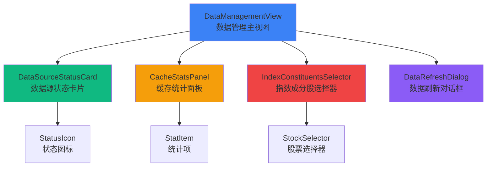

# 数据管理模块 - 前端组件

> **阶段**: Research阶段
> **模块**: 数据管理
> **状态**: ✅ 渐进式迁移完成
> **版本**: v2.0
> **最后更新**: 2026-02-10

> **对应章节**: [相关章节](../../../项目设计/MyQuant完整架构与工作流V3/08-前端实现示例.html)

---

## 🎯 模块UI组件列表

### 核心组件
1. `DataSourceStatusCard` - 数据源状态卡片
2. `CacheStatsPanel` - 缓存统计面板
3. `IndexConstituentsSelector` - 指数成分股选择器
4. `DataRefreshDialog` - 数据刷新对话框

---

## 📦 组件层次结构



---

## 🧩 组件详细定义

### 1. DataSourceStatusCard（数据源状态卡片）

**组件路径**: `frontend/src/views/research/data-management/DataSourceStatusCard.vue`

**Props**:
```typescript
interface DataSource {
  name: string;           // 数据源名称（tushare, akshare等）
  displayName: string;    // 显示名称
  status: 'connected' | 'disconnected' | 'error';  // 连接状态
  statusText: string;     // 状态文本
  latency?: number;       // 延迟（毫秒）
}

interface Props {
  source: DataSource;     // 数据源信息
}
```

**Events**:
```typescript
interface Emits {
  (e: 'refresh', source: string): void;  // 刷新数据源
  (e: 'configure', source: string): void; // 配置数据源
}
```

**组件代码**:
```vue
<template>
  <el-card :class="['source-card', source.status]">
    <h4>{{ source.displayName }}</h4>
    <el-icon :class="source.status === 'connected' ? 'success' : 'error'">
      {{ source.status === 'connected' ? '✓' : '✗' }}
    </el-icon>
    <p>状态: {{ source.statusText }}</p>
    <p v-if="source.status === 'connected'">
      延迟: {{ source.latency }}ms
    </p>
    <el-button-group>
      <el-button size="small" @click="$emit('refresh', source.name)">
        刷新
      </el-button>
      <el-button size="small" @click="$emit('configure', source.name)">
        配置
      </el-button>
    </el-button-group>
  </el-card>
</template>

<script setup lang="ts">
interface DataSource {
  name: string;
  displayName: string;
  status: 'connected' | 'disconnected' | 'error';
  statusText: string;
  latency?: number;
}

defineProps<{
  source: DataSource;
}>();

defineEmits<{
  (e: 'refresh', source: string): void;
  (e: 'configure', source: string): void;
}>();
</script>

<style scoped>
.source-card {
  text-align: center;
}
.source-card.connected {
  border-left: 4px solid #10b981;
}
.source-card.disconnected {
  border-left: 4px solid #f59e0b;
}
.source-card.error {
  border-left: 4px solid #ef4444;
}
.success {
  color: #10b981;
}
.error {
  color: #ef4444;
}
</style>
```

---

### 2. CacheStatsPanel（缓存统计面板）

**组件路径**: `frontend/src/views/research/data-management/CacheStatsPanel.vue`

**Props**:
```typescript
interface CacheLevelStats {
  name: string;       // 缓存层级名称
  size: number;       // 缓存大小（MB）
  hitRate: number;    // 命中率
  count: number;      // 数据条数
}

interface OverallStats {
  overall_hit_rate: number;  // 整体命中率
}

interface Props {
  l1: CacheLevelStats;
  l2: CacheLevelStats;
  l3: CacheLevelStats;
  overall: OverallStats;
}
```

**Events**:
```typescript
interface Emits {
  (e: 'refresh'): void;  // 刷新缓存统计
  (e: 'clear', level: string): void;  // 清除缓存
}
```

**组件代码**:
```vue
<template>
  <el-card class="cache-stats">
    <h3>多层缓存统计</h3>
    <el-row :gutter="20">
      <el-col :span="8">
        <div class="stat-item">
          <label>L1 内存缓存</label>
          <span>{{ l1.size }} MB</span>
          <div class="hit-rate">命中率: {{ (l1.hitRate * 100).toFixed(1) }}%</div>
        </div>
      </el-col>
      <el-col :span="8">
        <div class="stat-item">
          <label>L2 Redis缓存</label>
          <span>{{ l2.size }} MB</span>
          <div class="hit-rate">命中率: {{ (l2.hitRate * 100).toFixed(1) }}%</div>
        </div>
      </el-col>
      <el-col :span="8">
        <div class="stat-item">
          <label>L3 数据库</label>
          <span>{{ l3.size }} MB</span>
          <div class="hit-rate">命中率: {{ (l3.hitRate * 100).toFixed(1) }}%</div>
        </div>
      </el-col>
    </el-row>

    <div class="overall-stats">
      <h4>整体命中率: {{ (overall.overall_hit_rate * 100).toFixed(1) }}%</h4>
    </div>

    <el-button-group>
      <el-button type="primary" @click="$emit('refresh')">
        刷新统计
      </el-button>
      <el-button @click="$emit('clear', 'L1')">清除L1</el-button>
      <el-button @click="$emit('clear', 'L2')">清除L2</el-button>
    </el-button-group>
  </el-card>
</template>

<script setup lang="ts">
interface CacheLevelStats {
  name: string;
  size: number;
  hitRate: number;
  count: number;
}

interface OverallStats {
  overall_hit_rate: number;
}

defineProps<{
  l1: CacheLevelStats;
  l2: CacheLevelStats;
  l3: CacheLevelStats;
  overall: OverallStats;
}>();

defineEmits<{
  (e: 'refresh'): void;
  (e: 'clear', level: string): void;
}>();
</script>

<style scoped>
.stat-item {
  text-align: center;
  padding: 20px;
  background: rgba(26, 26, 46, 0.5);
  border-radius: 8px;
}
.stat-item label {
  display: block;
  margin-bottom: 10px;
  color: #94a3b8;
}
.stat-item span {
  font-size: 24px;
  font-weight: bold;
  color: #10b981;
}
.hit-rate {
  margin-top: 10px;
  color: #94a3b8;
}
.overall-stats {
  margin: 20px 0;
  text-align: center;
}
</style>
```

---

### 3. IndexConstituentsSelector（指数成分股选择器）

**组件路径**: `frontend/src/views/research/data-management/IndexConstituentsSelector.vue`

**Props**:
```typescript
interface IndexOption {
  value: string;    // 指数代码（csi300, csi500等）
  label: string;    // 显示名称
}

interface Props {
  indexes: IndexOption[];  // 可选指数列表
  loading?: boolean;       // 加载状态
}
```

**Events**:
```typescript
interface Emits {
  (e: 'change', indexId: string): void;  // 指数选择变化
  (e: 'load', stocks: string[]): void;   // 加载成分股
}
```

**组件代码**:
```vue
<template>
  <el-card>
    <h3>指数成分股</h3>
    <el-form :inline="true">
      <el-form-item label="选择指数">
        <el-select
          v-model="selectedIndex"
          placeholder="请选择指数"
          @change="handleIndexChange"
        >
          <el-option
            v-for="index in indexes"
            :key="index.value"
            :label="index.label"
            :value="index.value"
          />
        </el-select>
      </el-form-item>
      <el-form-item label="日期">
        <el-date-picker
          v-model="selectedDate"
          type="date"
          placeholder="选择日期"
        />
      </el-form-item>
      <el-form-item>
        <el-button
          type="primary"
          :loading="loading"
          @click="handleLoad"
        >
          加载成分股
        </el-button>
      </el-form-item>
    </el-form>

    <el-table
      v-if="stocks.length > 0"
      :data="stocks"
      max-height="400"
    >
      <el-table-column prop="code" label="股票代码" />
      <el-table-column prop="name" label="股票名称" />
    </el-table>
  </el-card>
</template>

<script setup lang="ts">
import { ref } from 'vue';

interface IndexOption {
  value: string;
  label: string;
}

const props = defineProps<{
  indexes: IndexOption[];
  loading?: boolean;
}>();

const emit = defineEmits<{
  (e: 'change', indexId: string): void;
  (e: 'load', stocks: string[]): void;
}>();

const selectedIndex = ref('');
const selectedDate = ref(new Date());
const stocks = ref<any[]>([]);

const handleIndexChange = (value: string) => {
  emit('change', value);
};

const handleLoad = () => {
  if (selectedIndex.value) {
    emit('load', stocks.value);
  }
};
</script>
```

---

### 4. DataManagementView（主视图）

**组件路径**: `frontend/src/views/research/data-management/index.vue`

**状态管理**:
```typescript
import { defineStore } from 'pinia';

export const useDataManagementStore = defineStore('dataManagement', {
  state: () => ({
    dataSources: [
      {
        name: 'tushare',
        displayName: 'TuShare',
        status: 'connected',
        statusText: '已连接',
        latency: 120
      },
      {
        name: 'akshare',
        displayName: 'AkShare',
        status: 'connected',
        statusText: '已连接',
        latency: 85
      }
    ],
    cacheStats: {
      l1: { name: 'L1', size: 256, hitRate: 0.85, count: 1523 },
      l2: { name: 'L2', size: 2560, hitRate: 0.12, count: 12456 },
      l3: { name: 'L3', size: 15360, hitRate: 0.03, count: 152340 },
      overall: { overall_hit_rate: 0.97 }
    },
    loading: false
  }),

  actions: {
    async refreshCacheStats() {
      this.loading = true;
      try {
        const response = await fetch('/api/v1/research/data/cache-stats');
        const data = await response.json();
        this.cacheStats = data.data;
      } finally {
        this.loading = false;
      }
    },

    async refreshData(source: string) {
      const response = await fetch('/api/v1/research/data/refresh', {
        method: 'POST',
        headers: { 'Content-Type': 'application/json' },
        body: JSON.stringify({ source })
      });
      return await response.json();
    }
  }
});
```

**主视图组件**:
```vue
<template>
  <div class="data-management-view">
    <h2>数据管理</h2>

    <!-- 数据源状态卡片 -->
    <el-row :gutter="20" class="source-cards">
      <el-col :span="6" v-for="source in store.dataSources" :key="source.name">
        <DataSourceStatusCard
          :source="source"
          @refresh="handleRefresh"
          @configure="handleConfigure"
        />
      </el-col>
    </el-row>

    <!-- 缓存统计面板 -->
    <CacheStatsPanel
      :l1="store.cacheStats.l1"
      :l2="store.cacheStats.l2"
      :l3="store.cacheStats.l3"
      :overall="store.cacheStats.overall"
      @refresh="store.refreshCacheStats"
      @clear="handleClearCache"
    />

    <!-- 指数成分股选择器 -->
    <IndexConstituentsSelector
      :indexes="indexOptions"
      :loading="store.loading"
      @change="handleIndexChange"
      @load="handleLoadStocks"
    />
  </div>
</template>

<script setup lang="ts">
import { useDataManagementStore } from '@/stores/data-management';
import DataSourceStatusCard from './DataSourceStatusCard.vue';
import CacheStatsPanel from './CacheStatsPanel.vue';
import IndexConstituentsSelector from './IndexConstituentsSelector.vue';

const store = useDataManagementStore();

const indexOptions = [
  { value: 'csi300', label: '沪深300' },
  { value: 'csi500', label: '中证500' },
  { value: 'sse50', label: '上证50' }
];

const handleRefresh = async (source: string) => {
  await store.refreshData(source);
};

const handleConfigure = (source: string) => {
  // 打开配置对话框
};

const handleClearCache = (level: string) => {
  // 清除缓存
};

const handleIndexChange = (indexId: string) => {
  // 处理指数选择
};

const handleLoadStocks = (stocks: string[]) => {
  // 加载成分股
};
</script>

<style scoped>
.data-management-view {
  padding: 20px;
}
.source-cards {
  margin-bottom: 20px;
}
</style>
```

---

## 🔗 相关文档

- [API设计](./API设计.md) - API端点定义
- [数据模型](./数据模型.md) - 数据表结构
- [Research阶段README](../README.md) - 阶段概述
- [第8章 - 前端实现示例](../../../项目设计/MyQuant完整架构与工作流V3/08-前端实现示例.html) - 更多前端示例

---

**维护说明**: 本文档与前端代码保持同步，如有组件变更请及时更新
**最后更新**: 2026-02-10
