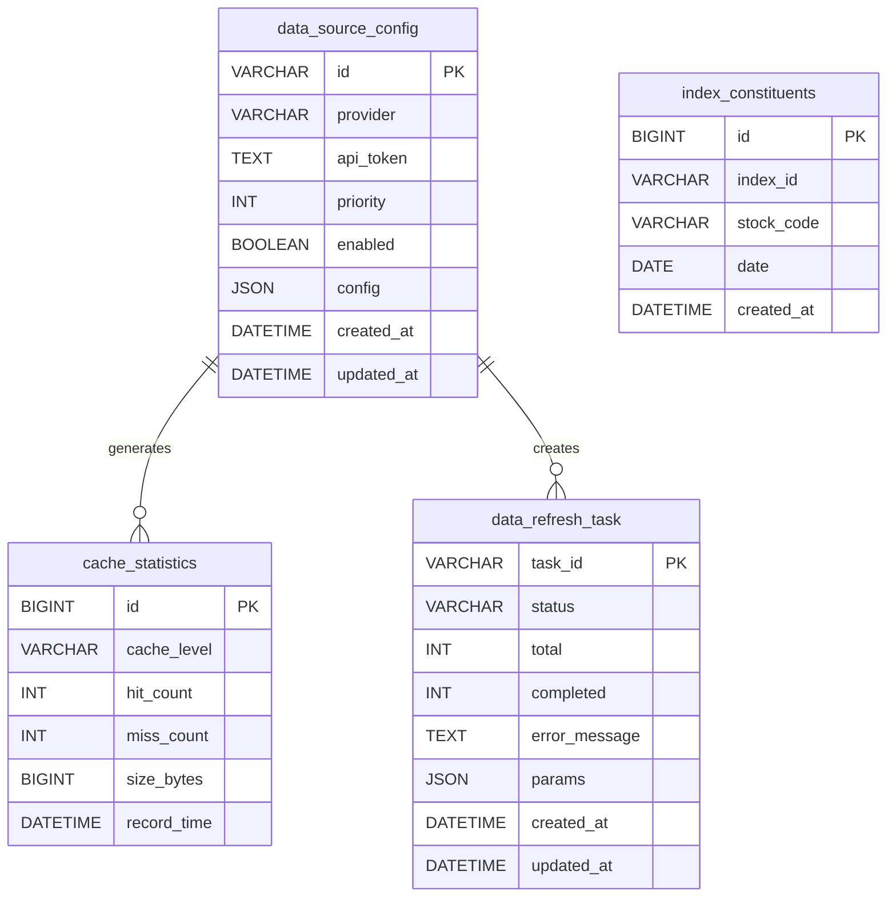

# 数据管理模块 - 数据模型

> **阶段**: Research阶段
> **模块**: 数据管理
> **状态**: ✅ 渐进式迁移完成
> **版本**: v2.0
> **最后更新**: 2026-02-10

> **对应章节**: [相关章节](../../../项目设计/MyQuant完整架构与工作流V3/02-Research阶段工作流.html)

---

## 🎯 模块定位

数据管理模块负责Research阶段的数据存储与管理，包括：
- 多层缓存数据
- 数据源配置
- 指数成分股数据
- 数据刷新任务记录

---

## 📊 数据表结构

### 1. 数据源配置表 (data_source_config)

**表名**: `data_source_config`

**说明**: 存储数据源提供商的配置信息

| 字段名 | 类型 | 长度 | 允许空 | 说明 |
|--------|------|------|--------|------|
| id | VARCHAR | 50 | ❌ | 主键，配置ID（如 cfg_tushare_001） |
| provider | VARCHAR | 50 | ❌ | 数据源提供商（tushare, akshare等） |
| api_token | TEXT | - | ❌ | API密钥 |
| priority | INT | - | ❌ | 优先级，数字越小优先级越高 |
| enabled | BOOLEAN | - | ❌ | 是否启用 |
| config | JSON | - | ✅ | 其他配置项（JSON格式） |
| created_at | DATETIME | - | ❌ | 创建时间 |
| updated_at | DATETIME | - | ❌ | 更新时间 |

**索引**:
- PRIMARY KEY: `id`
- UNIQUE INDEX: `provider`
- INDEX: `enabled`, `priority`

**示例数据**:
```json
{
  "id": "cfg_tushare_001",
  "provider": "tushare",
  "api_token": "xxxxxxxxxxxxxxxx",
  "priority": 1,
  "enabled": true,
  "config": {
    "timeout": 30,
    "retry_times": 3
  },
  "created_at": "2024-01-01 00:00:00",
  "updated_at": "2024-02-10 10:30:00"
}
```

---

### 2. 指数成分股表 (index_constituents)

**表名**: `index_constituents`

**说明**: 存储指数成分股的历史数据

| 字段名 | 类型 | 长度 | 允许空 | 说明 |
|--------|------|------|--------|------|
| id | BIGINT | - | ❌ | 主键，自增 |
| index_id | VARCHAR | 20 | ❌ | 指数代码（csi300, csi500等） |
| stock_code | VARCHAR | 20 | ❌ | 股票代码 |
| date | DATE | - | ❌ | 生效日期 |
| created_at | DATETIME | - | ❌ | 创建时间 |

**索引**:
- PRIMARY KEY: `id`
- UNIQUE INDEX: `index_id`, `stock_code`, `date`
- INDEX: `index_id`, `date`
- INDEX: `stock_code`, `date`

**示例数据**:
```json
{
  "id": 1,
  "index_id": "csi300",
  "stock_code": "000001.SZ",
  "date": "2024-01-01",
  "created_at": "2024-01-01 00:00:00"
}
```

---

### 3. 数据刷新任务表 (data_refresh_task)

**表名**: `data_refresh_task`

**说明**: 记录数据刷新任务

| 字段名 | 类型 | 长度 | 允许空 | 说明 |
|--------|------|------|--------|------|
| task_id | VARCHAR | 50 | ❌ | 主键，任务ID |
| status | VARCHAR | 20 | ❌ | 状态（pending, running, completed, failed） |
| total | INT | - | ✅ | 总数 |
| completed | INT | - | ✅ | 已完成数 |
| error_message | TEXT | - | ✅ | 错误信息 |
| params | JSON | - | ✅ | 任务参数（JSON格式） |
| created_at | DATETIME | - | ❌ | 创建时间 |
| updated_at | DATETIME | - | ❌ | 更新时间 |

**索引**:
- PRIMARY KEY: `task_id`
- INDEX: `status`, `created_at`

**示例数据**:
```json
{
  "task_id": "refresh_20240210_123456",
  "status": "running",
  "total": 100,
  "completed": 20,
  "error_message": null,
  "params": {
    "instruments": ["000001.SZ", "000002.SZ"],
    "start_date": "2020-01-01",
    "end_date": "2024-12-31"
  },
  "created_at": "2024-02-10 10:00:00",
  "updated_at": "2024-02-10 10:05:00"
}
```

---

### 4. 缓存统计表 (cache_statistics)

**表名**: `cache_statistics`

**说明**: 记录缓存使用统计（可选，用于历史分析）

| 字段名 | 类型 | 长度 | 允许空 | 说明 |
|--------|------|------|--------|------|
| id | BIGINT | - | ❌ | 主键，自增 |
| cache_level | VARCHAR | 10 | ❌ | 缓存层级（L1, L2, L3） |
| hit_count | INT | - | ❌ | 命中次数 |
| miss_count | INT | - | ❌ | 未命中次数 |
| size_bytes | BIGINT | - | ❌ | 缓存大小（字节） |
| record_time | DATETIME | - | ❌ | 记录时间 |

**索引**:
- PRIMARY KEY: `id`
- INDEX: `cache_level`, `record_time`

**示例数据**:
```json
{
  "id": 1,
  "cache_level": "L1",
  "hit_count": 1523,
  "miss_count": 269,
  "size_bytes": 268435456,
  "record_time": "2024-02-10 10:30:00"
}
```

---

## 🔗 数据关系

### ER图



---

## 💾 存储设计

### 多层缓存架构

```
L1: 内存缓存
  - 数据库: Redis / Dict
  - 容量: ~256 MB
  - 命中率目标: >80%
  - 保存内容: 热点数据（最近查询）

L2: 磁盘缓存
  - 数据库: HDF5 / Parquet
  - 容量: ~2.5 GB
  - 命中率目标: >10%
  - 保存内容: 常用数据（日线、分钟线）

L3: 数据库
  - 数据库: MySQL / PostgreSQL
  - 容量: ~15 GB+
  - 命中率目标: 剩余
  - 保存内容: 全量历史数据
```

---

## 📝 数据操作示例

### Python SQLAlchemy示例

```python
from sqlalchemy import create_engine, Column, String, Integer, Boolean, DateTime, Text, JSON
from sqlalchemy.ext.declarative import declarative_base
from sqlalchemy.orm import sessionmaker

Base = declarative_base()

class DataSourceConfig(Base):
    __tablename__ = 'data_source_config'

    id = Column(String(50), primary_key=True)
    provider = Column(String(50), unique=True, nullable=False)
    api_token = Column(Text, nullable=False)
    priority = Column(Integer, nullable=False)
    enabled = Column(Boolean, nullable=False)
    config = Column(JSON)
    created_at = Column(DateTime, nullable=False)
    updated_at = Column(DateTime, nullable=False)

# 创建配置
config = DataSourceConfig(
    id="cfg_tushare_001",
    provider="tushare",
    api_token="your_token",
    priority=1,
    enabled=True,
    config={"timeout": 30}
)

session.add(config)
session.commit()
```

---

## 🔗 相关文档

- [API设计](./API设计.md) - API端点定义
- [前端组件](./前端组件.md) - 前端UI组件文档
- [Research阶段README](../README.md) - 阶段概述
- [L0-L5数据类型架构](../../../backend/02-数据获取/L0-L5数据类型架构完整说明.md) - 数据架构详细说明

---

**维护说明**: 本文档与数据库schema保持同步，如有表结构变更请及时更新
**最后更新**: 2026-02-10
