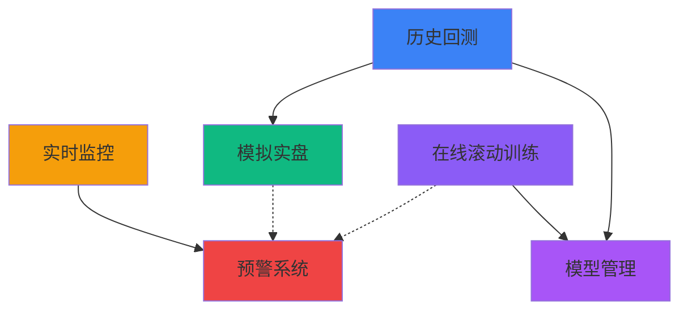

# Validation阶段开发指南

> **对应章节**: [第3章 - Validation阶段工作流](../../项目设计/MyQuant完整架构与工作流V3/03-Validation阶段工作流.html)
> **更新日期**: 2026-02-10

---

## 🎯 阶段目标

**核心任务**: 多时间框架回测、在线滚动训练、投资分析

**验证流程**: 策略回测 → 参数优化 → 模拟实盘 → 在线训练 → 实盘部署

---

## 📦 核心模块

### 1. 历史回测模块 📊

**模块定位**: 策略历史数据回测

**核心功能**:
- 单策略回测
- 组合策略回测
- 多时间框架对比
- 回测报告生成
- 绩效指标计算

**API端点（8个）**:
- `POST /api/v1/validation/backtest/execute` - 执行回测
- `GET /api/v1/validation/backtest/strategies` - 获取策略列表
- `POST /api/v1/validation/backtest/create` - 创建回测任务
- `GET /api/v1/validation/backtest/workflows` - 获取工作流列表
- `GET /api/v1/validation/backtest/report` - 获取回测报告
- `GET /api/v1/validation/backtest/positions` - 获取持仓数据
- `POST /api/v1/validation/backtest/compare` - 对比回测结果
- `DELETE /api/v1/validation/backtest/{id}` - 删除回测任务

**数据模型**: 见 [历史回测模块/数据模型.md](./历史回测模块/数据模型.md)
**API设计**: 见 [历史回测模块/API设计.md](./历史回测模块/API设计.md)
**前端组件**: 见 [历史回测模块/前端组件.md](./历史回测模块/前端组件.md)
**实施记录**: 见 [实施记录.md](./历史回测模块/实施记录.md) ⭐

---

### 2. 模拟实盘模块 🎮

**模块定位**: 仿真实盘交易环境

**核心功能**:
- 模拟交易执行
- 实时行情模拟
- 交易信号跟踪
- 资金变化记录

**API端点**:
- 待补充（基于V3文档）

**数据模型**: 见 [模拟实盘模块/数据模型.md](./模拟实盘模块/数据模型.md)
**API设计**: 见 [模拟实盘模块/API设计.md](./模拟实盘模块/API设计.md)
**前端组件**: 见 [模拟实盘模块/前端组件.md](./模拟实盘模块/前端组件.md)
**实施记录**: 见 [实施记录.md](./模拟实盘模块/实施记录.md) ⭐

---

### 3. 实时监控模块 📡

**模块定位**: 实时数据监控与告警

**核心功能**:
- 实时行情监控
- 交易信号监控
- 系统状态监控
- 异常告警

**API端点**:
- 待补充（基于V3文档）

**数据模型**: 见 [实时监控模块/数据模型.md](./实时监控模块/数据模型.md)
**API设计**: 见 [实时监控模块/API设计.md](./实时监控模块/API设计.md)
**前端组件**: 见 [实时监控模块/前端组件.md](./实时监控模块/前端组件.md)
**实施记录**: 见 [实施记录.md](./实时监控模块/实施记录.md) ⭐

---

### 4. 预警系统模块 🔔

**模块定位**: 智能预警通知

**核心功能**:
- 邮件预警
- 短信预警
- 微信推送
- 预警规则管理

**API端点**:
- 待补充（基于V3文档）

**数据模型**: 见 [预警系统模块/数据模型.md](./预警系统模块/数据模型.md)
**API设计**: 见 [预警系统模块/API设计.md](./预警系统模块/API设计.md)
**前端组件**: 见 [预警系统模块/前端组件.md](./预警系统模块/前端组件.md)
**实施记录**: 见 [实施记录.md](./预警系统模块/实施记录.md) ⭐

---

### 5. 在线服务模块 ✅ ⭐P1核心

**模块定位**: 基于QLib Online Serving的在线模型训练与验证

**应用说明**: 这是QLib **Online Serving**模块在Validation阶段的核心应用，用于模拟盘验证和在线策略测试

**核心功能**:
1. **历史模拟模式**（Simulation）
   - 在历史数据上模拟在线服务
   - 验证在线策略有效性
   - 评估模型切换策略

2. **在线服务模式**（Online）
   - 模拟盘环境中的模型管理
   - 实时预测服务
   - 自动例行更新
   - 交易信号准备

**组件体系**:
- Online Manager（总控制器）
- Online Strategy（在线策略基类）
- Rolling Strategy（滚动策略）
- Online Tool（模型状态管理）
- Updater（数据增量更新）

**API端点（12+个）**:
- `POST /api/v1/validation/online/first-train` - 首次训练
- `POST /api/v1/validation/online/routine` - 执行例行更新
- `POST /api/v1/validation/online/simulate` - 历史模拟
- `POST /api/v1/validation/online/prepare-signals` - 准备交易信号
- ...（详见API设计文档）

**数据模型**: 见 [在线服务模块/数据模型.md](./在线服务模块/数据模型.md)
**API设计**: 见 [在线服务模块/API设计.md](./在线服务模块/API设计.md)
**前端组件**: 见 [在线服务模块/前端组件.md](./在线服务模块/前端组件.md)
**实施记录**: 见 [实施记录.md](./在线服务模块/实施记录.md) ⭐

**文档状态**: ✅ **已完成**（API设计+数据模型+前端组件）

**优先级**: **P1**（Validation阶段核心功能）

---

### 6. RL策略验证模块 🤖 P2

**模块定位**: 强化学习策略的验证与测试

**应用说明**: 这是QLib **RL模块**在Validation阶段的应用

**核心功能**:
- RL策略模拟验证
- RL策略对比（RL vs 传统）
- RL参数优化
- RL鲁棒性测试

**API设计**: 见 [RL策略验证模块/API设计.md](./RL策略验证模块/API设计.md)
**实施记录**: 见 [实施记录.md](./RL策略验证模块/实施记录.md) ⭐

**文档状态**: ⚠️ **部分完成**（仅API设计，数据模型和前端组件待补充）

**优先级**: P2（如果使用RL策略）

---

### 7. 嵌套决策执行模块 📊 P2

**模块定位**: 多级别嵌套策略的联合回测与性能评估

**应用说明**: 这是QLib **Nested Decision Execution**模块在Validation阶段的核心应用

**核心功能**:
1. **嵌套回测**
   - 多级别策略联合回测（日频+日内+执行）
   - 考虑策略交互影响
   - 联合性能评估

2. **策略交互分析**
   - 分析不同级别策略的交互影响
   - 敏感性分析
   - 消融实验

3. **策略对比**
   - 对比不同嵌套策略配置
   - 评估添加各级别的价值
   - 优化策略组合

**Trading Agent架构**:
- Information Extractor（信息提取器）
- Forecast Model（预测模型）
- Decision Generator（决策生成器）

**API端点（6个）**:
- `POST /api/v1/validation/nested/backtest/create` - 创建嵌套回测任务
- `GET /api/v1/validation/nested/backtest/result/{task_id}` - 获取嵌套回测结果
- `GET /api/v1/validation/nested/backtest/status/{task_id}` - 查询回测任务状态
- `POST /api/v1/validation/nested/compare` - 对比不同嵌套策略配置
- `POST /api/v1/validation/nested/interaction/analyze` - 分析策略交互影响
- `DELETE /api/v1/validation/nested/backtest/stop/{task_id}` - 停止回测任务

**深度理解**: 见 [嵌套决策执行模块/深度理解与集成方案.md](./嵌套决策执行模块/深度理解与集成方案.md)
**数据模型**: 见 [嵌套决策执行模块/数据模型.md](./嵌套决策执行模块/数据模型.md)
**API设计**: 见 [嵌套决策执行模块/API设计.md](./嵌套决策执行模块/API设计.md)
**前端组件**: 见 [嵌套决策执行模块/前端组件.md](./嵌套决策执行模块/前端组件.md)
**实施记录**: 见 [实施记录.md](./嵌套决策执行模块/实施记录.md) ⭐

**文档状态**: ✅ **已完成**（深度理解+API设计+数据模型+前端组件）

**优先级**: P2（高频交易场景）

---

## 🔗 模块依赖关系

---

## 🤖 QLib高级模块在Validation阶段的应用

> **重要**: ML模块在Validation阶段是核心验证工具，用于评估ML策略的历史表现和在线预测能力

### 1. ML模型回测验证 ⭐ P0

**应用说明**: 使用Research阶段训练的ML模型进行历史回测，评估ML策略有效性

**核心功能**:
- **ML信号回测**: 使用ML预测评分生成交易信号进行回测
- **模型对比**: 对比不同ML模型的历史表现
- **参数敏感性**: 分析ML模型参数对回测结果的影响
- **因子贡献度**: 分析ML模型中各因子的贡献

**相关模块**:
- 依赖 [历史回测模块](./历史回测模块/README.md)
- 依赖 Research阶段 [机器学习训练模块](../Research阶段/机器学习训练模块/README.md)

---

### 2. ML模拟实盘验证 ⭐ P1

**应用说明**: 在模拟盘环境中使用ML预测进行交易模拟

**核心功能**:
- **实时ML预测**: 调用Online Prediction Service获取实时预测
- **信号模拟**: 将ML预测转换为模拟交易信号
- **资金模拟**: 模拟ML策略的资金曲线
- **风险模拟**: 评估ML策略的模拟风险指标

**相关模块**:
- 依赖 [模拟实盘模块](./模拟实盘模块/README.md)
- 依赖 Production阶段 [ML信号生成器模块](../Production阶段/ML信号生成器模块/README.md)

---

### 3. Nested Forecast Model ⭐ P2

**应用说明**: 在嵌套决策执行中使用ML预测模型作为Forecast Model

**核心功能**:
- **多级别预测**: 日频+日内ML预测
- **预测融合**: 融合不同时间窗口的ML预测
- **决策支持**: 为Decision Generator提供预测输入

**Trading Agent架构**:
- Information Extractor（信息提取器）
- **Forecast Model（预测模型）** ← ML模型
- Decision Generator（决策生成器）

---

### 4. Online Serving - 在线验证 ⭐ P1

**应用说明**: 这是QLib **Online Serving**模块在Validation阶段的核心应用，用于模拟盘验证

**核心功能**:
- **历史模拟模式**: 在历史数据上模拟在线服务
- **在线服务模式**: 模拟盘环境中的实时预测
- **例行更新验证**: 验证模型更新流程

**组件体系**:
- Online Manager（总控制器）
- Online Strategy（在线策略基类）
- Rolling Strategy（滚动策略）
- Online Tool（模型状态管理）
- Updater（数据增量更新）

---

### 5. RL策略验证 🤖 P2

**应用说明**: 这是QLib **RL模块**在Validation阶段的应用

**核心功能**:
- **RL策略模拟**: 使用RL策略进行模拟交易
- **RL vs ML对比**: 对比强化学习与传统ML策略
- **RL参数优化**: 优化RL超参数

---

## 📈 开发优先级

### P0 - 核心功能
- ✅ 历史回测模块（已完成）
- ✅ 在线服务模块（已完成 - P1核心功能）

### P1 - 重要功能
- ✅ 模拟实盘模块（文档已完成）
- ✅ 实时监控模块（文档已完成）

### P2 - 可选功能
- ✅ 预警系统模块（文档已完成）
- ✅ 嵌套决策执行模块（文档已完成 - 高频交易专用）
- ⚠️ RL策略验证模块（部分完成）

---

## 📚 相关文档

### 主文档
- [第3章 - Validation阶段工作流](../../项目设计/MyQuant完整架构与工作流V3/03-Validation阶段工作流.html)
- [第7章 - 完整API参考](../../项目设计/MyQuant完整架构与工作流V3/07-完整API参考.html)

### 投资分析
- [第3章 - 投资分析系统](../../项目设计/MyQuant完整架构与工作流V3/03-Validation阶段工作流.html#投资分析系统)
- 绩效归因（Brinson归因）
- 风险归因（因子暴露）

### QLib参考资料
- [QLib参考资料 - Contrib](../../QLib参考资料/)
- [QLib参考资料 - Strategy & Evaluate](../../QLib参考资料/)

---

**维护说明**: 本指南基于V3文档生成，与主文档保持同步
**最后更新**: 2026-02-10
