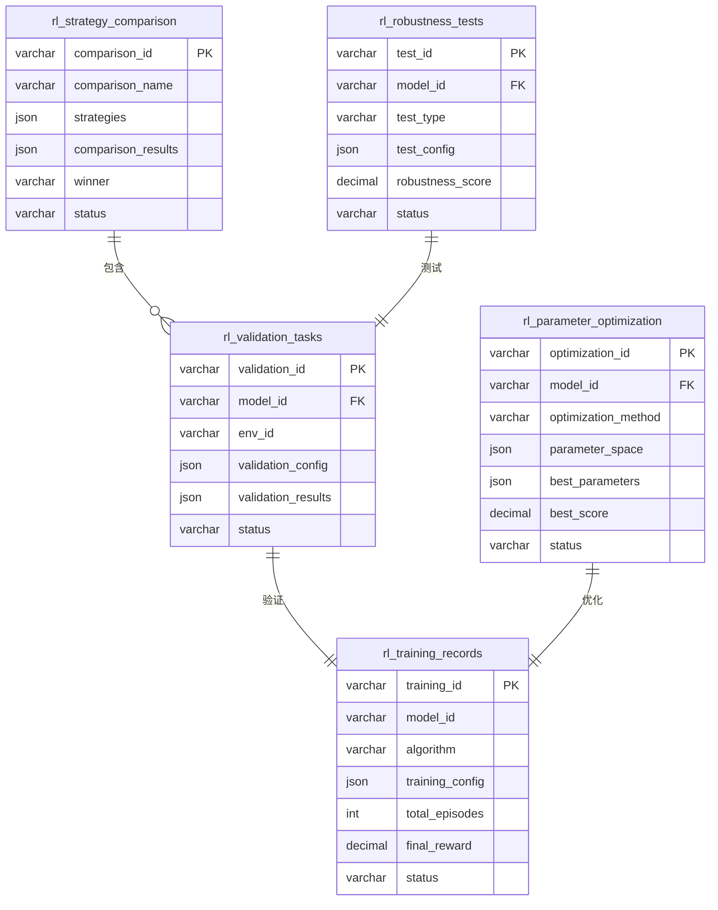

# RL策略验证模块 - 数据模型（Validation阶段）

> **阶段**: Validation阶段
> **模块**: RL策略验证
> **状态**: ✅ 文档完成
> **版本**: v1.0
> **最后更新**: 2026-02-11
> **优先级**: P2功能
> **核心价值**: RL策略验证、策略对比、鲁棒性测试
> **基于**: QLib Reinforcement Learning模块

---

## 📊 数据表结构

### 1. RL验证任务表 (rl_validation_tasks)

存储RL策略验证任务。

```sql
CREATE TABLE rl_validation_tasks (
    -- 主键
    validation_id VARCHAR(64) PRIMARY KEY COMMENT '验证ID',

    -- 任务基本信息
    model_id VARCHAR(64) NOT NULL COMMENT 'RL模型ID',
    env_id VARCHAR(64) NOT NULL COMMENT '环境ID',
    task_name VARCHAR(255) COMMENT '任务名称',

    -- 验证配置（JSON格式）
    validation_config JSON NOT NULL COMMENT '验证配置',

    -- 任务状态
    status ENUM('pending', 'running', 'completed', 'failed', 'cancelled') NOT NULL DEFAULT 'pending',
    progress JSON COMMENT '进度信息',

    -- 验证结果（JSON格式）
    validation_results JSON COMMENT '验证结果',

    -- 时间信息
    created_at TIMESTAMP NOT NULL DEFAULT CURRENT_TIMESTAMP,
    started_at TIMESTAMP NULL,
    completed_at TIMESTAMP NULL,
    duration_seconds INT COMMENT '执行时长',

    -- 元数据
    created_by VARCHAR(64) NOT NULL COMMENT '创建用户ID',

    -- 索引
    INDEX idx_model_id (model_id),
    INDEX idx_status (status),
    INDEX idx_created_at (created_at)
) ENGINE=InnoDB DEFAULT CHARSET=utf8mb4 COMMENT='RL验证任务表';
```

**validation_config字段结构**:
```json
{
  "start_time": "2020-01-01",
  "end_time": "2023-12-31",
  "initial_capital": 100000,
  "benchmark": "SH000300",
  "n_episodes": 100,
  "deterministic": true
}
```

**validation_results字段结构**:
```json
{
  "performance": {
    "mean_sharpe": 0.72,
    "mean_returns": 0.15,
    "max_drawdown": -0.12,
    "win_rate": 0.58
  },
  "episodes": [...],
  "equity_curve": {...}
}
```

---

### 2. RL策略对比表 (rl_strategy_comparison)

存储RL策略对比任务和结果。

```sql
CREATE TABLE rl_strategy_comparison (
    -- 主键
    comparison_id VARCHAR(64) PRIMARY KEY COMMENT '对比ID',

    -- 对比基本信息
    comparison_name VARCHAR(255) NOT NULL COMMENT '对比名称',
    description TEXT COMMENT '对比描述',

    -- 策略配置（JSON格式）
    strategies JSON NOT NULL COMMENT '参与对比的策略列表',

    -- 对比配置
    comparison_config JSON NOT NULL COMMENT '对比配置',

    -- 对比结果（JSON格式）
    comparison_results JSON COMMENT '对比结果',
    winner VARCHAR(64) COMMENT '获胜策略',

    -- 状态
    status ENUM('pending', 'running', 'completed', 'failed') NOT NULL DEFAULT 'pending',

    -- 时间信息
    created_at TIMESTAMP NOT NULL DEFAULT CURRENT_TIMESTAMP,
    completed_at TIMESTAMP NULL,

    -- 元数据
    created_by VARCHAR(64) NOT NULL,

    -- 索引
    INDEX idx_status (status),
    INDEX idx_created_at (created_at)
) ENGINE=InnoDB DEFAULT CHARSET=utf8mb4 COMMENT='RL策略对比表';
```

**strategies字段结构**:
```json
{
  "strategies": [
    {
      "name": "PPO策略",
      "model_id": "rl_model_ppo_001",
      "type": "rl"
    },
    {
      "name": "传统策略",
      "model_id": "trad_model_001",
      "type": "traditional"
    }
  ]
}
```

**comparison_results字段结构**:
```json
{
  "performance_table": {
    "PPO策略": {"sharpe": 0.72, "returns": 0.15},
    "传统策略": {"sharpe": 0.65, "returns": 0.12}
  },
  "statistical_tests": {
    "sharpe_diff": 0.07,
    "p_value": 0.03,
    "significant": true
  }
}
```

---

### 3. RL参数优化表 (rl_parameter_optimization)

存储RL策略参数优化记录。

```sql
CREATE TABLE rl_parameter_optimization (
    -- 主键
    optimization_id VARCHAR(64) PRIMARY KEY COMMENT '优化ID',

    -- 优化基本信息
    model_id VARCHAR(64) NOT NULL COMMENT 'RL模型ID',
    optimization_method ENUM('grid_search', 'random_search', 'bayesian', 'genetic') NOT NULL,

    -- 优化配置（JSON格式）
    parameter_space JSON NOT NULL COMMENT '参数空间定义',
    optimization_config JSON COMMENT '优化配置',

    -- 优化结果（JSON格式）
    optimization_results JSON COMMENT '优化结果',
    best_parameters JSON COMMENT '最优参数',
    best_score DECIMAL(10, 6) COMMENT '最优得分',

    -- 状态
    status ENUM('pending', 'running', 'completed', 'failed') NOT NULL DEFAULT 'pending',

    -- 时间信息
    created_at TIMESTAMP NOT NULL DEFAULT CURRENT_TIMESTAMP,
    completed_at TIMESTAMP NULL,

    -- 元数据
    created_by VARCHAR(64) NOT NULL,

    -- 索引
    INDEX idx_model_id (model_id),
    INDEX idx_status (status)
) ENGINE=InnoDB DEFAULT CHARSET=utf8mb4 COMMENT='RL参数优化表';
```

---

### 4. RL鲁棒性测试表 (rl_robustness_tests)

存储RL策略鲁棒性测试记录。

```sql
CREATE TABLE rl_robustness_tests (
    -- 主键
    test_id VARCHAR(64) PRIMARY KEY COMMENT '测试ID',

    -- 测试基本信息
    model_id VARCHAR(64) NOT NULL COMMENT 'RL模型ID',
    test_type ENUM('market_regime', 'noise', 'slippage', 'black_swan') NOT NULL,

    -- 测试配置（JSON格式）
    test_config JSON NOT NULL COMMENT '测试配置',
    scenarios JSON COMMENT '测试场景列表',

    -- 测试结果（JSON格式）
    test_results JSON COMMENT '测试结果',
    robustness_score DECIMAL(5, 4) COMMENT '鲁棒性评分',

    -- 状态
    status ENUM('pending', 'running', 'completed', 'failed') NOT NULL DEFAULT 'pending',

    -- 时间信息
    created_at TIMESTAMP NOT NULL DEFAULT CURRENT_TIMESTAMP,
    completed_at TIMESTAMP NULL,

    -- 元数据
    created_by VARCHAR(64) NOT NULL,

    -- 索引
    INDEX idx_model_id (model_id),
    INDEX idx_test_type (test_type),
    INDEX idx_status (status)
) ENGINE=InnoDB DEFAULT CHARSET=utf8mb4 COMMENT='RL鲁棒性测试表';
```

**test_config字段结构**:
```json
{
  "market_regimes": ["bull", "bear", "sideways"],
  "noise_levels": [0.01, 0.05, 0.1],
  "slippage_rates": [0.001, 0.005, 0.01]
}
```

---

### 5. RL训练记录表 (rl_training_records)

存储RL策略训练历史记录。

```sql
CREATE TABLE rl_training_records (
    -- 主键
    training_id VARCHAR(64) PRIMARY KEY COMMENT '训练ID',

    -- 训练基本信息
    model_id VARCHAR(64) NOT NULL COMMENT '模型ID',
    algorithm ENUM('PPO', 'A2C', 'DDPG', 'TD3', 'SAC') NOT NULL,

    -- 训练配置（JSON格式）
    training_config JSON NOT NULL COMMENT '训练配置',
    hyperparameters JSON COMMENT '超参数',

    -- 训练统计
    total_episodes INT COMMENT '总训练回合数',
    total_steps BIGINT COMMENT '总步数',
    training_time_seconds INT COMMENT '训练时长',

    -- 训练结果（JSON格式）
    training_results JSON COMMENT '训练结果',
    final_reward DECIMAL(10, 6) COMMENT '最终奖励',
    convergence_episode INT COMMENT '收敛回合数',

    -- 状态
    status ENUM('training', 'completed', 'failed', 'stopped') NOT NULL DEFAULT 'training',

    -- 时间信息
    started_at TIMESTAMP NOT NULL,
    completed_at TIMESTAMP NULL,

    -- 元数据
    created_by VARCHAR(64) NOT NULL,

    -- 索引
    INDEX idx_model_id (model_id),
    INDEX idx_algorithm (algorithm),
    INDEX idx_status (status)
) ENGINE=InnoDB DEFAULT CHARSET=utf8mb4 COMMENT='RL训练记录表';
```

---

## 🔗 数据关系图



---

## 📝 数据保留策略

| 表名 | 保留策略 | 说明 |
|------|---------|------|
| rl_validation_tasks | 保留1年 | 验证任务记录 |
| rl_strategy_comparison | 永久保留 | 策略对比记录 |
| rl_parameter_optimization | 保留6个月 | 参数优化记录 |
| rl_robustness_tests | 保留6个月 | 鲁棒性测试记录 |
| rl_training_records | 永久保留 | 训练历史记录 |

---

## 🔗 相关文档

- [API设计](./API设计.md) - API接口设计
- [前端组件](./前端组件.md) - 前端UI组件
- [实施记录](./实施记录.md) - 开发实施记录
- [QLib官方文档 - RL](https://qlib.readthedocs.io/en/latest/component/rl.html)

---

**最后更新**: 2026-02-11
