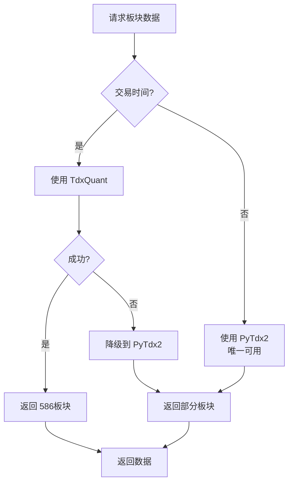
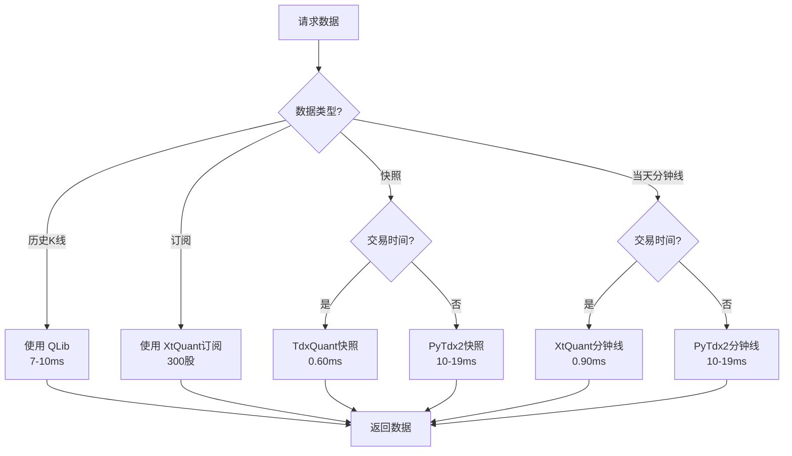

# 第3章 - 业务场景决策矩阵

**文档版本**: v3.0
**更新日期**: 2026-03-20

---

## 目录

- [3.1 双层路由架构](#31-双层路由架构)
- [3.2 板块数据路由](#32-板块数据路由)
- [3.3 非板块数据路由](#33-非板块数据路由)
- [3.4 完整决策表](#34-完整决策表)

---

## 3.1 双层路由架构

### V5 架构的核心设计

V5 场景化服务采用**双层路由**策略：

```
┌─────────────────────────────────────────────────────┐
│                   V5 双层路由                       │
├─────────────────────────────────────────────────────┤
│                                                     │
│  第一层：数据类型路由                               │
│  ├─ 板块数据？ → 板块专用路由                       │
│  └─ 非板块数据 → 通用数据路由                      │
│                                                     │
│  第二层：时间 + 标的类型路由                        │
│  ├─ 交易时间 vs 非交易时间                          │
│  ├─ 股票 vs 指数 vs 板块                           │
│  └─ 数据量选择（单只 vs 批量）                      │
│                                                     │
└─────────────────────────────────────────────────────┘
```

### 为什么需要双层路由？

| 问题 | 解决方案 |
|------|----------|
| 板块数据和非板块数据能力差异大 | 分离路由，各自优化 |
| TdxQuant不支持当天分钟线但板块最强 | 根据数据类型选择 |
| XtQuant不支持板块但分钟线强 | 避免错误调用 |
| 非交易时间数据源受限 | 时间层自动切换 |

---

## 3.2 板块数据路由

### 板块数据特性

板块数据是**特殊的数据类型**，需要单独的路由策略：

| 特性 | 说明 | 影响 |
|------|------|------|
| **XtQuant不支持** | 完全无法获取板块数据 | 必须排除XtQuant |
| **TdxQuant最强** | 6.99ms, 586板块 | 交易时间首选 |
| **PyTdx2可用** | ~15ms，部分板块 | 非交易时间唯一选择 |

### 板块数据路由流程图



### 板块数据路由配置

```python
class SectorDataRouter:
    """板块数据专用路由"""

    def get_source(self, is_trading_time: bool):
        """获取板块数据源"""

        if is_trading_time:
            # 交易时间：TdxQuant 绝对优势
            # - 6.99ms 响应
            # - 586个完整板块
            # - 双层数据源（服务器+本地）
            return {
                "primary": "TdxQuant",
                "reason": "最快最全（6.99ms, 586板块）",
                "performance": "6.99ms",
                "sector_count": 586
            }
        else:
            # 非交易时间：PyTdx2 唯一选择
            # - ~15ms 响应
            # - 部分板块
            # - 24/7可用
            return {
                "primary": "PyTdx2",
                "reason": "唯一可用（24/7）",
                "performance": "~15ms",
                "sector_count": "部分",
                "warning": "板块数量有限"
            }

    def get_sector_data(self, limit=20):
        """获取板块数据"""
        is_trading = self.is_trading_time()
        config = self.get_source(is_trading)

        if config["primary"] == "TdxQuant":
            return self.tdxquant_adapter.get_sectors(limit)
        else:
            return self.pytdx2_adapter.get_sectors(limit)
```

### 板块数据决策表

| 时间段 | 数据源 | 响应时间 | 板块数量 | 说明 |
|--------|--------|----------|----------|------|
| **交易时间** | **TdxQuant** 🔥 | **6.99ms** | **586个** | 绝对优势 |
| **交易时间** | PyTdx2 | ~15ms | 部分 | 备用方案 |
| **非交易时间** | **PyTdx2** 🌟 | **~15ms** | **部分** | 唯一可用 |

---

## 3.3 非板块数据路由

### 非板块数据分类

| 数据类型 | 子类型 | 特殊考虑 |
|----------|--------|----------|
| **快照数据** | L1实时快照 | TdxQuant最快(0.60ms) |
| **分钟线数据** | 当天分钟线 | **TdxQuant不支持，必须用XtQuant/PyTdx2** |
| **历史数据** | 历史K线 | QLib本地库优先(7-10ms) |
| **财务数据** | 财务信息 | TdxQuant优先 |
| **订阅数据** | L0订阅推送 | XtQuant(300股) > TdxQuant(100股) |

### 非板块数据路由流程图



### 关键决策点

#### 当天分钟线 - 关键限制 ⚠️

```
┌────────────────────────────────────────────────┐
│           当天分钟线数据源限制                   │
├────────────────────────────────────────────────┤
│                                                │
│  ❌ TdxQuant - 不支持当天分钟线                │
│     原因：API限制，只能获取历史K线              │
│                                                │
│  ✅ XtQuant - 交易时间最优                      │
│     性能：0.90ms 缓存                          │
│     限制：非交易时间不可用                      │
│                                                │
│  ✅ PyTdx2 - 24/7可用                          │
│     性能：10-19ms                              │
│     场景：非交易时间唯一选择                    │
│                                                │
└────────────────────────────────────────────────┘
```

#### 板块数据 - 关键限制 ⚠️

```
┌────────────────────────────────────────────────┐
│           板块数据源限制                        │
├────────────────────────────────────────────────┤
│                                                │
│  ✅ TdxQuant - 交易时间绝对优势                 │
│     性能：6.99ms                               │
│     数量：586个完整板块                        │
│                                                │
│  ❌ XtQuant - 完全不支持板块数据                │
│     原因：功能限制，无法获取板块信息             │
│                                                │
│  ✅ PyTdx2 - 非交易时间可用                     │
│     性能：~15ms                                │
│     数量：部分板块                              │
│                                                │
└────────────────────────────────────────────────┘
```

---

## 3.4 完整决策表

### 按数据类型和时间的完整决策

| 数据类型 | 时间段 | 优先级1 | 优先级2 | 优先级3 | 说明 |
|----------|--------|--------|--------|--------|------|
| **L1快照** | 交易时间 | TdxQuant 0.60ms | XtQuant 6ms | PyTdx2 10-19ms | TdxQuant最快 |
| **L1快照** | 非交易时间 | PyTdx2 10-19ms | - | - | 唯一可用 |
| **当天分钟线** | 交易时间 | XtQuant 0.90ms | PyTdx2 10-19ms | - | **TdxQuant不支持** |
| **当天分钟线** | 非交易时间 | PyTdx2 10-19ms | - | - | 唯一可用 |
| **历史K线** | 任何时间 | QLib 7-10ms | PyTdx2 ~19ms | TdxQuant ~50ms | 本地库优先 |
| **板块数据** | 交易时间 | **TdxQuant 6.99ms** 🔥 | PyTdx2 ~15ms | - | **XtQuant不支持** |
| **板块数据** | 非交易时间 | PyTdx2 ~15ms | - | - | 唯一可用 |
| **财务数据** | 交易时间 | TdxQuant | XtQuant | PyTdx2 | - |
| **财务数据** | 非交易时间 | PyTdx2 | - | - | 唯一可用 |
| **L0订阅** | 交易时间 | XtQuant 300股 | TdxQuant 100股 | - | 按需选择 |
| **L0订阅** | 非交易时间 | 不支持 | - | - | 市场休市 |

### 快速决策树

```
请求数据
  │
  ├─ 是板块数据？
  │   ├─ 是 → 交易时间？ → 是 → TdxQuant (6.99ms, 586板块) 🔥
  │   │                    └─ 否 → PyTdx2 (~15ms)
  │   │
  │   └─ 否 → 需要当天分钟线？
  │       ├─ 是 → 交易时间？ → 是 → XtQuant (0.90ms)
  │       │                    └─ 否 → PyTdx2 (10-19ms)
  │       │
  │       └─ 否 → 需要快照？
  │           ├─ 是 → 交易时间？ → 是 → TdxQuant (0.60ms) 🔥
  │           │                    └─ 否 → PyTdx2 (10-19ms)
  │           │
  │           └─ 否 → 需要历史K线？
  │               └─ 是 → QLib (7-10ms) → PyTdx2 (~19ms)
```

---

## 关键要点总结

### 1. 双层路由的重要性

- **第一层**：区分板块/非板块数据
- **第二层**：区分时间、标的类型、数据量

### 2. 板块数据的特殊处理

- **XtQuant完全不支持** - 必须在路由中排除
- **TdxQuant绝对优势** - 交易时间优先选择
- **PyTdx2备用** - 非交易时间唯一选择

### 3. 当天分钟线的特殊处理

- **TdxQuant不支持** - 必须在路由中排除
- **XtQuant最优** - 交易时间优先选择
- **PyTdx2备用** - 非交易时间唯一选择

### 4. 非交易时间的处理

- **PyTdx2是关键** - 唯一的在线数据源
- **QLib辅助** - 本地库历史数据

---

**下一步**：阅读 [第4章 - V5场景服务配置指南](04-场景服务配置指南.md)
